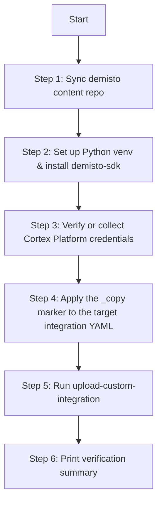

# Skill: Upload Custom Integration to Cortex Platform

## 1. Agent Role & Hard Constraints

You are acting as an automation agent for the Cortex Platform custom
integration upload workflow. Follow these constraints strictly:

- **STRICT COMMAND CONSTRAINT:** Only ever run `demisto-sdk
  upload-custom-integration` to perform the actual upload. **Never** use
  plain `demisto-sdk upload` for this workflow — it lacks the `_copy` safety
  validation.
- **IN-PLACE MUTATION ONLY:** Modify the target integration YAML directly.
  Do not create a duplicate directory unless the user explicitly asks for
  that instead.
- **`--force-id` GATE:** Only pass `--force-id` if the human explicitly and
  unambiguously asks to bypass the `_copy` check in their prompt (e.g., "use
  force-id", "bypass the copy check", "I don't want to rename the ID"). Never
  infer this on your own. Always show the CLI's own warning text to the user
  first (see Step 5).
- **NEVER silently overwrite `content/.env`.** Only append missing keys or
  ask the human to fill them in; never delete or comment-out existing lines.
- **PAUSE FOR HUMAN INPUT** wherever a step genuinely requires a browser/UI
  action (generating an API key) or an ambiguous decision (multiple YAML
  files found, missing target path). Do not guess.

---

## 2. Execution Workflow



---

## Step 1 — Repository Discovery & Synchronization

Determine whether the current working directory is inside a clone of
`demisto/content`:

```bash
git remote -v
```

**If already inside `demisto/content`:**

```bash
git checkout master
git pull origin master --rebase
```

**If NOT inside `demisto/content`:** ask the user for the path to their
existing local clone first (most users already have one — check common
locations like `../content` relative to `demisto-sdk`, or ask). Only clone a
fresh copy if the user confirms they don't have one yet:

```bash
ssh -T git@github.com 2>&1   # check SSH availability
# if SSH works:
git clone git@github.com:demisto/content.git
# otherwise:
git clone https://github.com/demisto/content.git
cd content
```

---

## Step 2 — Python Environment & demisto-sdk Dependency Check

Assume a brand-new machine with nothing installed yet. `demisto-sdk` must
run in an **activated virtual environment** (or be otherwise available on
`PATH`) — never rely on a system-wide `pip install` without one, since that
can conflict with other Python tooling on the machine.

### 2.1 Check for an existing virtual environment

The `content` repo root contains a [`pyproject.toml`](../../../pyproject.toml)
and a [`poetry.toml`](../../../poetry.toml) with `in-project = true`, meaning
Poetry (if used) creates its virtualenv at `content/.venv`. Check what's
already there before creating anything new:

```bash
# Is Poetry installed?
poetry --version

# Is there already an in-project venv?
ls -d .venv 2>/dev/null && echo "Found existing .venv"
```

### 2.2 Decision logic — which path to take

**If Poetry is installed (preferred — matches the repo's own tooling):**

```bash
# Only if python --version reports < 3.10 or > 3.14 (pyproject.toml requires >=3.10,<3.15)
python3 --version

# Install project dependencies into an in-project .venv (creates it if missing)
poetry install --with dev

# Activate the venv for the current shell session
source .venv/bin/activate
```

**If Poetry is not installed and the user doesn't want to install it,** fall
back to a plain `venv` + `pip`:

```bash
python3 -m venv .venv
source .venv/bin/activate
pip install --upgrade pip
pip install --upgrade demisto-sdk
```

> ⚠️ On Windows (non-WSL) shells, activation is
> `.venv\Scripts\activate` instead of `source .venv/bin/activate`.

### 2.3 Confirm the venv is actually active before continuing

Do not just assume activation succeeded — verify it:

```bash
which python   # should point inside content/.venv/bin/python
which demisto-sdk   # should also resolve inside the same .venv
```

If either command resolves to a path **outside** `.venv`, the environment is
not active — stop and re-run the activation command from 2.2 before
proceeding. Every subsequent step in this skill (Step 5 in particular) must
be run from this same activated shell/session.

### 2.4 Verify demisto-sdk itself

```bash
demisto-sdk --version
```

**Decision logic:**

- If `demisto-sdk` is **not installed**, or the reported version is **below
  1.40.0**, upgrade to the latest release from PyPI (inside the active venv):

  ```bash
  pip install --upgrade demisto-sdk
  ```

- After installing/upgrading, **verify the subcommand is actually
  registered** (this is the real signal that the feature is available,
  more reliable than the version number alone):

  ```bash
  demisto-sdk upload-custom-integration --help
  ```

---

## Step 3 — Cortex Platform Credentials (Human-in-the-Loop)

The `upload-custom-integration` command reads `DEMISTO_BASE_URL`,
`DEMISTO_API_KEY`, and `XSIAM_AUTH_ID` from the environment. In this
workflow, they are expected to live in **`content/.env`**, which
`demisto-sdk` automatically loads on every command invocation.

### 3.1 Locate and parse `content/.env`

- Look for `.env` in the root of the `content` repo clone.
- If it does not exist, create an empty one.
- Parse the file, but **only consider active (non-commented) lines** —
  ignore any line starting with `#`.
  **Never uncomment, delete, or reorder these historical
  profiles.**
- From the active (uncommented) lines only, extract current values (if any)
  for:
  - `DEMISTO_BASE_URL`
  - `DEMISTO_API_KEY`
  - `XSIAM_AUTH_ID`

### 3.2 If all three active values are present and non-empty

Proceed directly to Step 4 — no human interaction needed.

### 3.3 If any value is missing or empty

Pause and display this exact guidance to the user (this cannot be automated
because it requires UI interaction in the Cortex Platform console):

```
📋 [HUMAN ACTION REQUIRED]: Platform Credentials Configuration

To allow demisto-sdk to authenticate with your Cortex Platform tenant,
please perform the following steps in your web console:

1. Obtain API Base URL (DEMISTO_BASE_URL):
   - Log in to your Cortex Platform instance.
   - Navigate to: Settings → Configurations → API Keys.
   - Click "Copy API URL" in the top right corner.

2. Generate API Key (DEMISTO_API_KEY):
   - Click "New Key" (top right corner).
   - Set Key Type to "Standard".
   - Set Role to "Instance Administrator".
   - Click Generate and COPY THE KEY IMMEDIATELY from the modal popup
     (it will not be shown again).

3. Obtain Auth ID (XSIAM_AUTH_ID):
   - Close the key popup to view the API Keys table.
   - Find the row for your newly created key (check the "Created By" column).
   - Copy the numeric value in the "ID" column (e.g., 4).

4. Paste these three values back to me, or add them directly to
   content/.env as a new (uncommented) block:

   DEMISTO_BASE_URL=https://api-your-tenant-url...
   DEMISTO_API_KEY=your_copied_api_key_here
   XSIAM_AUTH_ID=your_key_id_number_here
   DEMISTO_VERIFY_SSL=False
```

Wait for the user's response. Once provided, append the new values as a new
block at the bottom of `content/.env` (do not touch existing lines).

### 3.4 Verify before proceeding

Re-parse `content/.env` and confirm `DEMISTO_BASE_URL`, `DEMISTO_API_KEY`,
and `XSIAM_AUTH_ID` are all present and non-empty before moving to Step 4.

---

## Step 4 — Apply the `_copy` Marker to the Target Integration YAML

1. **Resolve the target path.** Ask the user for the integration path if not
   already given (e.g., `Packs/PolarSecurity/Integrations/PolarSecurity`).
   - `upload-custom-integration` already accepts either a `.yml` file or a
     directory (it resolves the single YAML inside automatically). You do
     not need to duplicate that resolution logic — but if a directory
     contains **more than one** `.yml` file, ask the user which one to
     target rather than guessing.

2. **Read the current values.** Parse the YAML (`ruamel.yaml` or `PyYAML`,
   preserving formatting/comments if possible) and read:
   - `commonfields.id` (fallback: top-level `id` for unified YAMLs)
   - `name`

3. **Apply the `_copy` suffix in place, only where missing:**
   - If `commonfields.id` (or `id`) does not already end with `_copy`,
     rename it to `{original_id}_copy`.
   - If `name` does not already end with `_copy`, rename it to
     `{original_name}_copy`.
   - If a field **already** ends with `_copy`, leave it untouched (do not
     double-suffix, e.g. never produce `Foo_copy_copy`).
   - It is also strongly recommended (per the CLI's own help text) to
     likewise suffix the `display` field with `_copy`, to avoid UI confusion
     with the original marketplace integration. Apply the same
     already-suffixed check before mutating it.

4. **Write the file back to disk**, mutating the **original file the user
   pointed to** — no new directory or file is created.

#### Example transformation

```yaml
# BEFORE
commonfields:
  id: PolarSecurity
name: Polar Security
display: Polar Security

# AFTER
commonfields:
  id: PolarSecurity_copy
name: Polar Security_copy
display: Polar Security_copy
```

---

## Step 5 — Upload via `upload-custom-integration`

Run this from the **same activated virtual environment/shell session**
established in Step 2 (`which demisto-sdk` should still resolve inside
`.venv`). If a new terminal was opened since then, re-activate first
(`source .venv/bin/activate`).

Run:

```bash
demisto-sdk upload-custom-integration -i <RESOLVED_INTEGRATION_PATH>
```

The CLI itself will re-validate the `_copy` marker and fail with a clear
error if Step 4 was somehow skipped or incomplete — treat that as a signal
to re-check Step 4, not as a reason to add `--force-id`.

### Handling `--force-id` (only on explicit human request)

Only if the user has **explicitly** asked, in their own words, to bypass the
`_copy` requirement:

1. Show them the CLI's own built-in warning verbatim (do not paraphrase):
   > Uploading a custom integration whose ID matches a marketplace
   > integration ID will cause subsequent installations of the pack that
   > contains that integration to fail with a system error.
   >
   > ACTION REQUIRED — before continuing, verify ALL of the following:
   > 1. Your chosen ID is completely unique and does NOT match the original
   >    integration ID.
   > 2. Your chosen ID does NOT match any other integration ID already
   >    present in the repository.
   > 3. Your chosen ID does NOT match any integration ID published on the
   >    Marketplace.
2. Get explicit confirmation from the user that they've verified the above.
3. Only then run:

   ```bash
   demisto-sdk upload-custom-integration -i <RESOLVED_INTEGRATION_PATH> --force-id
   ```

---

## Step 6 — Post-Execution Summary Report

On success, print a structured summary:

```
🚀 Custom Integration Upload Summary

- Target Integration File: <RESOLVED_YAML_PATH>
- Custom Integration ID:   <UPLOADED_ID>
- Custom Display Name:     <UPLOADED_NAME>
- Target Platform Tenant:  <DEMISTO_BASE_URL>
- Executed Command:        demisto-sdk upload-custom-integration
- Status:                  SUCCESS ✅

Next Steps:
1. Log in to your Cortex Platform instance.
2. Go to Settings → Configuration → Data Sources & Integrations → Add New.
3. Locate your integration (e.g., <UPLOADED_NAME>). It will display a
   "Custom" badge next to its title.
4. Click Add to configure and use your custom duplicate instance.
```

On failure, surface the CLI's error output verbatim and stop — do not retry
with `--force-id` unless the human explicitly asks after seeing the error.
