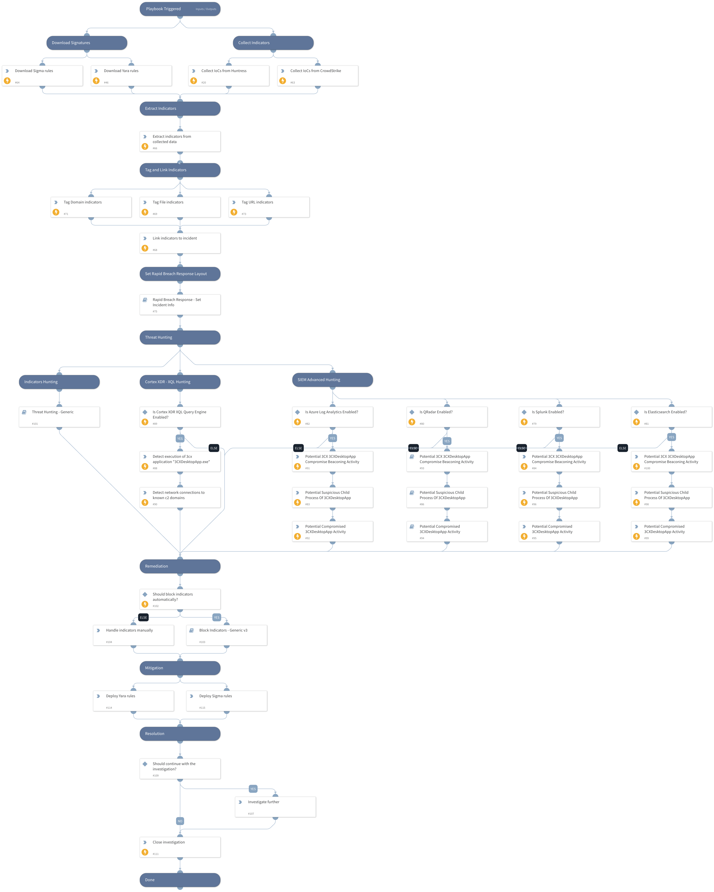

### 3CXDesktopApp Supply Chain Attack

#### Executive Summary 
On March 29, 2023, CrowdStrike [released a blog](https://www.crowdstrike.com/blog/crowdstrike-detects-and-prevents-active-intrusion-campaign-targeting-3cxdesktopapp-customers/) discussing a supply chain attack involving a software-based phone application called [3CXDesktopApp](https://www.3cx.com/). 

As of March 30, the 3CXDesktopApp installer hosted on the developer’s website will install the application with two malicious libraries included. The malicious libraries will ultimately run shellcode to load a backdoor on the system that allows actors to install additional malware on the victim machine.

Between March 9-30, 2023, we observed activity at 127 Cortex XDR customers that involved the 3CXDesktopApp process attempting to run shellcode, which was blocked by the XDR Agent’s In-process Shellcode Protection Module. Due to blocking the shellcode, we were unable to obtain the secondary payload used in this attack, so we cannot determine its capabilities or any post-exploitation activities carried out by the threat actor.

#### Affected Products 
According to 3CX’s announcement, the supply chain attack involved 3CX’s Electron Windows App shipped in Update 7, version numbers 18.12.407 & 18.12.416 and Electron Mac App version numbers 18.11.1213, 18.12.402, 18.12.407 & 18.12.416.

#### Playbook Flow

**This playbook should be triggered manually or can be configured as a job.** 
Please create a new incident and choose the 3CXDesktopApp Supply Chain Attack playbook and Rapid Breach Response incident type.

**The playbook includes the following tasks:**

**Hunting:**
- Cortex XDR
    - XQL hunting queries
- Advanced SIEM queries
    - Splunk
    - QRadar
    - Elasticsearch
    - Azure Log Analytics
- Indicators hunting

**References:**

[Threat Brief: 3CXDesktopApp Supply Chain Attack](https://unit42.paloaltonetworks.com/3cxdesktopapp-supply-chain-attack/)

[CrowdStrike Falcon Platform Detects and Prevents Active Intrusion Campaign Targeting 3CXDesktopApp Customers](https://www.crowdstrike.com/blog/crowdstrike-detects-and-prevents-active-intrusion-campaign-targeting-3cxdesktopapp-customers/)

Note: This is a beta playbook, which lets you implement and test pre-release software. Since the playbook is beta, it might contain bugs. Updates to the pack during the beta phase might include non-backward compatible features. We appreciate your feedback on the quality and usability of the pack to help us identify issues, fix them, and continually improve.

## Dependencies

This playbook uses the following sub-playbooks, integrations, and scripts.

### Sub-playbooks

* Block Indicators - Generic v3
* QRadarFullSearch
* Threat Hunting - Generic
* Rapid Breach Response - Set Incident Info

### Integrations

This playbook does not use any integrations.

### Scripts

* ParseHTMLIndicators
* HttpV2

### Commands

* es-search
* azure-log-analytics-execute-query
* associateIndicatorsToIncident
* extractIndicators
* xdr-xql-generic-query
* closeInvestigation
* splunk-search
* createNewIndicator

## Playbook Inputs

---

| **Name** | **Description** | **Default Value** | **Required** |
| --- | --- | --- | --- |
| PlaybookDescription | The playbook description to be used in the Rapid Breach Response - Set Incident Info sub-playbook. | ### 3CXDesktopApp Supply Chain Attack  #### Executive Summary  On March 29, 2023, CrowdStrike [released a blog](https://www.crowdstrike.com/blog/crowdstrike-detects-and-prevents-active-intrusion-campaign-targeting-3cxdesktopapp-customers/) discussing a supply chain attack involving a software-based phone application called [3CXDesktopApp](https://www.3cx.com/).   As of March 30, the 3CXDesktopApp installer hosted on the developer’s website will install the application with two malicious libraries included. The malicious libraries will ultimately run shellcode to load a backdoor on the system that allows actors to install additional malware on the victim machine.  Between March 9-30, 2023, we observed activity at 127 Cortex XDR customers that involved the 3CXDesktopApp process attempting to run shellcode, which was blocked by the XDR Agent’s In-process Shellcode Protection Module. Due to blocking the shellcode, we were unable to obtain the secondary payload used in this attack, so we cannot determine its capabilities or any post-exploitation activities carried out by the threat actor.  #### Affected Products  According to 3CX’s announcement, the supply chain attack involved 3CX’s Electron Windows App shipped in Update 7, version numbers 18.12.407 &amp; 18.12.416 and Electron Mac App version numbers 18.11.1213, 18.12.402, 18.12.407 &amp; 18.12.416.  **This playbook should be triggered manually or can be configured as a job.**  Please create a new incident and choose the 3CXDesktopApp Supply Chain Attack playbook and Rapid Breach Response incident type.  **The playbook includes the following tasks:**  **Hunting:** - Cortex XDR     - XQL hunting queries - Advanced SIEM queries     - Splunk     - QRadar     - Elasticsearch     - Azure Log Analytics - Indicators hunting  **References:**  [CrowdStrike Falcon Platform Detects and Prevents Active Intrusion Campaign Targeting 3CXDesktopApp Customers](https://www.crowdstrike.com/blog/crowdstrike-detects-and-prevents-active-intrusion-campaign-targeting-3cxdesktopapp-customers/)  Note: This is a beta playbook, which lets you implement and test pre-release software. Since the playbook is beta, it might contain bugs. Updates to the pack during the beta phase might include non-backward compatible features. We appreciate your feedback on the quality and usability of the pack to help us identify issues, fix them, and continually improve. | Optional |
| autoBlockIndicators | Whether to block the indicators automatically. | False | Optional |
| QRadarTimeRange | The time range to search for indicators in the Threat Hunting -  Generic playbook. | LAST 7 DAYS | Optional |
| SplunkEarliestTime | The earliest time to search for indicators in the Threat Hunting -  Generic playbook. | -7d@d | Optional |
| SplunkLatestTime | The latest time to search for indicators in the Threat Hunting -  Generic playbook. | now | Optional |
| XQLTimeRange | The time range for the Cortex XDR XQL query. | 7 days ago | Optional |
| excludeIndicators | List of indicators to exclude. | raw[.]githubusercontent[.]com,www[.]3cx[.]com,github[.]com | Optional |
| elasticSearchIndex | The index to search over using elastic query. |  | Optional |

## Playbook Outputs

---
There are no outputs for this playbook.

## Playbook Image

---

