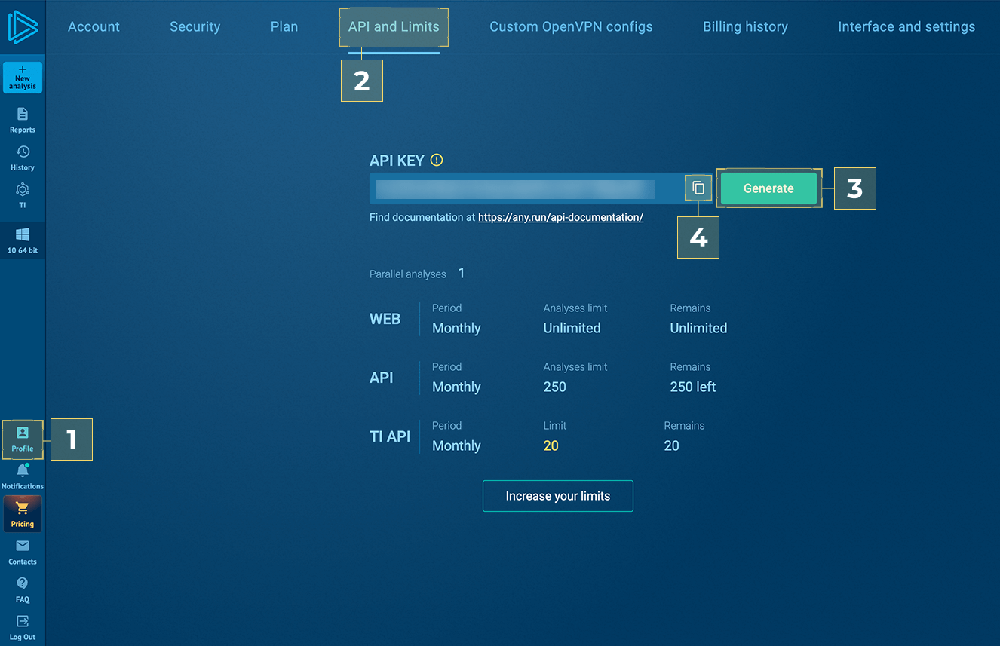

TI Lookup is a searchable database of IOCs, IOAs, IOBs, and events for threat hunting and a service for browsing malicious files by their content.

## Use Cases

Perform deep searches, look up threats online, and enrich your security solutions.

## Generate API token

* Follow [ANY.RUN TI Lookup](https://app.any.run/)
* [1] Profile > [2] API and Limits > [3] Generate > [4] Copy

## Configure ANY.RUN Lookup in Cortex

1. Navigate to **Settings** > **Integrations** > **Servers & Services**.
2. Search for ANY.RUN.
3. Click **Add instance** to create and configure a new integration instance.
4. Insert ANY.RUN API-KEY into the **Password** parameter.
5. Please use "ANY.RUN" as username.
6. Click **Test** to validate the URLs, token, and connection.

| **Parameter**    | **Description**                                                                                                                                                | **Required** |
|------------------|----------------------------------------------------------------------------------------------------------------------------------------------------------------| --- |
| Password         | ANY.RUN API-KEY without prefix                                                                                                                               | True |

## Commands

You can execute these commands from the CLI, as part of an automation, or in a playbook.
After you successfully execute a command, a DBot message appears in the War Room with the command details.

### anyrun-get-intelligence

***
Perform threat intelligence using specified IOC

#### Base Command

`anyrun-get-intelligence`

#### Input

| **Argument Name** | **Description** | **Required** |
| --- | --- | --- |
| lookup_depth | Specify the number of days from the current date for which you want to lookup. | Optional |
| query | Raw query with necessary filters. Supports condition concatenation with AND, OR, NOT and Parentheses (). | Optional |
| threat_name | The name of a particular threat: malware family, threat type, etc., as identified by the sandbox. Example: "Phishing". | Optional |
| threat_level | A verdict on the threat level of the sample. Possible values are: suspicious, malicious, info. | Optional |
| task_type | The type of the sample submitted to the sandbox. Possible values are: File, URL. | Optional |
| submission_country | The country from which the threat sample was submitted. Example: "es". | Optional |
| os | The specific version of Windows used in the environment. Possible values are: Windows 7, Windows 8, Windows 11. | Optional |
| os_software_set | The software package of applications installed on the OS. Possible values are: clean, office, complete. | Optional |
| os_bit_version | The bitness of the operating system. Possible values are: 32, 64. | Optional |
| registry_key | The specific key within the registry hive where the modification occurred. Please note: when entering registry keys, use a double backslash (\) to escape the single backslash. Example: "Windows\\CurrentVersion\\RunOnce. | Optional |
| registry_name | The name of the Windows Registry key field. Example: "browseinplace". | Optional |
| registry_value | The value of the Windows Registry key. Example: "Internet Explorer\iexplore.exe. | Optional |
| module_image_path | The full path to the module’s image file, the location on the disk where the module’s executable is stored. Example: "SysWOW64\\cryptbase.dll. | Optional |
| rule_threat_level | The threat level assigned to a particular event. Possible values are: suspicious, malicious, info. | Optional |
| rule_name | The name of the detection rule. Example: "Executable content was dropped or overwritten". | Optional |
| mitre | Techniques used by the malware according to the MITRE ATT&amp;CK classification. Example: "T1071". | Optional |
| image_path | Full path to process image. Example: "System32\\conhost.exe". | Optional |
| command_line | Full command line that initiated the process. Example: "PDQConnectAgent\\pdq-connect-agent.exe –service". | Optional |
| injected_flag | Indication of whether a process has been injected. Possible values are: true, false. | Optional |
| destination_ip | The IP address of the network connection that was established or attempted. | Optional |
| destination_port | The network port through which the connection was established. Example: "49760". | Optional |
| destination_ip_asn | Detected ASN. Example: "akamai-as". | Optional |
| destination_ip_geo | Two-letter country or region code of the detected IP geolocation. Example: "ae". | Optional |
| domain_name | The domain name that was recorded during the threat execution in a sandbox. Example: "tventyvd20sb.top". | Optional |
| ja3 | Types of TLS fingerprints that can indicate certain threats. | Optional |
| ja3s | Types of TLS fingerprints that can indicate certain threats. | Optional |
| jarm | Types of TLS fingerprints that can indicate certain threats. | Optional |
| file_path | The full path to the file on the system. | Optional |
| file_event_path | The path of a file associated with a file event. | Optional |
| file_extension | The extension that indicates the file type. | Optional |
| sha256 | Hash values relating to a file. | Optional |
| sha1 | Hash values relating to a file. | Optional |
| md5 | Hash values relating to a file. | Optional |
| suricata_class | The category assigned to the threat by Suricata based on its characteristics. Example: "a network trojan was detected". | Optional |
| suricata_message | The description of the threat according to Suricata. Example: "ET INFO 404/Snake/Matiex Keylogger Style External IP Check". | Optional |
| suricata_threat_level | The verdict on the threat according to Suricata based on its potential impact. Possible values are: suspicious, malicious, info. | Optional |
| suricata_id | The unique identifier of the Suricata rule: Example: "2044767". | Optional |
| sync_object_name | The name or identifier of the synchronization object used. Example: "rmc". | Optional |
| sync_object_type | The type of synchronization object used. Example: "mutex". | Optional |
| sync_object_operation | The operation performed on the synchronization object. Example: "create". | Optional |
| url | The URL called by the process. | Optional |
| http_request_content_type | The content type of the HTTP request sent to the server. Example: "application/json". | Optional |
| http_response_content_type | The content type of the HTTP response received from the server. Example: "text/html". | Optional |
| http_request_file_type | The file type of the file being uploaded in the HTTP request. Example: "binary". | Optional |
| http_response_file_type | The file type of the file being downloaded in the HTTP response. Example: "binary". | Optional |

#### Context Output

| **Path** | **Type** | **Description** |
| --- | --- | --- |
| ANYRUN.Lookup.destinationPort | Unknown | Destination ports numbers. |
| ANYRUN.Lookup.destinationIPgeo | Unknown | Destination IP Geo \(countries\). |
| ANYRUN.Lookup.destinationIpAsn.asn | String | Destination IP ASN \(autonomous system number\). |
| ANYRUN.Lookup.destinationIpAsn.date | Date | Destination IP ASN Date. |
| ANYRUN.Lookup.relatedTasks | String | Links to related tasks in ANY.RUN sandbox. |
| ANYRUN.Lookup.threatName | String | Threat names. |
| ANYRUN.Lookup.relatedIncidents.task | String | Link to the task in ANY.RUN sandbox. |
| ANYRUN.Lookup.relatedIncidents.time | Date | Creation time. |
| ANYRUN.Lookup.relatedIncidents.MITRE | Unknown | Array of MITRE matrix techniques IDs ans sub-techniques IDs. |
| ANYRUN.Lookup.relatedIncidents.event.destinationPort | String | Destination ports numbers. |
| ANYRUN.Lookup.relatedIncidents.event.destinationIP | String | Destination IP address. |
| ANYRUN.Lookup.relatedIncidents.process.commandLine | String | Command line string. |
| ANYRUN.Lookup.relatedIncidents.process.imagePath | String | Image path string. |
| ANYRUN.Lookup.relatedIncidents.process.threatName | String | Threat names. |
| ANYRUN.Lookup.relatedIncidents.process.MITRE | Unknown | Array of MITRE matrix techniques IDs ans sub-techniques IDs. |
| ANYRUN.Lookup.relatedIncidents.process.pid | Number | Process ID. |
| ANYRUN.Lookup.relatedIncidents.process.scores.specs.known_threat | Boolean | Indicates if it is a known threat. |
| ANYRUN.Lookup.relatedIncidents.process.scores.specs.network_loader | Boolean | Indicates if network download was detected. |
| ANYRUN.Lookup.relatedIncidents.process.scores.specs.network | Boolean | Indicates if network activity was enabled. |
| ANYRUN.Lookup.relatedIncidents.process.scores.specs.uac_request | Boolean | Indicates if User Access Control \(UAC\) request was detected. |
| ANYRUN.Lookup.relatedIncidents.process.scores.specs.injects | Boolean | Indicates if threat uses injections. |
| ANYRUN.Lookup.relatedIncidents.process.scores.specs.service_luncher | Boolean | Indicates if new service registration was detected. |
| ANYRUN.Lookup.relatedIncidents.process.scores.specs.executable_dropped | Boolean | Indicates if threat uses dropped executables. |
| ANYRUN.Lookup.relatedIncidents.process.scores.specs.multiprocessing | Boolean | Indicates if threat uses multiprocessing. |
| ANYRUN.Lookup.relatedIncidents.process.scores.specs.crashed_apps | Boolean | Indicates if application crashed. |
| ANYRUN.Lookup.relatedIncidents.process.scores.specs.debug_output | Boolean | Indicates if application has debug output message. |
| ANYRUN.Lookup.relatedIncidents.process.scores.specs.stealing | Boolean | Indicates if process steals info from infected machine. |
| ANYRUN.Lookup.relatedIncidents.process.scores.specs.exploitable | Boolean | Indicates if any known exploit was detected. |
| ANYRUN.Lookup.relatedIncidents.process.scores.specs.static_detections | Boolean | Indicates if any malicious pattern was detected by static analysis engine. |
| ANYRUN.Lookup.relatedIncidents.process.scores.specs.susp_struct | Boolean | Is susp struct |
| ANYRUN.Lookup.relatedIncidents.process.scores.specs.autostart | Boolean | Indicates if application was added to autostart. |
| ANYRUN.Lookup.relatedIncidents.process.scores.specs.low_access | Boolean | Indicates if threat uses low level access. |
| ANYRUN.Lookup.relatedIncidents.process.scores.specs.tor | Boolean | Indicates if TOR was used. |
| ANYRUN.Lookup.relatedIncidents.process.scores.specs.spam | Boolean | Indicates if spam was detected. |
| ANYRUN.Lookup.relatedIncidents.process.scores.specs.malware_config | Boolean | Indicates if malware config was extracted from submitted file. |
| ANYRUN.Lookup.relatedIncidents.process.scores.specs.process_dump | Boolean | Indicates if the process memory dump can be extracted. |
| ANYRUN.Lookup.relatedIncidents.process.eventsCounters.raw.registry | Number | Number or registry events. |
| ANYRUN.Lookup.relatedIncidents.process.eventsCounters.raw.files | Number | Number or files. |
| ANYRUN.Lookup.relatedIncidents.process.eventsCounters.raw.modules | Number | Number or modules. |
| ANYRUN.Lookup.relatedIncidents.process.eventsCounters.raw.objects | Number | Number or objects. |
| ANYRUN.Lookup.relatedIncidents.process.threatLevel | Number | Threat level. |
| ANYRUN.Lookup.relatedIncidents.event.destinationIpAsn | String | Destination IP ASN \(autonomous system number\). |
| ANYRUN.Lookup.relatedIncidents.event.title | String | Title of event type. |
| ANYRUN.Lookup.relatedIncidents.event.url | String | URL. |
| ANYRUN.Lookup.relatedIncidents.event.domainName | String | Domain name |
| ANYRUN.Lookup.relatedIncidents.event.ruleThreatLevel | String | Rule threat level. |
| ANYRUN.Lookup.destinationIP.destinationIP | String | Destination IP address. |
| ANYRUN.Lookup.destinationIP.date | Date | Creation date. |
| ANYRUN.Lookup.destinationIP.threatLevel | Number | Threat level. |
| ANYRUN.Lookup.destinationIP.threatName | Unknown | Threat names. |
| ANYRUN.Lookup.destinationIP.isMalconf | Boolean | Indicates if the IOC was extracted from malware configuration. |
| ANYRUN.Lookup.relatedFiles.task | String | Link to the task in ANY.RUN sandbox. |
| ANYRUN.Lookup.relatedFiles.fileLink | String | Link to the HTTP response files. |
| ANYRUN.Lookup.relatedFiles.time | Date | Creation date. |
| ANYRUN.Lookup.relatedFiles.process.commandLine | String | Command line string. |
| ANYRUN.Lookup.relatedFiles.process.imagePath | String | Image path string. |
| ANYRUN.Lookup.relatedFiles.process.MITRE | String | Array of MITRE matrix techniques IDs ans sub-techniques IDs. |
| ANYRUN.Lookup.relatedFiles.process.pid | Number | Process ID. |
| ANYRUN.Lookup.relatedFiles.process.scores.specs.known_threat | Boolean | Indicates if it is a known threat. |
| ANYRUN.Lookup.relatedFiles.process.scores.specs.network_loader | Boolean | Indicates if network download was detected. |
| ANYRUN.Lookup.relatedFiles.process.scores.specs.network | Boolean | Indicates if network activity was enabled. |
| ANYRUN.Lookup.relatedFiles.process.scores.specs.uac_request | Boolean | Indicates if User Access Control \(UAC\) request was detected. |
| ANYRUN.Lookup.relatedFiles.process.scores.specs.injects | Boolean | Indicates if threat uses injections. |
| ANYRUN.Lookup.relatedFiles.process.scores.specs.service_luncher | Boolean | Indicates if new service registration was detected. |
| ANYRUN.Lookup.relatedFiles.process.scores.specs.executable_dropped | Boolean | Indicates if threat uses dropped executables. |
| ANYRUN.Lookup.relatedFiles.process.scores.specs.multiprocessing | Boolean | Indicates if threat uses multiprocessing. |
| ANYRUN.Lookup.relatedFiles.process.scores.specs.crashed_apps | Boolean | Indicates if application crashed. |
| ANYRUN.Lookup.relatedFiles.process.scores.specs.debug_output | Boolean | Indicates if application has debug output message. |
| ANYRUN.Lookup.relatedFiles.process.scores.specs.stealing | Boolean | Indicates if process steals info from infected machine. |
| ANYRUN.Lookup.relatedFiles.process.scores.specs.exploitable | Boolean | Indicates if any known exploit was detected. |
| ANYRUN.Lookup.relatedFiles.process.scores.specs.static_detections | Boolean | Indicates if any malicious pattern was detected by static analysis engine. |
| ANYRUN.Lookup.relatedFiles.process.scores.specs.susp_struct | Boolean | Is susp struct. |
| ANYRUN.Lookup.relatedFiles.process.scores.specs.autostart | Boolean | Indicates if application was added to autostart. |
| ANYRUN.Lookup.relatedFiles.process.scores.specs.low_access | Boolean | Indicates if threat uses low level access. |
| ANYRUN.Lookup.relatedFiles.process.scores.specs.tor | Boolean | Indicates if TOR was used. |
| ANYRUN.Lookup.relatedFiles.process.scores.specs.spam | Boolean | Indicates if spam was detected. |
| ANYRUN.Lookup.relatedFiles.process.scores.specs.malware_config | Boolean | Indicates if malware config was extracted from submitted file. |
| ANYRUN.Lookup.relatedFiles.process.eventsCounters.raw.registry | Number | Number or registry events. |
| ANYRUN.Lookup.relatedFiles.process.eventsCounters.raw.files | Number | Number or files. |
| ANYRUN.Lookup.relatedFiles.process.eventsCounters.raw.modules | Number | Number or modules. |
| ANYRUN.Lookup.relatedFiles.process.eventsCounters.raw.objects | Number | Number or objects. |
| ANYRUN.Lookup.relatedFiles.process.threatLevel | Number | Threat level. |
| ANYRUN.Lookup.relatedFiles.hashes.md5 | String | MD5 hash string. |
| ANYRUN.Lookup.relatedFiles.hashes.sha1 | String | SHA1 hash string. |
| ANYRUN.Lookup.relatedFiles.hashes.sha256 | String | SHA256 hash string. |
| ANYRUN.Lookup.relatedFiles.hashes.ssdeep | String | Ssdeep hash string. |
| ANYRUN.Lookup.relatedFiles.process.threatName | String | Threat name. |
| ANYRUN.Lookup.relatedFiles.process.scores.specs.process_dump | Boolean | Indicates if the process memory dump can be extracted. |
| ANYRUN.Lookup.relatedDNS.domainName | String | Domain name. |
| ANYRUN.Lookup.relatedDNS.threatName | Unknown | Threat name. |
| ANYRUN.Lookup.relatedDNS.threatLevel | Number | Threat level. |
| ANYRUN.Lookup.relatedDNS.date | Date | Creation date. |
| ANYRUN.Lookup.relatedDNS.isMalconf | Boolean | Indicates if the IOC was extracted from malware configuration. |
| ANYRUN.Lookup.relatedURLs.url | String | URL. |
| ANYRUN.Lookup.relatedURLs.date | Date | Creation date. |
| ANYRUN.Lookup.relatedURLs.threatLevel | Number | Threat level. |
| ANYRUN.Lookup.relatedURLs.threatName | Unknown | Threat names. |
| ANYRUN.Lookup.relatedURLs.isMalconf | Boolean | Indicates if the IOC was extracted from malware configuration. |
| ANYRUN.Lookup.sourceTasks.uuid | String | Task UUID. |
| ANYRUN.Lookup.sourceTasks.related | String | Link to the task in ANY.RUN sandbox. |
| ANYRUN.Lookup.sourceTasks.date | Date | Task creation time. |
| ANYRUN.Lookup.sourceTasks.threatLevel | Number | Threat level. |
| ANYRUN.Lookup.sourceTasks.tags | Unknown | Tags. |
| ANYRUN.Lookup.sourceTasks.mainObject.type | String | Type. |
| ANYRUN.Lookup.sourceTasks.mainObject.name | String | Name. |
| ANYRUN.Lookup.sourceTasks.mainObject.hashes.md5 | String | MD5 hash string. |
| ANYRUN.Lookup.sourceTasks.mainObject.hashes.sha1 | String | SHA1 hash string. |
| ANYRUN.Lookup.sourceTasks.mainObject.hashes.sha256 | String | SHA256 hash string. |
| ANYRUN.Lookup.sourceTasks.mainObject.hashes.ssdeep | String | Ssdeep hash string. |
| ANYRUN.Lookup.relatedSynchronizationObjects.syncObjectTime | Date | Time. |
| ANYRUN.Lookup.relatedSynchronizationObjects.syncObjectType | String | Type. |
| ANYRUN.Lookup.relatedSynchronizationObjects.syncObjectOperation | String | Operation. |
| ANYRUN.Lookup.relatedSynchronizationObjects.syncObjectName | String | Name. |
| ANYRUN.Lookup.relatedSynchronizationObjects.task | String | Task link. |
| ANYRUN.Lookup.relatedSynchronizationObjects.process.commandLine | String | Command line string. |
| ANYRUN.Lookup.relatedSynchronizationObjects.process.imagePath | String | Image path string. |
| ANYRUN.Lookup.relatedSynchronizationObjects.process.MITRE | Unknown | Array of MITRE matrix techniques IDs ans sub-techniques IDs. |
| ANYRUN.Lookup.relatedSynchronizationObjects.process.pid | Number | Process ID. |
| ANYRUN.Lookup.relatedSynchronizationObjects.process.scores.specs.known_threat | Boolean | Indicates if it is a known threat. |
| ANYRUN.Lookup.relatedSynchronizationObjects.process.scores.specs.network_loader | Boolean | Indicates if network download was detected. |
| ANYRUN.Lookup.relatedSynchronizationObjects.process.scores.specs.network | Boolean | Indicates if network activity was enabled. |
| ANYRUN.Lookup.relatedSynchronizationObjects.process.scores.specs.uac_request | Boolean | Indicates if User Access Control \(UAC\) request was detected. |
| ANYRUN.Lookup.relatedSynchronizationObjects.process.scores.specs.injects | Boolean | Indicates if threat uses injections. |
| ANYRUN.Lookup.relatedSynchronizationObjects.process.scores.specs.service_luncher | Boolean | Indicates if new service registration was detected. |
| ANYRUN.Lookup.relatedSynchronizationObjects.process.scores.specs.executable_dropped | Boolean | Indicates if threat uses dropped executables. |
| ANYRUN.Lookup.relatedSynchronizationObjects.process.scores.specs.multiprocessing | Boolean | Indicates if threat uses multiprocessing. |
| ANYRUN.Lookup.relatedSynchronizationObjects.process.scores.specs.crashed_apps | Boolean | Indicates if application crashed. |
| ANYRUN.Lookup.relatedSynchronizationObjects.process.scores.specs.debug_output | Boolean | Indicates if application has debug output message. |
| ANYRUN.Lookup.relatedSynchronizationObjects.process.scores.specs.stealing | Boolean | Indicates if process steals info from infected machine. |
| ANYRUN.Lookup.relatedSynchronizationObjects.process.scores.specs.exploitable | Boolean | Indicates if any known exploit was detected. |
| ANYRUN.Lookup.relatedSynchronizationObjects.process.scores.specs.static_detections | Boolean | Indicates if any malicious pattern was detected by static analysis engine |
| ANYRUN.Lookup.relatedSynchronizationObjects.process.scores.specs.susp_struct | Boolean | Is susp struct. |
| ANYRUN.Lookup.relatedSynchronizationObjects.process.scores.specs.autostart | Boolean | Indicates if application was added to autostart |
| ANYRUN.Lookup.relatedSynchronizationObjects.process.scores.specs.low_access | Boolean | Indicates if threat uses low level access. |
| ANYRUN.Lookup.relatedSynchronizationObjects.process.scores.specs.tor | Boolean | Indicates if TOR was used. |
| ANYRUN.Lookup.relatedSynchronizationObjects.process.scores.specs.spam | Boolean | Indicates if spam was detected. |
| ANYRUN.Lookup.relatedSynchronizationObjects.process.scores.specs.malware_config | Boolean | Indicates if malware config was extracted from submitted file. |
| ANYRUN.Lookup.relatedSynchronizationObjects.process.eventsCounters.raw.registry | Number | Number or registry events. |
| ANYRUN.Lookup.relatedSynchronizationObjects.process.eventsCounters.raw.files | Number | Number or files. |
| ANYRUN.Lookup.relatedSynchronizationObjects.process.eventsCounters.raw.modules | Number | Number or modules. |
| ANYRUN.Lookup.relatedSynchronizationObjects.process.eventsCounters.raw.objects | Number | Number or objects. |
| ANYRUN.Lookup.relatedSynchronizationObjects.process.threatLevel | Number | Threat level. |
| ANYRUN.Lookup.relatedSynchronizationObjects.process.threatName | String | Threat name. |
| ANYRUN.Lookup.relatedSynchronizationObjects.process.scores.specs.process_dump | Boolean | Indicates if the process memory dump can be extracted. |
| ANYRUN.Lookup.relatedNetworkThreats.suricataClass | String | Suricata class. |
| ANYRUN.Lookup.relatedNetworkThreats.imagePath | String | Image path. |
| ANYRUN.Lookup.relatedNetworkThreats.suricataID | String | SID. |
| ANYRUN.Lookup.relatedNetworkThreats.suricataMessage | String | Suricata message. |
| ANYRUN.Lookup.relatedNetworkThreats.tags | Unknown | Tags. |
| ANYRUN.Lookup.relatedNetworkThreats.MITRE | Unknown | Array of MITRE matrix techniques IDs ans sub-techniques IDs. |
| ANYRUN.Lookup.relatedNetworkThreats.suricataThreatLevel | String | Suricata threat level. |
| ANYRUN.Lookup.relatedNetworkThreats.task | String | Task link. |
| ANYRUN.Lookup.summary.threatLevel | Number | Threat level. |
| ANYRUN.Lookup.summary.lastSeen | Date | Last Seen Date |
| ANYRUN.Lookup.summary.detectedType | String | Detected type. |
| ANYRUN.Lookup.summary.isTrial | Boolean | Is trial request. |
| ANYRUN.Lookup.summary.tags | String | Tags. |
| ANYRUN.Lookup.summary.details.type | String | IOC type. |
| ANYRUN.Lookup.summary.details.threatLevel | Number | Threat level. |
| ANYRUN.Lookup.summary.details.lastSeen | Date | Last Seen Date |
| ANYRUN.Lookup.summary.details.count | Number | Count of iocs/objects by threat level |

### ip

***
Check the IP address reputation.

#### Base Command

`ip`

#### Input

| **Argument Name**          | **Description** | **Required** |
|----------------------------| --- | --- |
| ip                         | IP address to check. | Required |

#### Context Output

| **Path**                       | **Type** | **Description**                                            |
|--------------------------------| --- |------------------------------------------------------------|
| IP.Address                     | String | The IP address.                                        |
| IP.Country                     | String | The IP country.                                        |
| IP.Port                        | String | The IP destination port.                               |
| IP.ASOwner                     | String | The IP autonomous system owner.                        |
| IP.LastModified                | String | The IP last modified date.                             |
| IP.Tags                        | String | The IP related tags.                                   |
| IP.FeedRelatedIndicators.value | String | The IP related indicator type.                         |
| IP.FeedRelatedIndicators.type  | String | The IP related indicator value.                        |
| DBotScore.Indicator            | String | The indicator that was tested.                             |
| DBotScore.Type                 | String | The indicator type.                                        |
| DBotScore.Vendor               | String | The vendor used to calculate the score.                    |
| DBotScore.Score                | Number | The actual score.                                          |
| DBotScore.Reliability          | String | Reliability of the source providing the intelligence data. |

### domain

***
Check the Domain name reputation.

#### Base Command

`domain`

#### Input

| **Argument Name**          | **Description**       | **Required** |
|----------------------------|-----------------------| --- |
| domain                         | Domain name to check. | Required |

#### Context Output

| **Path**                           | **Type** | **Description**                                            |
|------------------------------------| --- |------------------------------------------------------------|
| Domain.Name                        | String | The Domain name.                                           |
| Domain.Country                     | String | The Domain country.                                        |
| Domain.Port                        | String | The Domain destination port.                               |
| Domain.ASOwner                     | String | The Domain autonomous system owner.                        |
| Domain.LastModified                | String | The Domain last modified date.                             |
| Domain.Tags                        | String | The Domain related tags.                                   |
| Domain.FeedRelatedIndicators.value | String | The Domain related indicator type.                         |
| Domain.FeedRelatedIndicators.type  | String | The Domain related indicator value.                        |
| DBotScore.Indicator                | String | The indicator that was tested.                             |
| DBotScore.Type                     | String | The indicator type.                                        |
| DBotScore.Vendor                   | String | The vendor used to calculate the score.                    |
| DBotScore.Score                    | Number | The actual score.                                          |
| DBotScore.Reliability              | String | Reliability of the source providing the intelligence data. |

### url

***
Check the URL reputation.

#### Base Command

`url`

#### Input

| **Argument Name** | **Description** | **Required** |
|-------------------|-----------------| --- |
| url               | URL to check.   | Required |

#### Context Output

| **Path**                        | **Type** | **Description**                                            |
|---------------------------------| --- |------------------------------------------------------------|
| URL.Data                        | String | The URL name.                                              |
| URL.Country                     | String | The URL country.                                           |
| URL.Port                        | String | The URL destination port.                                  |
| URL.ASOwner                     | String | The URL autonomous system owner.                           |
| URL.LastModified                | String | The URL last modified date.                                |
| URL.Tags                        | String | The URL related tags.                                      |
| URL.FeedRelatedIndicators.value | String | The URL related indicator type.                            |
| URL.FeedRelatedIndicators.type  | String | The URL related indicator value.                           |
| DBotScore.Indicator             | String | The indicator that was tested.                             |
| DBotScore.Type                  | String | The indicator type.                                        |
| DBotScore.Vendor                | String | The vendor used to calculate the score.                    |
| DBotScore.Score                 | Number | The actual score.                                          |
| DBotScore.Reliability           | String | Reliability of the source providing the intelligence data. |

### file

***
Check the SHA256 hash reputation.

#### Base Command

`file`

#### Input

| **Argument Name** | **Description**       | **Required** |
|-------------------|-----------------------| --- |
| file              | SHA256 hash to check. | Required |

#### Context Output

| **Path**                         | **Type** | **Description**                                                  |
|----------------------------------| --- |------------------------------------------------------------------|
| File.Name                        | String | The File name.                                                   |
| File.Extension                   | String | The File extension.                                              |
| File.Path                        | String | The File path.                                                   |
| File.SHA256                      | String | The File SHA256 hash value.                                      |
| File.SHA1                        | String | The File SHA1 hash value.                                        |
| File.MD5                         | String | The File MD5 hash value.                                         |
| File.SSDeep                | String | The ssdeep hash of the File (same as displayed in file entries). |
| File.Tags                        | String | The File related tags.                                           |
| File.FeedRelatedIndicators.value | String | The File related indicator type.                                 |
| File.FeedRelatedIndicators.type  | String | The File related indicator value.                                |
| DBotScore.Indicator              | String | The indicator that was tested.                                   |
| DBotScore.Type                   | String | The indicator type.                                              |
| DBotScore.Vendor                 | String | The vendor used to calculate the score.                          |
| DBotScore.Score                  | Number | The actual score.                                                |
| DBotScore.Reliability            | String | Reliability of the source providing the intelligence data.       |
