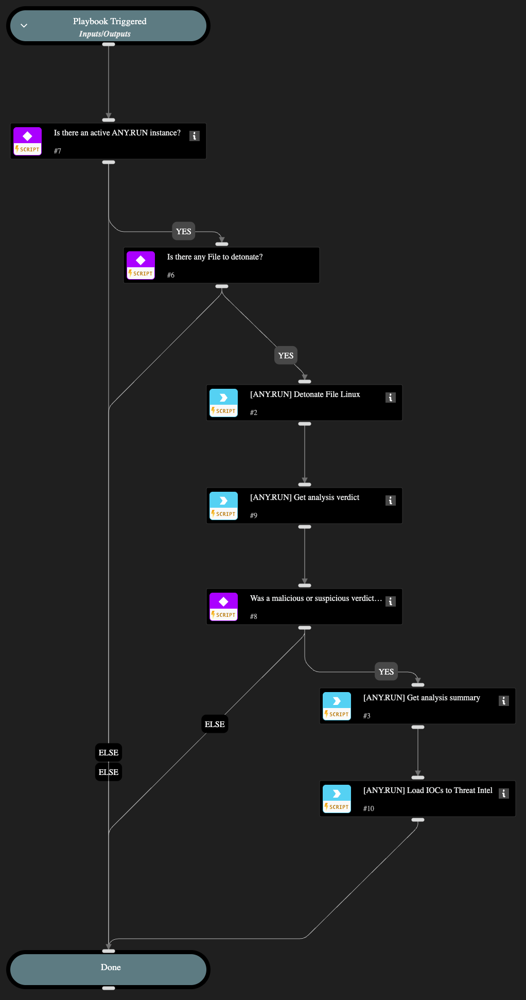

This playbook submits a file extracted from an incident attachment to the ANY.RUN cloud sandbox for dynamic analysis in an Linux environment. It helps to automate malware detonation and behavior observation on Linux OS.

## Dependencies

This playbook uses the following sub-playbooks, integrations, and scripts.

### Sub-playbooks

This playbook does not use any sub-playbooks.

### Integrations

* AnyRunSandbox

### Scripts

* IsIntegrationAvailable
* associateIndicatorsToIncident

### Commands

* anyrun-detonate-file-linux
* anyrun-get-analysis-report
* anyrun-get-analysis-verdict

## Playbook Inputs

---

| **Name** | **Description** | **Default Value** | **Required** |
| --- | --- | --- | --- |
| file | XSOAR Entry ID | ${File.EntryID} | Optional |
| run_as_root | Run file with superuser privileges | False | Optional |
| env_locale | Operation system language. Use locale identifier or country name \(Ex: "en-US" or "Brazil"\). Case insensitive. | en-US | Optional |
| env_os | Operation system | ubuntu | Optional |
| opt_network_connect | Network connection state. | True | Optional |
| opt_network_fakenet | FakeNet feature status. | False | Optional |
| opt_network_tor | TOR using. | False | Optional |
| opt_network_geo | Tor geo location option. Example: US, AU. | fastest | Optional |
| opt_network_mitm | HTTPS MITM proxy option. | False | Optional |
| opt_network_residential_proxy | Residential proxy using. | False | Optional |
| opt_network_residential_proxy_geo | Residential proxy geo location option. Example: US, AU. | fastest | Optional |
| opt_privacy_type | Privacy settings. Supports: public, bylink, owner, byteam. | bylink | Optional |
| opt_timeout | Timeout option. Size range: 10-660. | 240 | Optional |
| obj_ext_cmd | Optional command line |  | Optional |
| obj_ext_startfolder | Start object from. Supports: desktop, home, downloads, appdata, temp, windows, root | temp | Optional |
| obj_ext_extension | Change extension to valid | True | Optional |

## Playbook Outputs

---
There are no outputs for this playbook.

## Playbook Image

---

