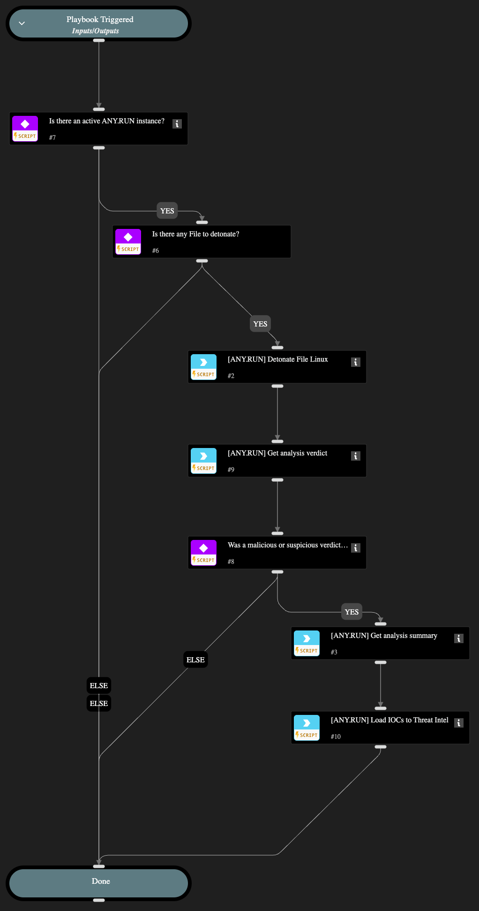

This playbook submits a file extracted from an incident attachment to the ANY.RUN cloud sandbox for dynamic analysis in an Linux environment. It helps to automate malware detonation and behavior observation on Linux OS.

## Dependencies

This playbook uses the following sub-playbooks, integrations, and scripts.

### Sub-playbooks

This playbook does not use any sub-playbooks.

### Integrations

* AnyRunSandbox

### Scripts

* GetInstances
* IsIntegrationAvailable
* Set
* associateIndicatorsToIncident

### Commands

* anyrun-detonate-file-linux
* anyrun-get-analysis-report
* anyrun-get-analysis-verdict

## Playbook Inputs

---

| **Name** | **Description** | **Default Value** | **Required** |
| --- | --- | --- | --- |
| Using | The name of the ANY.RUN Cloud Sandbox integration instance to use for running commands in this playbook. If left empty, and more than one instance is enabled, the playbook automatically selects the first active instance instead of running commands on every enabled instance. |  | Optional |
| file | The existing War Room file EntryID to submit for analysis. | ${File.EntryID} | Optional |
| run_as_root | Whether to run the file with superuser privileges. | False | Optional |
| env_locale | The operating system language. Use locale identifier or country name \(for example, "en-US" or "Brazil"\). Case insensitive. | en-US | Optional |
| env_os | The operating system. Possible values: ubuntu, debian. | ubuntu | Optional |
| opt_network_connect | Whether to enable network connection. | True | Optional |
| opt_network_fakenet | Whether to enable the FakeNet feature. | False | Optional |
| opt_network_tor | Whether to use TOR. | False | Optional |
| opt_network_geo | The TOR geo location option, for example US, AU. | fastest | Optional |
| opt_network_mitm | Whether to use the HTTPS MITM proxy. | False | Optional |
| opt_network_residential_proxy | Whether to use a residential proxy. | False | Optional |
| opt_network_residential_proxy_geo | The residential proxy geo location option, for example US, AU. | fastest | Optional |
| opt_privacy_type | The privacy settings. Supports: public, bylink, owner, byteam. | bylink | Optional |
| opt_timeout | The timeout value. Size range: 10-660. | 240 | Optional |
| obj_ext_cmd | The optional command line. |  | Optional |
| obj_ext_startfolder | The directory from which to start the file analysis. Supports: desktop, home, downloads, appdata, temp, windows, root. | temp | Optional |
| obj_ext_extension | Whether to change the extension to a valid one. | True | Optional |

## Playbook Outputs

---
| **Path** | **Description** | **Type** |
| --- | --- | --- |
| ANYRUN_DetonateFileLinux.TaskID | The ANY.RUN task UUID. | String |
| ANYRUN.SandboxAnalysisReportVerdict | The ANY.RUN verdict. | String |
| ANYRUN.IOCs | The IOCs extracted from the ANY.RUN report. | Unknown |

## Playbook Image

---

