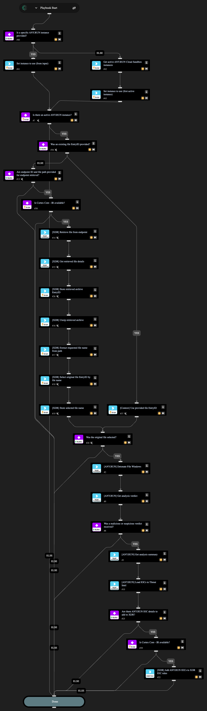

This playbook submits a file retrieved from a Cortex XDR endpoint to the ANY.RUN Cloud Sandbox for dynamic analysis in a Windows environment. It automates malware detonation and behavior observation on Windows OS.

## Dependencies

This playbook uses the following sub-playbooks, integrations, and scripts.

### Sub-playbooks

This playbook does not use any sub-playbooks.

### Integrations

* AnyRunSandbox
* Cortex Core - IR

### Scripts

* GetInstances
* IsIntegrationAvailable
* Set
* SetAndHandleEmpty
* UnzipFile

### Commands

* anyrun-detonate-file-windows
* anyrun-get-analysis-report
* anyrun-get-analysis-verdict
* core-add-indicator-rule
* core-retrieve-file-details
* core-retrieve-files

## Playbook Inputs

---

| **Name** | **Description** | **Default Value** | **Required** |
| --- | --- | --- | --- |
| Using | The name of the ANY.RUN Cloud Sandbox integration instance to use for running commands in this playbook. If left empty, and more than one instance is enabled, the playbook automatically selects the first active instance instead of running commands on every enabled instance. |  | Optional |
| file_entry_id | The existing War Room file EntryID. If provided, endpoint retrieval is skipped and this file is submitted to ANY.RUN. |  | Optional |
| endpoint_id | The Cortex XDR endpoint/agent ID. Used only when file_entry_id is not provided. | ${issue.xdmsourceagentidentifier} | Optional |
| file_path | The full path to the file on the endpoint. Used for retrieval and for extracting the filename used to select the original file after unzip. | ${issue.initiatorpath} | Optional |
| retrieve_timeout_seconds | The timeout for Cortex XDR file retrieve polling. | 240 | Optional |
| retrieve_poll_interval_seconds | The polling interval for Cortex XDR file retrieve action status checks. | 30 | Optional |
| env_locale | The operating system language. Use locale identifier or country name \(for example, "en-US" or "Brazil"\). Case insensitive. | en-US | Optional |
| env_bitness | The bitness of the operating system. Supports: 32, 64. | 64 | Optional |
| env_version | The version of the OS. Supports: 7, 10, 11. | 10 | Optional |
| env_type | The environment preset type. You can select \*\*development\*\* env for OS Windows 10 x64. For all other cases, \*\*complete\*\* env is required. | complete | Optional |
| opt_network_connect | Whether to enable network connection. | True | Optional |
| opt_network_fakenet | Whether to enable the FakeNet feature. | False | Optional |
| opt_network_tor | Whether to use TOR. | False | Optional |
| opt_network_geo | The TOR geo location option, for example US, AU. | fastest | Optional |
| opt_network_mitm | Whether to use the HTTPS MITM proxy. | False | Optional |
| opt_network_residential_proxy | Whether to use a residential proxy. | False | Optional |
| opt_network_residential_proxy_geo | The residential proxy geo location option, for example US, AU. | fastest | Optional |
| opt_privacy_type | The privacy settings. Supports: public, bylink, owner, byteam. | bylink | Optional |
| opt_timeout | The timeout value. Size range: 10-660. | 240 | Optional |
| opt_automated_interactivity | Whether to enable automated interactivity. | True | Optional |
| obj_ext_cmd | The optional command line. |  | Optional |
| obj_ext_startfolder | The directory from which to start the file analysis. Supports: desktop, home, downloads, appdata, temp, windows, root. | temp | Optional |
| obj_force_elevation | Whether to force the file to execute with elevated privileges and an elevated token \(for PE32, PE32\+, PE64 files only\). | False | Optional |
| obj_ext_extension | Whether to change the extension to a valid one. | True | Optional |

## Playbook Outputs

---
| **Path** | **Description** | **Type** |
| --- | --- | --- |
| SelectedOriginalFile.EntryID | The War Room EntryID of the selected original file sent to ANY.RUN. | String |
| SelectedOriginalFile.Name | The name of the selected original file. | String |
| ANYRUN_DetonateFileWindows.TaskID | The ANY.RUN task UUID. | String |
| ANYRUN.SandboxAnalysisReportVerdict | The ANY.RUN verdict. | String |
| ANYRUN.IOCs | The IOCs extracted from the ANY.RUN report. | Unknown |
| ANYRUN.IOCDetails | The detailed IOC objects prepared for Cortex XDR indicator rules. | Unknown |

