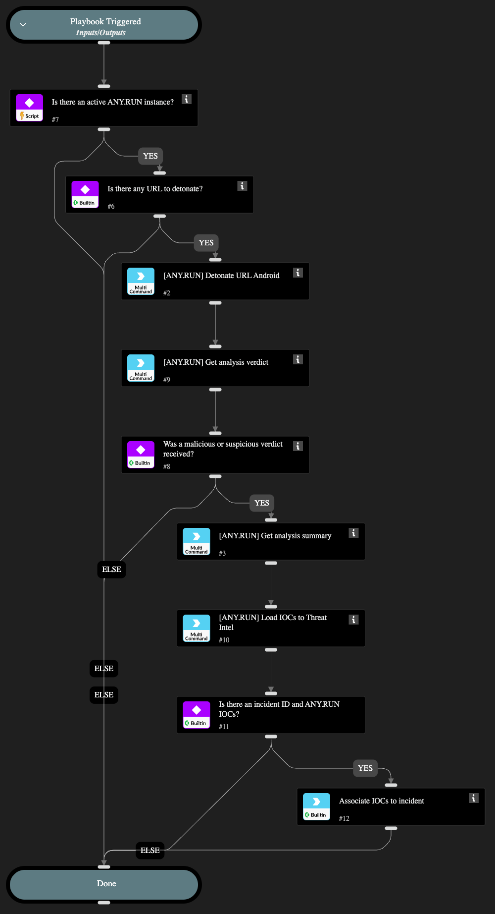

This playbook submits a URL extracted from an indicator to the ANY.RUN cloud sandbox for dynamic analysis in an Android environment. It automates the analysis of potentially malicious URLs on Android OS.

## Dependencies

This playbook uses the following sub-playbooks, integrations, and scripts.

### Sub-playbooks

This playbook does not use any sub-playbooks.

### Integrations

* AnyRunSandbox

### Scripts

* IsIntegrationAvailable
* associateIndicatorsToIncident

### Commands

* anyrun-detonate-url-android
* anyrun-get-analysis-report
* anyrun-get-analysis-verdict

## Playbook Inputs

---

| **Name** | **Description** | **Default Value** | **Required** |
| --- | --- | --- | --- |
| Using | The name of the ANY.RUN Cloud Sandbox integration instance to use for running commands in this playbook. If left empty, and more than one instance is enabled, the playbook automatically selects the first active instance instead of running the commands on every enabled instance. |  | Optional |
| obj_url | Target URL. Size range 5-512. Example: \(http/https\)://\(your-link\). | ${URL.Data} | Optional |
| env_locale | Operation system language. Use locale identifier or country name \(Ex: "en-US" or "Brazil"\). Case insensitive. | en-US | Optional |
| opt_network_connect | Network connection state. | True | Optional |
| opt_network_fakenet | FakeNet feature status. | False | Optional |
| opt_network_tor | TOR using. | False | Optional |
| opt_network_geo | Tor geo location option. Example: US, AU. | fastest | Optional |
| opt_network_mitm | HTTPS MITM proxy option. | False | Optional |
| opt_network_residential_proxy | Residential proxy using. | False | Optional |
| opt_network_residential_proxy_geo | Residential proxy geo location option. Example: US, AU. | fastest | Optional |
| opt_privacy_type | Privacy settings. Supports: public, bylink, owner, byteam. | bylink | Optional |
| opt_timeout | Timeout option. Size range: 10-660. | 120 | Optional |

## Playbook Outputs

---
There are no outputs for this playbook.

## Playbook Image

---

