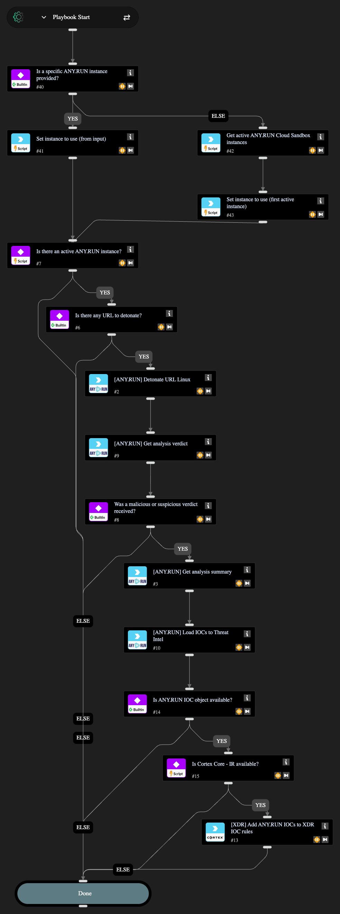

This playbook submits a URL from a Cortex XDR issue to the ANY.RUN Cloud Sandbox for dynamic analysis in a Linux environment. It helps to automate malware detonation and behavior observation on Linux OS.

## Dependencies

This playbook uses the following sub-playbooks, integrations, and scripts.

### Sub-playbooks

This playbook does not use any sub-playbooks.

### Integrations

* AnyRunSandbox
* Cortex Core - IR

### Scripts

* GetInstances
* IsIntegrationAvailable
* Set

### Commands

* anyrun-detonate-url-linux
* anyrun-get-analysis-report
* anyrun-get-analysis-verdict
* core-add-indicator-rule

## Playbook Inputs

---

| **Name** | **Description** | **Default Value** | **Required** |
| --- | --- | --- | --- |
| Using | The name of the ANY.RUN Cloud Sandbox integration instance to use for running commands in this playbook. If left empty, and more than one instance is enabled, the playbook automatically selects the first active instance instead of running commands on every enabled instance. |  | Optional |
| obj_url | The target URL to submit to ANY.RUN. By default, this playbook uses the Cortex XDR normalized target URL field xdm.target.url \(${issue.xdmtargeturl}\). If your issue uses another URL field, such as xdm.network.http.url, override this input accordingly. Size range 5-512. Example: \(http/https\)://\(your-link\). | ${issue.xdmtargeturl} | Optional |
| env_locale | The operating system language. Use locale identifier or country name \(for example, "en-US" or "Brazil"\). Case insensitive. | en-US | Optional |
| env_os | The operating system. Possible values: ubuntu, debian. | ubuntu | Optional |
| opt_network_connect | Whether to enable network connection. | True | Optional |
| opt_network_fakenet | Whether to enable the FakeNet feature. | False | Optional |
| opt_network_tor | Whether to use TOR. | False | Optional |
| opt_network_geo | The TOR geo location option, for example US, AU. | fastest | Optional |
| opt_network_mitm | Whether to use the HTTPS MITM proxy. | False | Optional |
| opt_network_residential_proxy | Whether to use a residential proxy. | False | Optional |
| opt_network_residential_proxy_geo | The residential proxy geo location option, for example US, AU. | fastest | Optional |
| opt_privacy_type | The privacy settings. Supports: public, bylink, owner, byteam. | bylink | Optional |
| opt_timeout | The timeout value. Size range: 10-660. | 120 | Optional |
| obj_ext_browser | The browser name. Supports: Google Chrome, Mozilla Firefox. | Google Chrome | Optional |
| obj_ext_extension | Whether to change the extension to a valid one. | True | Optional |

## Playbook Outputs

---
| **Path** | **Description** | **Type** |
| --- | --- | --- |
| ANYRUN_DetonateUrlLinux.TaskID | The ANY.RUN task UUID. | String |
| ANYRUN.SandboxAnalysisReportVerdict | The ANY.RUN verdict. | String |
| ANYRUN.IOCs | The IOCs extracted from the ANY.RUN report. | Unknown |
| ANYRUN.IOCDetails | The detailed IOC objects prepared for Cortex XDR indicator rules. | Unknown |

