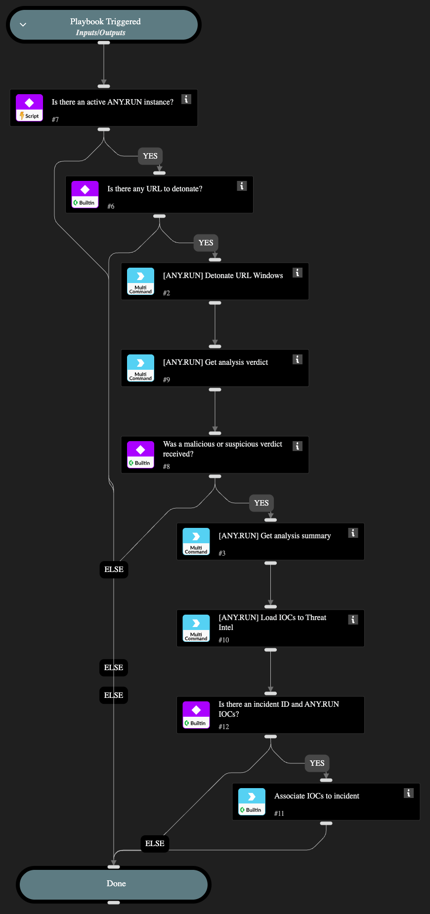

This playbook submits a URL extracted from an indicator to the ANY.RUN cloud sandbox for dynamic analysis in an Windows environment. It automates the analysis of potentially malicious URLs on Windows OS.

## Dependencies

This playbook uses the following sub-playbooks, integrations, and scripts.

### Sub-playbooks

This playbook does not use any sub-playbooks.

### Integrations

* AnyRunSandbox

### Scripts

* GetInstances
* IsIntegrationAvailable
* Set
* associateIndicatorsToIncident

### Commands

* anyrun-detonate-url-windows
* anyrun-get-analysis-report
* anyrun-get-analysis-verdict

## Playbook Inputs

---

| **Name** | **Description** | **Default Value** | **Required** |
| --- | --- | --- | --- |
| Using | The name of the ANY.RUN Cloud Sandbox integration instance to use for running commands in this playbook. If left empty, and more than one instance is enabled, the playbook automatically selects the first active instance instead of running commands on every enabled instance. |  | Optional |
| obj_url | The target URL. Size range 5-512. Example: \(http/https\)://\(your-link\). | ${URL.Data} | Optional |
| env_locale | The operating system language. Use locale identifier or country name \(for example, "en-US" or "Brazil"\). Case insensitive. | en-US | Optional |
| env_bitness | The bitness of the operating system. Supports: 32, 64. | 64 | Optional |
| env_version | The version of the OS. Supports: 7, 10, 11. | 10 | Optional |
| env_type | The environment preset type. You can select \*\*development\*\* env for OS Windows 10 x64. For all other cases, \*\*complete\*\* env is required. | complete | Optional |
| opt_network_connect | Whether to enable network connection. | True | Optional |
| opt_network_fakenet | Whether to enable the FakeNet feature. | False | Optional |
| opt_network_tor | Whether to use TOR. | False | Optional |
| opt_network_geo | The TOR geo location option, for example US, AU. | fastest | Optional |
| opt_network_mitm | Whether to use the HTTPS MITM proxy. | False | Optional |
| opt_network_residential_proxy | Whether to use a residential proxy. | False | Optional |
| opt_network_residential_proxy_geo | The residential proxy geo location option, for example US, AU. | fastest | Optional |
| opt_privacy_type | The privacy settings. Supports: public, bylink, owner, byteam. | bylink | Optional |
| opt_timeout | The timeout value. Size range: 10-660. | 120 | Optional |
| opt_automated_interactivity | Whether to enable automated interactivity. | True | Optional |
| obj_ext_browser | The browser name. Supports: Google Chrome, Mozilla Firefox, Internet Explorer, Microsoft Edge. | Google Chrome | Optional |
| obj_ext_extension | Whether to change the extension to a valid one. | True | Optional |

## Playbook Outputs

---
| **Path** | **Description** | **Type** |
| --- | --- | --- |
| ANYRUN_DetonateUrlWindows.TaskID | The ANY.RUN task UUID. | String |
| ANYRUN.SandboxAnalysisReportVerdict | The ANY.RUN verdict. | String |
| ANYRUN.IOCs | The IOCs extracted from the ANY.RUN report. | Unknown |

## Playbook Image

---

