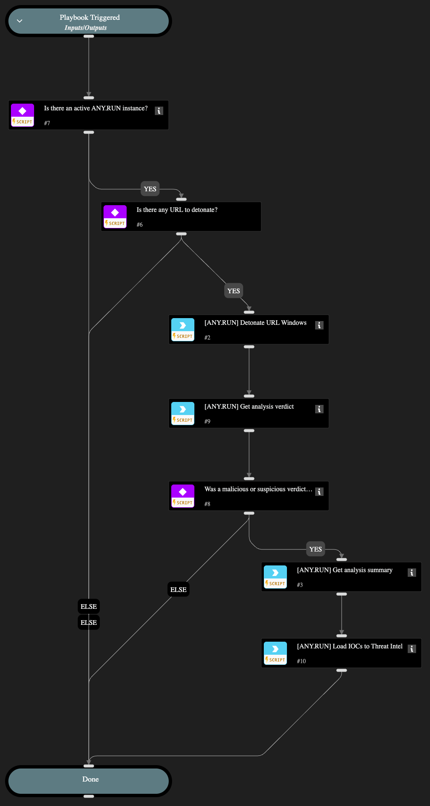

This playbook submits a URL extracted from an indicator to the ANY.RUN cloud sandbox for dynamic analysis in an Windows environment. It automates the analysis of potentially malicious URLs on Windows OS.

## Dependencies

This playbook uses the following sub-playbooks, integrations, and scripts.

### Sub-playbooks

This playbook does not use any sub-playbooks.

### Integrations

* AnyRunSandbox

### Scripts

* IsIntegrationAvailable

### Commands

* anyrun-detonate-url-windows
* anyrun-get-analysis-report
* anyrun-get-analysis-verdict

## Playbook Inputs

---

| **Name** | **Description** | **Default Value** | **Required** |
| --- | --- | --- | --- |
| obj_url | Target URL. Size range 5-512. Example: \(http/https\)://\(your-link\) | ${URL.Data} | Optional |
| env_locale | Operation system language. Use locale identifier or country name \(Ex: "en-US" or "Brazil"\). Case insensitive. | en-US | Optional |
| env_bitness | Bitness of Operation System. Supports 32, 64 | 64 | Optional |
| env_version | Version of OS. Supports: 7, 10, 11 | 10 | Optional |
| env_type | Environment preset type. You can select \*\*development\*\* env for OS Windows 10 x64. For all other cases, \*\*complete\*\* env is required | complete | Optional |
| opt_network_connect | Network connection state. | True | Optional |
| opt_network_fakenet | FakeNet feature status. | False | Optional |
| opt_network_tor | TOR using. | False | Optional |
| opt_network_geo | Tor geo location option. Example: US, AU. | fastest | Optional |
| opt_network_mitm | HTTPS MITM proxy option. | False | Optional |
| opt_network_residential_proxy | Residential proxy using. | False | Optional |
| opt_network_residential_proxy_geo | Residential proxy geo location option. Example: US, AU. | fastest | Optional |
| opt_privacy_type | Privacy settings. Supports: public, bylink, owner, byteam. | bylink | Optional |
| opt_timeout | Timeout option. Size range: 10-660. | 60 | Optional |
| obj_ext_browser | Browser name. Supports: Google Chrome, Mozilla Firefox, Internet Explorer, Microsoft Edge | Google Chrome | Optional |
| obj_ext_extension | Change extension to valid | True | Optional |

## Playbook Outputs

---
There are no outputs for this playbook.

## Playbook Image

---

