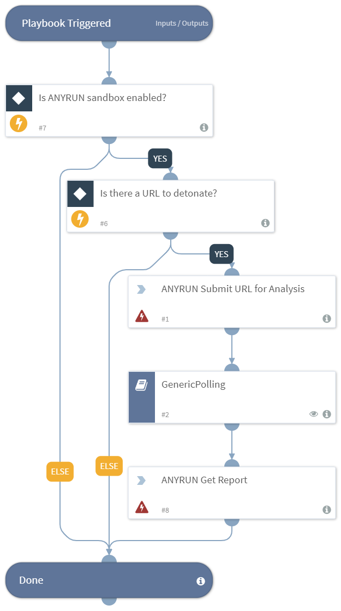

Detonates one or more URLs using the `ANYRUN` sandbox integration.
Returns relevant reports to the War Room and URL reputations to the context data.

## Dependencies
This playbook uses the following sub-playbooks, integrations, and scripts.

### Sub-playbooks
* GenericPolling

### Integrations
* ANYRUN

### Scripts
This playbook does not use any scripts.

### Commands
* anyrun-run-analysis
* anyrun-get-report

## Playbook Inputs
---

| **Name** | **Description** | **Default Value** | **Source** | **Required** |
| --- | --- | --- | --- | --- |
| URL | The URL to detonate. | None | URL | Optional |
| Interval | The duration for executing the pooling (in minutes). | 1 | - | Optional |
| Timeout | The duration after which to stop pooling and to resume the playbook (in minutes). | 15 | - | Optional |

## Playbook Outputs
---

| **Path** | **Description** | **Type** |
| --- | --- | --- |
| ANYRUN.Task.AnalysisDate | The date and time the analysis was executed. | String |
| ANYRUN.Task.Behavior.Category | The category of a process behavior. | String |
| ANYRUN.Task.Behavior.Action | The actions performed by a process. | String |
| ANYRUN.Task.Behavior.ThreatLevel | The threat score associated with a process behavior. | Number |
| ANYRUN.Task.Behavior.ProcessUUID | The unique ID of the process whose behaviors are being profiled. | String |
| ANYRUN.Task.Connection.Reputation | The connection reputation. | String |
| ANYRUN.Task.Connection.ProcessUUID | The ID of the process that created the connection. | String |
| ANYRUN.Task.Connection.ASN | The connection autonomous system network. | String |
| ANYRUN.Task.Connection.Country | The connection country. | String |
| ANYRUN.Task.Connection.Protocol | The connection protocol. | String |
| ANYRUN.Task.Connection.Port | The connection port number. | Number |
| ANYRUN.Task.Connection.IP | The connection IP address number. | String |
| ANYRUN.Task.DnsRequest.Reputation | The reputation of the DNS request. | String |
| ANYRUN.Task.DnsRequest.IP | The IP addresses associated with a DNS request. | Unknown |
| ANYRUN.Task.DnsRequest.Domain | The domain resolution of a DNS request. | String |
| ANYRUN.Task.Threat.ProcessUUID | The unique process ID from where the threat originated. | String |
| ANYRUN.Task.Threat.Msg | The threat message. | String |
| ANYRUN.Task.Threat.Class | The class of the threat. | String |
| ANYRUN.Task.Threat.SrcPort | The port on which the threat originated. | Number |
| ANYRUN.Task.Threat.DstPort | The destination port of the threat. | Number |
| ANYRUN.Task.Threat.SrcIP | The source IP address where the threat originated. | String |
| ANYRUN.Task.Threat.DstIP | The destination IP address of the threat. | String |
| ANYRUN.Task.HttpRequest.Reputation | The reputation of the HTTP request. | String |
| ANYRUN.Task.HttpRequest.Country | The HTTP request country. | String |
| ANYRUN.Task.HttpRequest.ProcessUUID | The ID of the process making the HTTP request. | String |
| ANYRUN.Task.HttpRequest.Body | The HTTP request body parameters and details. | Unknown |
| ANYRUN.Task.HttpRequest.HttpCode | The HTTP request response code. | Number |
| ANYRUN.Task.HttpRequest.Status | The status of the HTTP request. | String |
| ANYRUN.Task.HttpRequest.ProxyDetected | Whether the HTTP request was made through a proxy. | Boolean |
| ANYRUN.Task.HttpRequest.Port | The HTTP request port. | Number |
| ANYRUN.Task.HttpRequest.IP | The HTTP request IP address. | String |
| ANYRUN.Task.HttpRequest.URL | The HTTP request URL. | String |
| ANYRUN.Task.HttpRequest.Host | The HTTP request host. | String |
| ANYRUN.Task.HttpRequest.Method | The HTTP request method type. | String |
| ANYRUN.Task.FileInfo | The details of the submitted file. | String |
| ANYRUN.Task.OS | The OS of the sandbox in which the file was analyzed. | String |
| ANYRUN.Task.ID | The unique ID of the task. | String |
| ANYRUN.Task.MIME | The MIME of the file submitted for analysis. | String |
| ANYRUN.Task.Verdict | The `ANY.RUN` verdict for the maliciousness of the submitted file or URL. | String |
| ANYRUN.Task.Process.FileName | The file name of the process. | String |
| ANYRUN.Task.Process.PID | The process identification number. | Number |
| ANYRUN.Task.Process.PPID | The parent process identification number. | Number |
| ANYRUN.Task.Process.ProcessUUID | The unique process ID (used by `ANY.RUN`). | String |
| ANYRUN.Task.Process.CMD | The process command. | String |
| ANYRUN.Task.Process.Path | The path of the executed command. | String |
| ANYRUN.Task.Process.User | The user who executed the command. | String |
| ANYRUN.Task.Process.IntegrityLevel | The process integrity level. | String |
| ANYRUN.Task.Process.ExitCode | The process exit code. | Number |
| ANYRUN.Task.Process.MainProcess | Whether the process is the main process. | Boolean |
| ANYRUN.Task.Process.Version.Company | The company responsible for the program executed. | String |
| ANYRUN.Task.Process.Version.Description | The description of the type of program. | String |
| ANYRUN.Task.Process.Version.Version | The version of the program executed. | String |
| DBotScore.Indicator | The indicator that was tested. | String |
| DBotScore.Score | The actual score. | Number |
| DBotScore.Type | The type of indicator. | String |
| DBotScore.Vendor | The vendor used to calculate the score. | String |
| URL.Data | The URL data. | String |
| URL.Malicious.Vendor | The vendor that made the decision that the URL is malicious. | String |
| URL.Malicious.Description | Tthe reason that the vendor made the decision that the URL is malicious. | String |
| ANYRUN.Task.Status | The task analysis status. | String |

## Playbook Image
---

