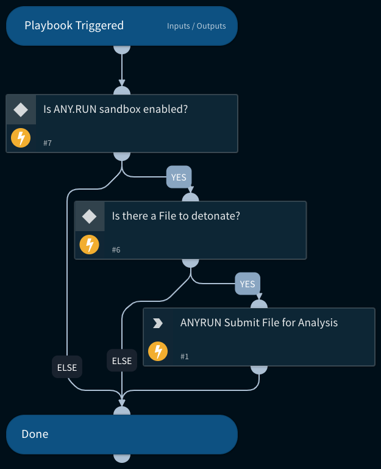

Detonates one or more files using the ANYRUN sandbox integration.
Returns relevant reports to the War Room and file reputations to the context data.
All file types are supported.

## Dependencies
This playbook uses the following sub-playbooks, integrations, and scripts.

### Sub-playbooks
This playbook does not use any sub-playbooks.

### Integrations
* ANYRUN

### Scripts
This playbook does not use any scripts.

### Commands
* anyrun-run-analysis

## Playbook Inputs
---

| **Name** | **Description** | **Default Value** | **Required** |
| --- | --- | --- | --- |
| File | File object of the file to detonate. The File is taken from the context. | File.None | Optional |
| Interval | Duration for executing the polling \(in seconds\) | 20 | Optional |
| Timeout | The duration after which to stop polling and to resume the playbook \(in seconds\) | 1300 | Optional |

## Playbook Outputs
---

| **Path** | **Description** | **Type** |
| --- | --- | --- |
| ANYRUN.Task.AnalysisDate | Date and time the analysis was executed. | String |
| ANYRUN.Task.Behavior.Category | Category of a process behavior. | String |
| ANYRUN.Task.Behavior.Action | Actions performed by a process. | String |
| ANYRUN.Task.Behavior.ThreatLevel | Threat score associated with a process behavior. | Number |
| ANYRUN.Task.Behavior.ProcessUUID | Unique ID of the process whose behaviors are being profiled. | String |
| ANYRUN.Task.Connection.Reputation | Connection reputation. | String |
| ANYRUN.Task.Connection.ProcessUUID | ID of the process that created the connection. | String |
| ANYRUN.Task.Connection.ASN | Connection autonomous system network. | String |
| ANYRUN.Task.Connection.Country | Connection country. | String |
| ANYRUN.Task.Connection.Protocol | Connection protocol. | String |
| ANYRUN.Task.Connection.Port | Connection port number. | Number |
| ANYRUN.Task.Connection.IP | Connection IP number. | String |
| ANYRUN.Task.DnsRequest.Reputation | Reputation of the DNS request. | String |
| ANYRUN.Task.DnsRequest.IP | IP addresses associated with a DNS request. | Unknown |
| ANYRUN.Task.DnsRequest.Domain | Domain resolution of a DNS request. | String |
| ANYRUN.Task.Threat.ProcessUUID | Unique process ID from where the threat originated. | String |
| ANYRUN.Task.Threat.Msg | Threat message. | String |
| ANYRUN.Task.Threat.Class | Class of the threat. | String |
| ANYRUN.Task.Threat.SrcPort | Port on which the threat originated. | Number |
| ANYRUN.Task.Threat.DstPort | Destination port of the threat. | Number |
| ANYRUN.Task.Threat.SrcIP | Source IP address where the threat originated. | String |
| ANYRUN.Task.Threat.DstIP | Destination IP address of the threat. | String |
| ANYRUN.Task.HttpRequest.Reputation | Reputation of the HTTP request. | String |
| ANYRUN.Task.HttpRequest.Country | HTTP request country. | String |
| ANYRUN.Task.HttpRequest.ProcessUUID | ID of the process making the HTTP request. | String |
| ANYRUN.Task.HttpRequest.Body | HTTP request body parameters and details. | Unknown |
| ANYRUN.Task.HttpRequest.HttpCode | HTTP request response code. | Number |
| ANYRUN.Task.HttpRequest.Status | Status of the HTTP request. | String |
| ANYRUN.Task.HttpRequest.ProxyDetected | Whether the HTTP request was made through a proxy. | Boolean |
| ANYRUN.Task.HttpRequest.Port | HTTP request port. | Number |
| ANYRUN.Task.HttpRequest.IP | HTTP request IP address. | String |
| ANYRUN.Task.HttpRequest.URL | HTTP request URL. | String |
| ANYRUN.Task.HttpRequest.Host | HTTP request host. | String |
| ANYRUN.Task.HttpRequest.Method | HTTP request method type. | String |
| ANYRUN.Task.FileInfo | Details of the submitted file. | String |
| ANYRUN.Task.OS | OS of the sandbox in which the file was analyzed. | String |
| ANYRUN.Task.ID | The unique ID of the task. | String |
| ANYRUN.Task.MIME | The MIME of the file submitted for analysis. | String |
| ANYRUN.Task.MD5 | The MD5 hash of the file submitted for analysis. | String |
| ANYRUN.Task.SHA1 | The SHA1 hash of the file submitted for analysis. | String |
| ANYRUN.Task.SHA256 | The SHA256 hash of the file submitted for analysis. | String |
| ANYRUN.Task.SSDeep | SSDeep hash of the file submitted for analysis. | String |
| ANYRUN.Task.Verdict | ANY.RUN verdict for the maliciousness of the submitted file or URL. | String |
| ANYRUN.Task.Process.FileName | File name of the process. | String |
| ANYRUN.Task.Process.PID | Process identification number. | Number |
| ANYRUN.Task.Process.PPID | Parent process identification number. | Number |
| ANYRUN.Task.Process.ProcessUUID | Unique process ID \(used by ANY.RUN\). | String |
| ANYRUN.Task.Process.CMD | Process command. | String |
| ANYRUN.Task.Process.Path | Path of the executed command. | String |
| ANYRUN.Task.Process.User | User who executed the command. | String |
| ANYRUN.Task.Process.IntegrityLevel | The process integrity level. | String |
| ANYRUN.Task.Process.ExitCode | Process exit code. | Number |
| ANYRUN.Task.Process.MainProcess | Whether the process is the main process. | Boolean |
| ANYRUN.Task.Process.Version.Company | Company responsible for the program executed. | String |
| ANYRUN.Task.Process.Version.Description | Description of the type of program. | String |
| ANYRUN.Task.Process.Version.Version | Version of the program executed. | String |
| DBotScore.Indicator | The indicator that was tested. | String |
| DBotScore.Score | The actual score. | Number |
| DBotScore.Type | Type of indicator. | String |
| DBotScore.Vendor | Vendor used to calculate the score. | String |
| File.Extension | Extension of the file submitted for analysis. | String |
| File.Name | The name of the file submitted for analysis. | String |
| File.MD5 | MD5 hash of the file submitted for analysis. | String |
| File.SHA1 | SHA1 hash of the file submitted for analysis. | String |
| File.SHA256 | SHA256 hash of the file submitted for analysis. | String |
| File.SSDeep | SSDeep hash of the file submitted for analysis. | String |
| File.Malicious.Vendor | For malicious files, the vendor that made the decision. | String |
| File.Malicious.Description | For malicious files, the reason that the vendor made the decision. | String |
| ANYRUN.Task.Status | Task analysis status. | String |

## Playbook Image
---
