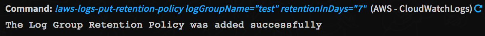
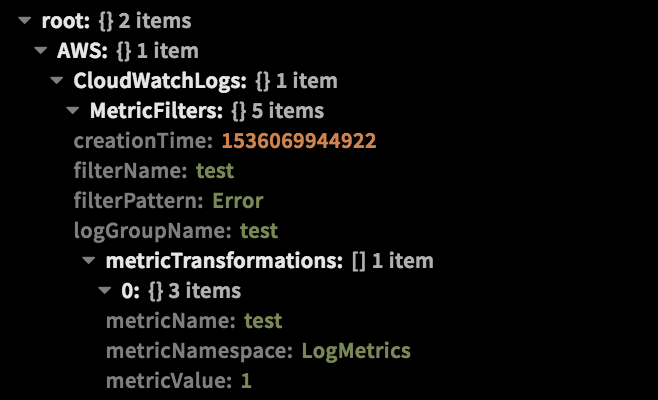

<!-- HTML_DOC -->

Use the AWS CloudWatch Logs integration to monitor, store, and access your log files from AWS Elastic Compute Cloud (Amazon EC2) instances, AWS CloudTrail, AWS Route 53, and other sources. You can then retrieve the associated log data from CloudWatch Logs. For more information see the <a href="https://docs.aws.amazon.com/AmazonCloudWatch/latest/logs/WhatIsCloudWatchLogs.html" rel="nofollow">CloudWatch documentation</a>.

For detailed instructions about setting up authentication, see: <a href="https://xsoar.pan.dev/docs/reference/articles/aws-integrations---authentication">AWS Integrations - Authentication</a>.

<h2>Configure the AWS Cloud Watch Logs Integration on Cortex XSOAR</h2>
<ol>
<li>Navigate to <strong>Settings</strong> &gt; <strong>Integrations</strong> &gt; <strong>Servers &amp; Services</strong>.</li>
<li>Search for AWS - CloudWatchLogs.</li>
<li>Click <strong>Add instance</strong> to create and configure a new integration instance. 
<ul>
<li>
<strong>Name</strong>: a textual name for the integration instance.</li>
<li><strong>Default Region</strong></li>
<li><strong>Role Arn</strong></li>
<li><strong>Role Session Name</strong></li>
<li><strong>Role Session Duration</strong></li>
<li><strong>Access Key</strong></li>
<li><strong>Secret key</strong></li>
<li><strong>Timeout</strong></li>
<li><strong>Retries</strong></li>
</ul>
</li>
<li>Click <strong>Test</strong> to validate the URLs, token, and connection.</li>
</ol>
<h2>Commands</h2>

You can execute these commands from the Cortex XSOAR CLI, as part of an automation, or in a playbook. After you successfully execute a command, a DBot message appears in the War Room with the command details.

<ol>
<li><a href="#h_97524814141539170450412">Create a log group: aws-logs-create-log-group</a></li>
<li><a href="#h_5057555411231539170456210">Create a log stream: aws-logs-create-log-stream</a></li>
<li><a href="#h_6610132052411539170462177">Delete a log group: aws-logs-delete-log-group</a></li>
<li><a href="#h_6794234493581539170468577">Delete a log stream: aws-logs-delete-log-stream</a></li>
<li><a href="#h_6369265584741539170476181">Get a list of log events: aws-logs-filter-log-events</a></li>
<li><a href="#h_3857347865901539170482677">Get a list of log groups: aws-logs-describe-log-groups</a></li>
<li><a href="#h_1980862417051539170491449">Get a list of log streams: aws-logs-describe-log-streams</a></li>
<li><a href="#h_5016742518191539170499700">Assign a retention policy for a log group: aws-logs-put-retention-policy</a></li>
<li><a href="#h_2248133599311539170508332">Delete a retention policy: aws-logs-delete-retention-policy</a></li>
<li><a href="#h_48298123210421539170515290">Upload log events to a log stream: aws-logs-put-log-events</a></li>
<li><a href="#h_34162922711531539170522887">Create or modify a metric filter: aws-logs-put-metric-filter</a></li>
<li><a href="#h_48620941212621539170533774">Delete a metric filter: aws-logs-delete-metric-filter</a></li>
<li><a href="#h_44862796213701539170540253">Get a list of metric filters: aws-logs-describe-metric-filters</a></li>
</ol>
<h3 id="h_97524814141539170450412">1. Create a log group</h3>

Creates a log group with the specified name.

<h5>Base Command</h5>

<code>aws-logs-create-log-group</code>

<h5>Input</h5>
<table style="width: 748px;" border="2" cellpadding="6">
<thead>
<tr>
<th style="width: 143px;"><strong>Argument Name</strong></th>
<th style="width: 494px;"><strong>Description</strong></th>
<th style="width: 71px;"><strong>Required</strong></th>
</tr>
</thead>
<tbody>
<tr>
<td style="width: 143px;">logGroupName</td>
<td style="width: 494px;">The name of the log group.</td>
<td style="width: 71px;">Required</td>
</tr>
<tr>
<td style="width: 143px;">kmsKeyId</td>
<td style="width: 494px;">The Amazon Resource Name (ARN) of the CMK to use when encrypting log data.</td>
<td style="width: 71px;">Optional</td>
</tr>
<tr>
<td style="width: 143px;">region</td>
<td style="width: 494px;">The AWS Region, if not specified the default region will be used.</td>
<td style="width: 71px;">Optional</td>
</tr>
<tr>
<td style="width: 143px;">roleArn</td>
<td style="width: 494px;">The Amazon Resource Name (ARN) of the role to assume.</td>
<td style="width: 71px;">Optional</td>
</tr>
<tr>
<td style="width: 143px;">roleSessionName</td>
<td style="width: 494px;">An identifier for the assumed role session.</td>
<td style="width: 71px;">Optional</td>
</tr>
<tr>
<td style="width: 143px;">roleSessionDuration</td>
<td style="width: 494px;">The duration, in seconds, of the role session. The value can range from 900 seconds (15 minutes) up to the maximum session duration setting for the role.</td>
<td style="width: 71px;">Optional</td>
</tr>
</tbody>
</table>

 

<h5>Context Output</h5>

There is no context output for this command.

<h5>Command Example</h5>
<pre>!aws-logs-create-log-group logGroupName=test</pre>
<h5>Context Example</h5>

There is no context output for this command.

<h5>Human Readable Output</h5>

<h3 id="h_5057555411231539170456210">2. Create a log stream</h3>

Creates a log stream for the specified log group.

<h5>Base Command</h5>

<code>aws-logs-create-log-stream</code>

<h5>Input</h5>
<table style="width: 748px;" border="2" cellpadding="6">
<thead>
<tr>
<th style="width: 145px;"><strong>Argument Name</strong></th>
<th style="width: 492px;"><strong>Description</strong></th>
<th style="width: 71px;"><strong>Required</strong></th>
</tr>
</thead>
<tbody>
<tr>
<td style="width: 145px;">logGroupName</td>
<td style="width: 492px;">The name of the log group.</td>
<td style="width: 71px;">Required</td>
</tr>
<tr>
<td style="width: 145px;">logStreamName</td>
<td style="width: 492px;">The name of the log stream.</td>
<td style="width: 71px;">Required</td>
</tr>
<tr>
<td style="width: 145px;">region</td>
<td style="width: 492px;">The AWS Region, if not specified the default region will be used.</td>
<td style="width: 71px;">Optional</td>
</tr>
<tr>
<td style="width: 145px;">roleArn</td>
<td style="width: 492px;">The Amazon Resource Name (ARN) of the role to assume.</td>
<td style="width: 71px;">Optional</td>
</tr>
<tr>
<td style="width: 145px;">roleSessionName</td>
<td style="width: 492px;">An identifier for the assumed role session.</td>
<td style="width: 71px;">Optional</td>
</tr>
<tr>
<td style="width: 145px;">roleSessionDuration</td>
<td style="width: 492px;">The duration, in seconds, of the role session. The value can range from 900 seconds (15 minutes) up to the maximum session duration setting for the role.</td>
<td style="width: 71px;">Optional</td>
</tr>
</tbody>
</table>

 

<h5>Context Output</h5>

There is no context output for this command.

<h5>Command Example</h5>
<pre>!aws-logs-create-log-stream logGroupName=test logStreamName=test</pre>
<h5>Context Example</h5>

There is no context output for this command.

<h5>Human Readable Output</h5>

<h3 id="h_6610132052411539170462177">3. Delete a log group</h3>

Deletes the specified log group and permanently deletes all the archived log events associated with the log group.

<h5>Base Command</h5>

<code>aws-logs-delete-log-group</code>

<h5>Input</h5>
<table style="width: 748px;" border="2" cellpadding="6">
<thead>
<tr>
<th style="width: 145px;"><strong>Argument Name</strong></th>
<th style="width: 492px;"><strong>Description</strong></th>
<th style="width: 71px;"><strong>Required</strong></th>
</tr>
</thead>
<tbody>
<tr>
<td style="width: 145px;">logGroupName</td>
<td style="width: 492px;">The name of the log group.</td>
<td style="width: 71px;">Required</td>
</tr>
<tr>
<td style="width: 145px;">region</td>
<td style="width: 492px;">The AWS Region, if not specified the default region will be used.</td>
<td style="width: 71px;">Optional</td>
</tr>
<tr>
<td style="width: 145px;">roleArn</td>
<td style="width: 492px;">The Amazon Resource Name (ARN) of the role to assume.</td>
<td style="width: 71px;">Optional</td>
</tr>
<tr>
<td style="width: 145px;">roleSessionName</td>
<td style="width: 492px;">An identifier for the assumed role session.</td>
<td style="width: 71px;">Optional</td>
</tr>
<tr>
<td style="width: 145px;">roleSessionDuration</td>
<td style="width: 492px;">The duration, in seconds, of the role session. The value can range from 900 seconds (15 minutes) up to the maximum session duration setting for the role.</td>
<td style="width: 71px;">Optional</td>
</tr>
</tbody>
</table>

 

<h5>Context Output</h5>

There is no context output for this command.

<h5>Command Example</h5>
<pre>!aws-logs-delete-log-group logGroupName=test</pre>
<h5>Context Example</h5>

There is no context output for this command.

<h5>Human Readable Output</h5>

<h3 id="h_6794234493581539170468577">4. Delete a log stream</h3>

Deletes the specified log stream and permanently deletes all the archived log events associated with the log stream.

<h5>Base Command</h5>

<code>aws-logs-delete-log-stream</code>

<h5>Input</h5>
<table style="width: 748px;" border="2" cellpadding="6">
<thead>
<tr>
<th style="width: 145px;"><strong>Argument Name</strong></th>
<th style="width: 492px;"><strong>Description</strong></th>
<th style="width: 71px;"><strong>Required</strong></th>
</tr>
</thead>
<tbody>
<tr>
<td style="width: 145px;">logGroupName</td>
<td style="width: 492px;">The name of the log group.</td>
<td style="width: 71px;">Required</td>
</tr>
<tr>
<td style="width: 145px;">logStreamName</td>
<td style="width: 492px;">The name of the log stream.</td>
<td style="width: 71px;">Required</td>
</tr>
<tr>
<td style="width: 145px;">region</td>
<td style="width: 492px;">The AWS Region, if not specified the default region will be used.</td>
<td style="width: 71px;">Optional</td>
</tr>
<tr>
<td style="width: 145px;">roleArn</td>
<td style="width: 492px;">The Amazon Resource Name (ARN) of the role to assume.</td>
<td style="width: 71px;">Optional</td>
</tr>
<tr>
<td style="width: 145px;">roleSessionName</td>
<td style="width: 492px;">An identifier for the assumed role session.</td>
<td style="width: 71px;">Optional</td>
</tr>
<tr>
<td style="width: 145px;">roleSessionDuration</td>
<td style="width: 492px;">The duration, in seconds, of the role session. The value can range from 900 seconds (15 minutes) up to the maximum session duration setting for the role.</td>
<td style="width: 71px;">Optional</td>
</tr>
</tbody>
</table>

 

Context Output

There is no context output for this command.

<h5>Command Example</h5>
<pre>!aws-logs-delete-log-stream logGroupName=test logStreamName=test</pre>
<h5>Context Example</h5>

There is no context output for this command.

<h5>Human Readable Output</h5>

<h3 id="h_6369265584741539170476181">5. Get list of log events</h3>

Lists log events from the specified log group. You can list all the log events or filter the results using a filter pattern, a time range, and the name of the log stream.

<h5>Base Command</h5>

<code>aws-logs-filter-log-events</code>

<h5>Input</h5>
<table style="width: 748px;" border="2" cellpadding="6">
<thead>
<tr>
<th style="width: 145px;"><strong>Argument Name</strong></th>
<th style="width: 492px;"><strong>Description</strong></th>
<th style="width: 71px;"><strong>Required</strong></th>
</tr>
</thead>
<tbody>
<tr>
<td style="width: 145px;">logGroupName</td>
<td style="width: 492px;">The name of the log group.</td>
<td style="width: 71px;">Required</td>
</tr>
<tr>
<td style="width: 145px;">logStreamNames</td>
<td style="width: 492px;">Optional list of log stream names. Separated by comma.</td>
<td style="width: 71px;">Optional</td>
</tr>
<tr>
<td style="width: 145px;">startTime</td>
<td style="width: 492px;">The start of the time range, expressed as the number of milliseconds after Jan 1, 1970 00:00:00 UTC (Unix Time). Events with a time stamp before this time are not returned.</td>
<td style="width: 71px;">Optional</td>
</tr>
<tr>
<td style="width: 145px;">endTime</td>
<td style="width: 492px;">The end of the time range, expressed as the number of milliseconds after Jan 1, 1970 00:00:00 UTC (Unix Time). Events with a time stamp later than this time are not returned.</td>
<td style="width: 71px;">Optional</td>
</tr>
<tr>
<td style="width: 145px;">filterPattern</td>
<td style="width: 492px;">The filter pattern to use. If not provided, all the events are matched.</td>
<td style="width: 71px;">Optional</td>
</tr>
<tr>
<td style="width: 145px;">limit</td>
<td style="width: 492px;">The maximum number of events to return. The default is 10,000 events.</td>
<td style="width: 71px;">Optional</td>
</tr>
<tr>
<td style="width: 145px;">interleaved</td>
<td style="width: 492px;">If the value is true, the operation makes a best effort to provide responses that contain events from multiple log streams within the log group, interleaved in a single response. If the value is false, all the matched log events in the first log stream are searched first, then those in the next log stream, and so on. The default is false.</td>
<td style="width: 71px;">Optional</td>
</tr>
<tr>
<td style="width: 145px;">region</td>
<td style="width: 492px;">The AWS Region, if not specified the default region will be used.</td>
<td style="width: 71px;">Optional</td>
</tr>
<tr>
<td style="width: 145px;">roleArn</td>
<td style="width: 492px;">The Amazon Resource Name (ARN) of the role to assume.</td>
<td style="width: 71px;">Optional</td>
</tr>
<tr>
<td style="width: 145px;">roleSessionName</td>
<td style="width: 492px;">An identifier for the assumed role session.</td>
<td style="width: 71px;">Optional</td>
</tr>
<tr>
<td style="width: 145px;">roleSessionDuration</td>
<td style="width: 492px;">The duration, in seconds, of the role session. The value can range from 900 seconds (15 minutes) up to the maximum session duration setting for the role.</td>
<td style="width: 71px;">Optional</td>
</tr>
</tbody>
</table>

 

<h5>Context Output</h5>
<table style="width: 748px;" border="2" cellpadding="6">
<thead>
<tr>
<th style="width: 334px;"><strong>Path</strong></th>
<th style="width: 35px;"><strong>Type</strong></th>
<th style="width: 339px;"><strong>Description</strong></th>
</tr>
</thead>
<tbody>
<tr>
<td style="width: 334px;">AWS.CloudWatchLogs.Events.LogStreamName</td>
<td style="width: 35px;">string</td>
<td style="width: 339px;">The name of the log stream this event belongs to.</td>
</tr>
<tr>
<td style="width: 334px;">AWS.CloudWatchLogs.Events.Timestamp</td>
<td style="width: 35px;">date</td>
<td style="width: 339px;">The time the event occurred, expressed as the number of milliseconds after Jan 1, 1970 00:00:00 UTC.</td>
</tr>
<tr>
<td style="width: 334px;">AWS.CloudWatchLogs.Events.Message</td>
<td style="width: 35px;">string</td>
<td style="width: 339px;">The data contained in the log event.</td>
</tr>
<tr>
<td style="width: 334px;">AWS.CloudWatchLogs.Events.IngestionTime</td>
<td style="width: 35px;">date</td>
<td style="width: 339px;">The time the event was ingested, expressed as the number of milliseconds after Jan 1, 1970 00:00:00 UTC.</td>
</tr>
<tr>
<td style="width: 334px;">AWS.CloudWatchLogs.Events.EventId</td>
<td style="width: 35px;">string</td>
<td style="width: 339px;">The ID of the event.</td>
</tr>
</tbody>
</table>

 

<h5>Command Example</h5>
<pre>!aws-logs-filter-log-events logGroupName=test</pre>
<h5>Context Example</h5>

<h5>Human Readable Output</h5>

<h3 id="h_3857347865901539170482677">6. Get a list of log groups</h3>

Lists the specified log groups. You can list all your log groups or filter the results by prefix. The results are ASCII-sorted by log group name.

<h5>Base Command</h5>

<code>aws-logs-describe-log-groups</code>

<h5>Input</h5>
<table style="width: 748px;" border="2" cellpadding="6">
<thead>
<tr>
<th style="width: 149px;"><strong>Argument Name</strong></th>
<th style="width: 488px;"><strong>Description</strong></th>
<th style="width: 71px;"><strong>Required</strong></th>
</tr>
</thead>
<tbody>
<tr>
<td style="width: 149px;">logGroupNamePrefix</td>
<td style="width: 488px;">The prefix to match.</td>
<td style="width: 71px;">Optional</td>
</tr>
<tr>
<td style="width: 149px;">limit</td>
<td style="width: 488px;">The maximum number of items returned. If you don't specify a value, the default is up to 50 items.</td>
<td style="width: 71px;">Optional</td>
</tr>
<tr>
<td style="width: 149px;">region</td>
<td style="width: 488px;">The AWS Region, if not specified the default region will be used.</td>
<td style="width: 71px;">Optional</td>
</tr>
<tr>
<td style="width: 149px;">roleArn</td>
<td style="width: 488px;">The Amazon Resource Name (ARN) of the role to assume.</td>
<td style="width: 71px;">Optional</td>
</tr>
<tr>
<td style="width: 149px;">roleSessionName</td>
<td style="width: 488px;">An identifier for the assumed role session.</td>
<td style="width: 71px;">Optional</td>
</tr>
<tr>
<td style="width: 149px;">roleSessionDuration</td>
<td style="width: 488px;">The duration, in seconds, of the role session. The value can range from 900 seconds (15 minutes) up to the maximum session duration setting for the role.</td>
<td style="width: 71px;">Optional</td>
</tr>
</tbody>
</table>

 

<h5>Context Output</h5>
<table style="width: 748px;" border="2" cellpadding="6">
<thead>
<tr>
<th style="width: 362px;"><strong>Path</strong></th>
<th style="width: 52px;"><strong>Type</strong></th>
<th style="width: 294px;"><strong>Description</strong></th>
</tr>
</thead>
<tbody>
<tr>
<td style="width: 362px;">AWS.CloudWatchLogs.LogGroups.LogGroupName</td>
<td style="width: 52px;">string</td>
<td style="width: 294px;">The name of the log group.</td>
</tr>
<tr>
<td style="width: 362px;">AWS.CloudWatchLogs.LogGroups.CreationTime</td>
<td style="width: 52px;">number</td>
<td style="width: 294px;">The creation time of the log group, expressed as the number of milliseconds after Jan 1, 1970 00:00:00 UTC.</td>
</tr>
<tr>
<td style="width: 362px;">AWS.CloudWatchLogs.LogGroups.RetentionInDays</td>
<td style="width: 52px;">number</td>
<td style="width: 294px;">The number of days to retain the log events in the specified log group.</td>
</tr>
<tr>
<td style="width: 362px;">AWS.CloudWatchLogs.LogGroups.MetricFilterCount</td>
<td style="width: 52px;">number</td>
<td style="width: 294px;">The number of metric filters.</td>
</tr>
<tr>
<td style="width: 362px;">AWS.CloudWatchLogs.LogGroups.Arn</td>
<td style="width: 52px;">string</td>
<td style="width: 294px;">The Amazon Resource Name (ARN) of the log group.</td>
</tr>
<tr>
<td style="width: 362px;">AWS.CloudWatchLogs.LogGroups.StoredBytes</td>
<td style="width: 52px;">number</td>
<td style="width: 294px;">The number of bytes stored.</td>
</tr>
<tr>
<td style="width: 362px;">AWS.CloudWatchLogs.LogGroups.KmsKeyId</td>
<td style="width: 52px;">string</td>
<td style="width: 294px;">The Amazon Resource Name (ARN) of the CMK to use when encrypting log data.</td>
</tr>
</tbody>
</table>

 

<h5>Command Example</h5>
<pre>!aws-logs-describe-log-groups</pre>
<h5>Context Example</h5>

<h5>Human Readable Output</h5>

<h3 id="h_1980862417051539170491449">7. Get a list of log streams</h3>

Lists the log streams for the specified log group. You can list all the log streams or filter the results by prefix. You can also control how the results are ordered.

<h5>Base Command</h5>

<code>aws-logs-describe-log-streams</code>

<h5>Input</h5>
<table style="width: 748px;" border="2" cellpadding="6">
<thead>
<tr>
<th style="width: 156px;"><strong>Argument Name</strong></th>
<th style="width: 481px;"><strong>Description</strong></th>
<th style="width: 71px;"><strong>Required</strong></th>
</tr>
</thead>
<tbody>
<tr>
<td style="width: 156px;">logGroupName</td>
<td style="width: 481px;">The name of the log group.</td>
<td style="width: 71px;">Required</td>
</tr>
<tr>
<td style="width: 156px;">logStreamNamePrefix</td>
<td style="width: 481px;">The prefix to match. If orderBy is LastEventTime ,you cannot specify this parameter.</td>
<td style="width: 71px;">Optional</td>
</tr>
<tr>
<td style="width: 156px;">orderBy</td>
<td style="width: 481px;">If the value is LogStreamName , the results are ordered by log stream name. If the value is LastEventTime , the results are ordered by the event time. The default value is LogStreamName .If you order the results by event time, you cannot specify the logStreamNamePrefix parameter.</td>
<td style="width: 71px;">Optional</td>
</tr>
<tr>
<td style="width: 156px;">limit</td>
<td style="width: 481px;">The maximum number of items returned. If you don't specify a value, the default is up to 50 items.</td>
<td style="width: 71px;">Optional</td>
</tr>
<tr>
<td style="width: 156px;">region</td>
<td style="width: 481px;">The AWS Region, if not specified the default region will be used.</td>
<td style="width: 71px;">Optional</td>
</tr>
<tr>
<td style="width: 156px;">roleArn</td>
<td style="width: 481px;">The Amazon Resource Name (ARN) of the role to assume.</td>
<td style="width: 71px;">Optional</td>
</tr>
<tr>
<td style="width: 156px;">roleSessionName</td>
<td style="width: 481px;">An identifier for the assumed role session.</td>
<td style="width: 71px;">Optional</td>
</tr>
<tr>
<td style="width: 156px;">roleSessionDuration</td>
<td style="width: 481px;">The duration, in seconds, of the role session. The value can range from 900 seconds (15 minutes) up to the maximum session duration setting for the role.</td>
<td style="width: 71px;">Optional</td>
</tr>
</tbody>
</table>

 

<h5>Context Output</h5>
<table style="width: 748px;" border="2" cellpadding="6">
<thead>
<tr>
<th style="width: 487px;"><strong>Path</strong></th>
<th style="width: 52px;"><strong>Type</strong></th>
<th style="width: 169px;"><strong>Description</strong></th>
</tr>
</thead>
<tbody>
<tr>
<td style="width: 487px;">AWS.CloudWatchLogs.LogGroups.LogStreams.LogGroupName</td>
<td style="width: 52px;">string</td>
<td style="width: 169px;">The Name of the log group.</td>
</tr>
<tr>
<td style="width: 487px;">AWS.CloudWatchLogs.LogGroups.LogStreams.LogStreamName</td>
<td style="width: 52px;">string</td>
<td style="width: 169px;">The name of the log stream.</td>
</tr>
<tr>
<td style="width: 487px;">AWS.CloudWatchLogs.LogGroups.LogStreams.CreationTime</td>
<td style="width: 52px;">number</td>
<td style="width: 169px;">The creation time of the stream, expressed as the number of milliseconds after Jan 1, 1970 00:00:00 UTC.</td>
</tr>
<tr>
<td style="width: 487px;">AWS.CloudWatchLogs.LogGroups.LogStreams.Arn</td>
<td style="width: 52px;">string</td>
<td style="width: 169px;">The Amazon Resource Name (ARN) of the log stream.</td>
</tr>
<tr>
<td style="width: 487px;">AWS.CloudWatchLogs.LogGroups.LogStreams.FirstEventTimestamp</td>
<td style="width: 52px;">date</td>
<td style="width: 169px;">The time of the first event, expressed as the number of milliseconds after Jan 1, 1970 00:00:00 UTC.</td>
</tr>
<tr>
<td style="width: 487px;">AWS.CloudWatchLogs.LogGroups.LogStreams.LastEventTimestamp</td>
<td style="width: 52px;">date</td>
<td style="width: 169px;">the time of the most recent log event in the log stream in CloudWatch Logs. This number is expressed as the number of milliseconds after Jan 1, 1970 00:00:00 UTC. lastEventTime updates on an eventual consistency basis. It typically updates in less than an hour from ingestion, but may take longer in some rare situations.</td>
</tr>
<tr>
<td style="width: 487px;">AWS.CloudWatchLogs.LogGroups.LogStreams.LastIngestionTime</td>
<td style="width: 52px;">date</td>
<td style="width: 169px;">The ingestion time, expressed as the number of milliseconds after Jan 1, 1970 00:00:00 UTC.</td>
</tr>
<tr>
<td style="width: 487px;">AWS.CloudWatchLogs.LogGroups.LogStreams.UploadSequenceToken</td>
<td style="width: 52px;">string</td>
<td style="width: 169px;">The sequence token.</td>
</tr>
<tr>
<td style="width: 487px;">AWS.CloudWatchLogs.LogGroups.LogStreams.StoredBytes</td>
<td style="width: 52px;">number</td>
<td style="width: 169px;">The number of bytes stored.</td>
</tr>
</tbody>
</table>

 

<h5>Command Example</h5>
<pre>!aws-logs-describe-log-streams logGroupName=test</pre>
<h5>Context Example</h5>

<h5>Human Readable Output</h5>

<h3 id="h_5016742518191539170499700">8. Assign a retention policy for a log group</h3>

Sets the retention of the specified log group. A retention policy allows you to configure the number of days for which to retain log events in the specified log group.

<h5>Base Command</h5>

<code>aws-logs-put-retention-policy</code>

<h5>Input</h5>
<table style="width: 748px;" border="2" cellpadding="6">
<thead>
<tr>
<th style="width: 144px;"><strong>Argument Name</strong></th>
<th style="width: 493px;"><strong>Description</strong></th>
<th style="width: 71px;"><strong>Required</strong></th>
</tr>
</thead>
<tbody>
<tr>
<td style="width: 144px;">logGroupName</td>
<td style="width: 493px;">The name of the log group.</td>
<td style="width: 71px;">Required</td>
</tr>
<tr>
<td style="width: 144px;">retentionInDays</td>
<td style="width: 493px;">The number of days to retain the log events in the specified log group.</td>
<td style="width: 71px;">Required</td>
</tr>
<tr>
<td style="width: 144px;">region</td>
<td style="width: 493px;">The AWS Region, if not specified the default region will be used.</td>
<td style="width: 71px;">Optional</td>
</tr>
<tr>
<td style="width: 144px;">roleArn</td>
<td style="width: 493px;">The Amazon Resource Name (ARN) of the role to assume.</td>
<td style="width: 71px;">Optional</td>
</tr>
<tr>
<td style="width: 144px;">roleSessionName</td>
<td style="width: 493px;">An identifier for the assumed role session.</td>
<td style="width: 71px;">Optional</td>
</tr>
<tr>
<td style="width: 144px;">roleSessionDuration</td>
<td style="width: 493px;">The duration, in seconds, of the role session. The value can range from 900 seconds (15 minutes) up to the maximum session duration setting for the role.</td>
<td style="width: 71px;">Optional</td>
</tr>
</tbody>
</table>

 

<h5>Context Output</h5>

There is no context output for this command.

<h5>Command Example</h5>
<pre>!aws-logs-put-retention-policy logGroupName=test retentionInDays=7</pre>
<h5>Context Example</h5>

There is no context output for this command.

<h5>Human Readable Output</h5>

<h3 id="h_2248133599311539170508332">9. Delete a retention policy</h3>

Deletes the specified retention policy. Log events do not expire if they belong to log groups without a retention policy.

<h5>Base Command</h5>

<code>aws-logs-delete-retention-policy</code>

<h5>Input</h5>
<table style="width: 748px;" border="2" cellpadding="6">
<thead>
<tr>
<th style="width: 228px;"><strong>Argument Name</strong></th>
<th style="width: 347px;"><strong>Description</strong></th>
<th style="width: 133px;"><strong>Required</strong></th>
</tr>
</thead>
<tbody>
<tr>
<td style="width: 228px;">logGroupName</td>
<td style="width: 347px;">The name of the log group.</td>
<td style="width: 133px;">Required</td>
</tr>
</tbody>
</table>

 

<h5>Context Output</h5>

There is no context output for this command.

<h5>Command Example</h5>
<pre>!aws-logs-delete-retention-policy logGroupName=test</pre>
<h5>Context Example</h5>

There is no context output for this command.

<h5>Human Readable Output</h5>

<h3 id="h_48298123210421539170515290">10. Upload log events to a log stream</h3>

Uploads a batch of log events to the specified log stream. You must include the sequence token obtained from the response of the previous call. An upload in a newly created log stream does not require a sequence token. You can also get the sequence token using DescribeLogStreams . If you call PutLogEvents twice within a narrow time period using the same value for sequenceToken , both calls may be successful, or one may be rejected.

<h5>Base Command</h5>

<code>aws-logs-put-log-events</code>

<h5>Input</h5>
<table style="width: 748px;" border="2" cellpadding="6">
<thead>
<tr>
<th style="width: 147px;"><strong>Argument Name</strong></th>
<th style="width: 490px;"><strong>Description</strong></th>
<th style="width: 71px;"><strong>Required</strong></th>
</tr>
</thead>
<tbody>
<tr>
<td style="width: 147px;">logGroupName</td>
<td style="width: 490px;">The name of the log group.</td>
<td style="width: 71px;">Required</td>
</tr>
<tr>
<td style="width: 147px;">logStreamName</td>
<td style="width: 490px;">The name of the log stream.</td>
<td style="width: 71px;">Required</td>
</tr>
<tr>
<td style="width: 147px;">timestamp</td>
<td style="width: 490px;">The time the event occurred, expressed as the number of milliseconds fter Jan 1, 1970 00:00:00 UTC. (Unix Time)</td>
<td style="width: 71px;">Required</td>
</tr>
<tr>
<td style="width: 147px;">message</td>
<td style="width: 490px;">The raw event message.</td>
<td style="width: 71px;">Required</td>
</tr>
<tr>
<td style="width: 147px;">sequenceToken</td>
<td style="width: 490px;">The sequence token obtained from the response of the previous PutLogEvents call. An upload in a newly created log stream does not require a sequence token. You can also get the sequence token using DescribeLogStreams . If you call PutLogEvents twice within a narrow time period using the same value for sequenceToken , both calls may be successful, or one may be rejected.</td>
<td style="width: 71px;">Optional</td>
</tr>
<tr>
<td style="width: 147px;">region</td>
<td style="width: 490px;">The AWS Region, if not specified the default region will be used.</td>
<td style="width: 71px;">Optional</td>
</tr>
<tr>
<td style="width: 147px;">roleArn</td>
<td style="width: 490px;">The Amazon Resource Name (ARN) of the role to assume.</td>
<td style="width: 71px;">Optional</td>
</tr>
<tr>
<td style="width: 147px;">roleSessionName</td>
<td style="width: 490px;">An identifier for the assumed role session.</td>
<td style="width: 71px;">Optional</td>
</tr>
<tr>
<td style="width: 147px;">roleSessionDuration</td>
<td style="width: 490px;">The duration, in seconds, of the role session. The value can range from 900 seconds (15 minutes) up to the maximum session duration setting for the role.</td>
<td style="width: 71px;">Optional</td>
</tr>
</tbody>
</table>

 

<h5>Context Output</h5>
<table style="width: 748px;" border="2" cellpadding="6">
<thead>
<tr>
<th style="width: 446px;"><strong>Path</strong></th>
<th style="width: 53px;"><strong>Type</strong></th>
<th style="width: 209px;"><strong>Description</strong></th>
</tr>
</thead>
<tbody>
<tr>
<td style="width: 446px;">AWS.CloudWatchLogs.PutLogEvents.NextSequenceToken</td>
<td style="width: 53px;">string</td>
<td style="width: 209px;">The next sequence token.</td>
</tr>
</tbody>
</table>

 

<h5>Command Example</h5>
<pre>!aws-logs-put-log-events logGroupName=test logStreamName=test message="test message" timestamp=1536063673395</pre>
<h5>Context Example</h5>

<h5>Human Readable Output</h5>

<h3 id="h_34162922711531539170522887">11. Create or modify a metric filter</h3>

Creates or updates a metric filter and associates it with the specified log group. Metric filters allow you to configure rules to extract metric data from log events ingested through PutLogEvents .

<h5>Base Command</h5>

<code>aws-logs-put-metric-filter</code>

<h5>Input</h5>
<table style="width: 748px;" border="2" cellpadding="6">
<thead>
<tr>
<th style="width: 145px;"><strong>Argument Name</strong></th>
<th style="width: 492px;"><strong>Description</strong></th>
<th style="width: 71px;"><strong>Required</strong></th>
</tr>
</thead>
<tbody>
<tr>
<td style="width: 145px;">logGroupName</td>
<td style="width: 492px;">The name of the log group.</td>
<td style="width: 71px;">Required</td>
</tr>
<tr>
<td style="width: 145px;">filterName</td>
<td style="width: 492px;">A name for the metric filter.</td>
<td style="width: 71px;">Required</td>
</tr>
<tr>
<td style="width: 145px;">filterPattern</td>
<td style="width: 492px;">A filter pattern for extracting metric data out of ingested log events.</td>
<td style="width: 71px;">Required</td>
</tr>
<tr>
<td style="width: 145px;">metricName</td>
<td style="width: 492px;">The name of the CloudWatch metric.</td>
<td style="width: 71px;">Required</td>
</tr>
<tr>
<td style="width: 145px;">metricNamespace</td>
<td style="width: 492px;">The namespace of the CloudWatch metric.</td>
<td style="width: 71px;">Required</td>
</tr>
<tr>
<td style="width: 145px;">metricValue</td>
<td style="width: 492px;">The value to publish to the CloudWatch metric when a filter pattern matches a log event.</td>
<td style="width: 71px;">Required</td>
</tr>
<tr>
<td style="width: 145px;">region</td>
<td style="width: 492px;">The AWS Region, if not specified the default region will be used.</td>
<td style="width: 71px;">Optional</td>
</tr>
<tr>
<td style="width: 145px;">roleArn</td>
<td style="width: 492px;">The Amazon Resource Name (ARN) of the role to assume.</td>
<td style="width: 71px;">Optional</td>
</tr>
<tr>
<td style="width: 145px;">roleSessionName</td>
<td style="width: 492px;">An identifier for the assumed role session.</td>
<td style="width: 71px;">Optional</td>
</tr>
<tr>
<td style="width: 145px;">roleSessionDuration</td>
<td style="width: 492px;">The duration, in seconds, of the role session. The value can range from 900 seconds (15 minutes) up to the maximum session duration setting for the role.</td>
<td style="width: 71px;">Optional</td>
</tr>
</tbody>
</table>

 

<h5>Context Output</h5>

There is no context output for this command.

<h5>Command Example</h5>
<pre>!aws-logs-put-metric-filter filterName=test filterPattern="Error" logGroupName=test metricName=test metricNamespace=LogMetrics metricValue=1</pre>
<h5>Context Example</h5>

There is no context output for this command.

<h5>Human Readable Output</h5>

<h3 id="h_48620941212621539170533774">12. Delete a metric filter</h3>

Deletes the specified metric filter.

<h5>Base Command</h5>

<code>aws-logs-delete-metric-filter</code>

<h5>Input</h5>
<table style="width: 748px;" border="2" cellpadding="6">
<thead>
<tr>
<th style="width: 148px;"><strong>Argument Name</strong></th>
<th style="width: 489px;"><strong>Description</strong></th>
<th style="width: 71px;"><strong>Required</strong></th>
</tr>
</thead>
<tbody>
<tr>
<td style="width: 148px;">logGroupName</td>
<td style="width: 489px;">The name of the log group.</td>
<td style="width: 71px;">Required</td>
</tr>
<tr>
<td style="width: 148px;">filterName</td>
<td style="width: 489px;">The name of the metric filter.</td>
<td style="width: 71px;">Required</td>
</tr>
<tr>
<td style="width: 148px;">region</td>
<td style="width: 489px;">The AWS Region, if not specified the default region will be used.</td>
<td style="width: 71px;">Optional</td>
</tr>
<tr>
<td style="width: 148px;">roleArn</td>
<td style="width: 489px;">The Amazon Resource Name (ARN) of the role to assume.</td>
<td style="width: 71px;">Optional</td>
</tr>
<tr>
<td style="width: 148px;">roleSessionName</td>
<td style="width: 489px;">An identifier for the assumed role session.</td>
<td style="width: 71px;">Optional</td>
</tr>
<tr>
<td style="width: 148px;">roleSessionDuration</td>
<td style="width: 489px;">The duration, in seconds, of the role session. The value can range from 900 seconds (15 minutes) up to the maximum session duration setting for the role.</td>
<td style="width: 71px;">Optional</td>
</tr>
</tbody>
</table>

 

<h5>Context Output</h5>

There is no context output for this command.

<h5>Command Example</h5>
<pre>!aws-logs-delete-metric-filter filterName=test logGroupName=test</pre>
<h5>Context Example</h5>

There is no context output for this command.

<h5>Human Readable Output</h5>

<h3 id="h_44862796213701539170540253">13. Get a list of metric filters</h3>

Lists the specified metric filters. You can list all the metric filters or filter the results by log name, prefix, metric name, or metric namespace.

<h5>Base Command</h5>

<code>aws-logs-describe-metric-filters</code>

<h5>Input</h5>
<table style="width: 748px;" border="2" cellpadding="6">
<thead>
<tr>
<th style="width: 148px;"><strong>Argument Name</strong></th>
<th style="width: 489px;"><strong>Description</strong></th>
<th style="width: 71px;"><strong>Required</strong></th>
</tr>
</thead>
<tbody>
<tr>
<td style="width: 148px;">logGroupName</td>
<td style="width: 489px;">The name of the log group.</td>
<td style="width: 71px;">Optional</td>
</tr>
<tr>
<td style="width: 148px;">filterNamePrefix</td>
<td style="width: 489px;">The prefix to match.</td>
<td style="width: 71px;">Optional</td>
</tr>
<tr>
<td style="width: 148px;">metricName</td>
<td style="width: 489px;">Filters results to include only those with the specified metric name. If you include this parameter in your request, you must also include the metricNamespace parameter.</td>
<td style="width: 71px;">Optional</td>
</tr>
<tr>
<td style="width: 148px;">metricNamespace</td>
<td style="width: 489px;">Filters results to include only those in the specified namespace. If you include this parameter in your request, you must also include the metricName parameter.</td>
<td style="width: 71px;">Optional</td>
</tr>
</tbody>
</table>

 

<h5>Context Output</h5>
<table style="width: 748px;" border="2" cellpadding="6">
<thead>
<tr>
<th style="width: 540px;"><strong>Path</strong></th>
<th style="width: 38px;"><strong>Type</strong></th>
<th style="width: 130px;"><strong>Description</strong></th>
</tr>
</thead>
<tbody>
<tr>
<td style="width: 540px;">AWS.CloudWatchLogs.MetricFilters.filterName</td>
<td style="width: 38px;">string</td>
<td style="width: 130px;">The name of the metric filter.</td>
</tr>
<tr>
<td style="width: 540px;">AWS.CloudWatchLogs.MetricFilters.filterPattern</td>
<td style="width: 38px;">string</td>
<td style="width: 130px;">A symbolic description of how CloudWatch Logs should interpret the data in each log event. For example, a log event may contain time stamps, IP addresses, strings, and so on. You use the filter pattern to specify what to look for in the log event message.</td>
</tr>
<tr>
<td style="width: 540px;">AWS.CloudWatchLogs.MetricFilters.metricTransformations.metricName</td>
<td style="width: 38px;">string</td>
<td style="width: 130px;">The name of the CloudWatch metric.</td>
</tr>
<tr>
<td style="width: 540px;">AWS.CloudWatchLogs.MetricFilters.metricTransformations.metricNamespace</td>
<td style="width: 38px;">string</td>
<td style="width: 130px;">The namespace of the CloudWatch metric.</td>
</tr>
<tr>
<td style="width: 540px;">AWS.CloudWatchLogs.MetricFilters.metricTransformations.metricValue</td>
<td style="width: 38px;">string</td>
<td style="width: 130px;">The value to publish to the CloudWatch metric when a filter pattern matches a log event.</td>
</tr>
<tr>
<td style="width: 540px;">AWS.CloudWatchLogs.MetricFilters.metricTransformations.defaultValue</td>
<td style="width: 38px;">string</td>
<td style="width: 130px;">The value to emit when a filter pattern does not match a log event. This value can be null.</td>
</tr>
<tr>
<td style="width: 540px;">AWS.CloudWatchLogs.MetricFilters.creationTime</td>
<td style="width: 38px;">date</td>
<td style="width: 130px;">The creation time of the metric filter, expressed as the number of milliseconds after Jan 1, 1970 00:00:00 UTC.</td>
</tr>
<tr>
<td style="width: 540px;">AWS.CloudWatchLogs.MetricFilters.logGroupName</td>
<td style="width: 38px;">string</td>
<td style="width: 130px;">The name of the log group.</td>
</tr>
</tbody>
</table>

 

<h5>Command Example</h5>
<pre>!aws-logs-describe-metric-filters</pre>
<h5>Context Example</h5>

<h5>Human Readable Output</h5>

