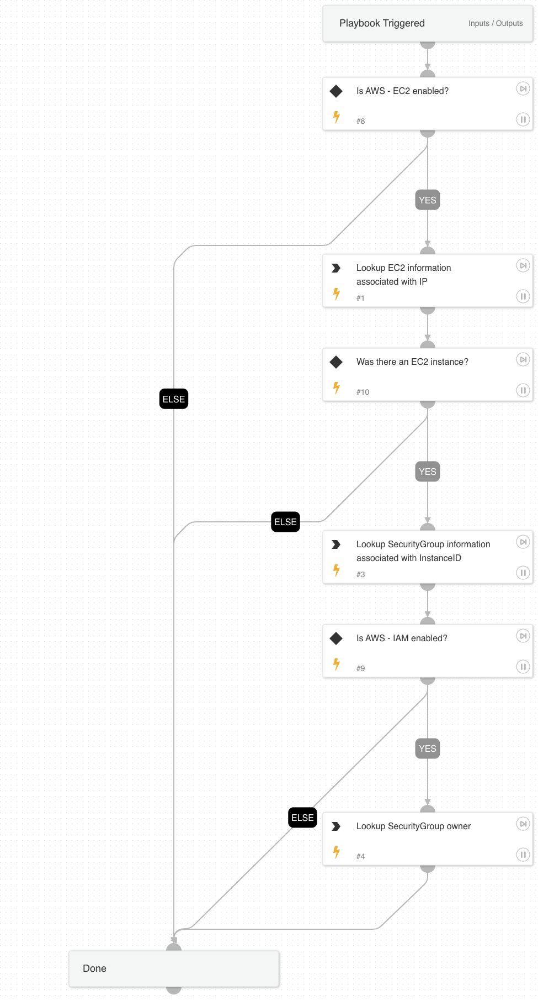

Given the IP address this playbook enriches EC2 and IAM information.

## Dependencies

This playbook uses the following sub-playbooks, integrations, and scripts.

### Sub-playbooks

This playbook does not use any sub-playbooks.

### Integrations

* AWS - EC2
* AWS - System Manager

### Scripts

* Set
* AWSAccountHierarchy

### Commands

* aws-ec2-describe-instances
* aws-ec2-describe-security-groups
* aws-ec2-describe-regions
* aws-ec2-get-ipam-discovered-public-addresses
* aws-ssm-inventory-entry-list
* aws-ec2-describe-ipam-resource-discoveries

## Playbook Inputs

---

| **Name** | **Description** | **Default Value** | **Required** |
| --- | --- | --- | --- |
| AwsIP | AWS IP in alert | alert.remoteip | Required |
| AWSAssumeRoleName | If assuming roles for AWS, this is the name of the role to assume \(should be the same for all organizations\). |  | Optional |
| Indicator Query | Indicators matching the indicator query will be used as playbook input. |  | Optional |

## Playbook Outputs

---

| **Path** | **Description** | **Type** |
| --- | --- | --- |
| AWS.EC2.Instances | AWS EC2 information. | unknown |
| AWS.EC2.SecurityGroups | AWS Security group information. | unknown |
| AWSHierarchy | AWS account hierarchy information. | unknown |
| AWS.SSM | AWS SSM information. | unknown |

## Playbook Image

---

