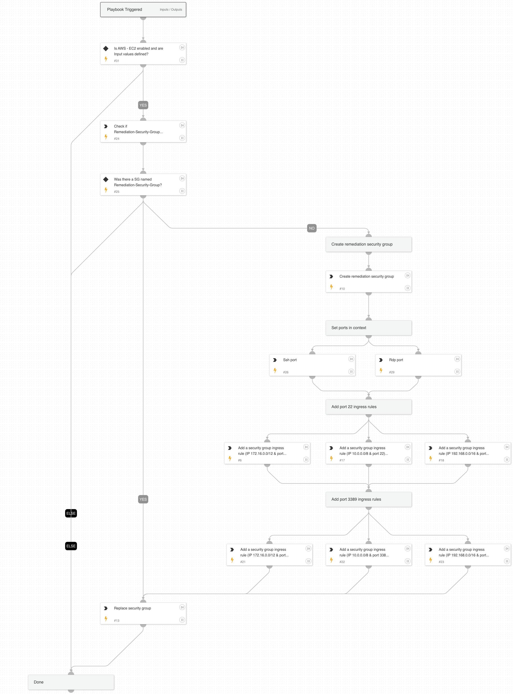

Replace current security groups with limited access security groups.

## Dependencies
This playbook uses the following sub-playbooks, integrations, and scripts.

### Sub-playbooks
This playbook does not use any sub-playbooks.

### Integrations
* AWS - EC2

### Scripts
* Set

### Commands
* aws-ec2-describe-security-groups
* aws-ec2-authorize-security-group-ingress-rule
* aws-ec2-modify-network-interface-attribute
* aws-ec2-create-security-group

## Playbook Inputs
---

| **Name** | **Description** | **Default Value** | **Required** |
| --- | --- | --- | --- |
| VpcID | This is the VPC ID used for Security group creation. |  | Required |
| NicID | This is the Network interface of Ec2 instance. |  | Required |
| RemediationRule | The security group that will used for remediating internet exposures.  | Remediation-Security-Group | Required |

## Playbook Outputs
---
There are no outputs for this playbook.

## Playbook Image
---
