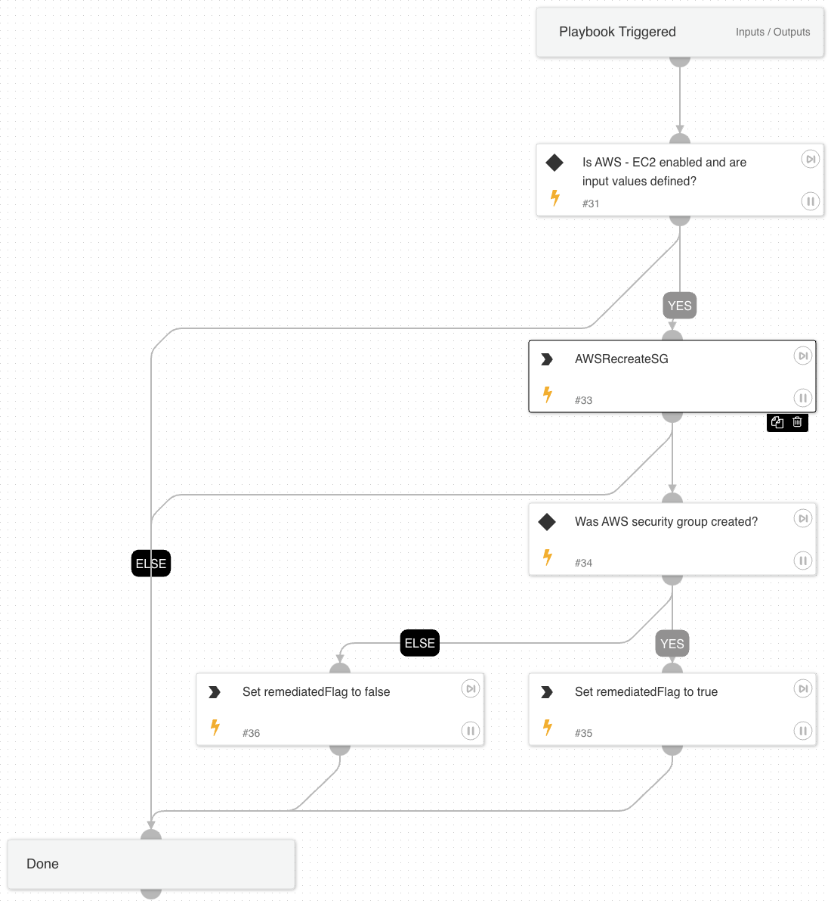

This playbook takes in some information about an EC2 instance (ID and public_ip) and with provided port and protocol, determines what security groups on the primary interface of an EC2 instance are over-permissive.  It uses an automation to determine what interface on an EC2 instance has an over-permissive security group on, determine which security groups have over-permissive rules and to replace them with a copy of the security group that has only the over-permissive portion removed.  Over-permissive is defined as sensitive ports (SSH, RDP, etc) being exposed to the internet via IPv4.

## Dependencies

This playbook uses the following sub-playbooks, integrations, and scripts.

### Sub-playbooks

This playbook does not use any sub-playbooks.

### Integrations

This playbook does not use any integrations.

### Scripts

* AWSRecreateSG

### Commands

This playbook does not use any commands.

## Playbook Inputs

---

| **Name** | **Description** | **Default Value** | **Required** |
| --- | --- | --- | --- |
| InstanceID | ID of the AWS EC2 instance. |  | Required |
| Port | TCP/UDP port to be restricted. | alert.remoteport | Required |
| Protocol | Protocol of the port to be restricted. |  | Required |
| PublicIP | Public IP address of the EC2 instance. | alert.remoteip | Optional |

## Playbook Outputs

---
There are no outputs for this playbook.

## Playbook Image

---

