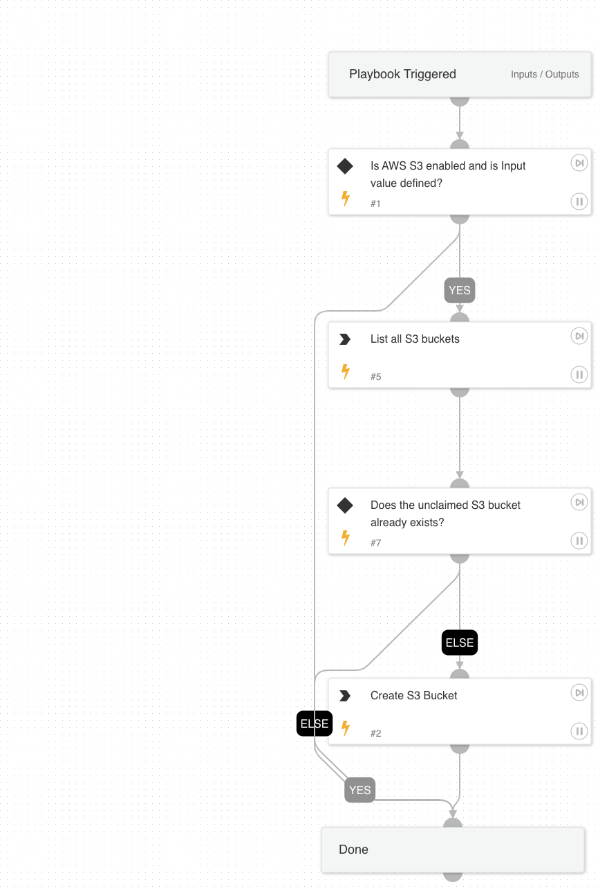

The playbook will create the unclaimed S3 bucket.

## Dependencies
This playbook uses the following sub-playbooks, integrations, and scripts.

### Sub-playbooks
This playbook does not use any sub-playbooks.

### Integrations
* AWS - S3

### Scripts
This playbook does not use any scripts.

### Commands
* aws-s3-list-buckets
* aws-s3-create-bucket

## Playbook Inputs
---

| **Name** | **Description** | **Default Value** | **Required** |
| --- | --- | --- | --- |
| S3BucketName | Unclaimed S3 bucket name. |  | Required |

## Playbook Outputs
---
There are no outputs for this playbook.

## Playbook Image
---
