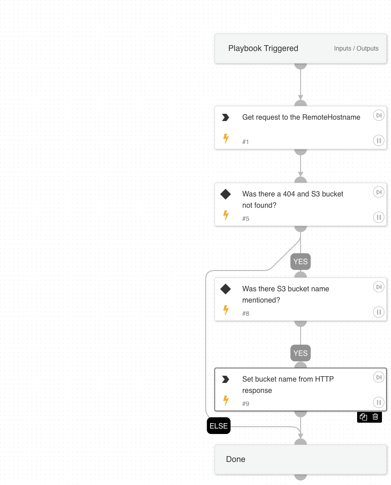

The playbook sends a HTTP get response to the hostname and validates if there is missing bucket information. 

## Dependencies
This playbook uses the following sub-playbooks, integrations, and scripts.

### Sub-playbooks
This playbook does not use any sub-playbooks.

### Integrations
This playbook does not use any integrations.

### Scripts
* Set
* http

### Commands
This playbook does not use any commands.

## Playbook Inputs
---

| **Name** | **Description** | **Default Value** | **Required** |
| --- | --- | --- | --- |
| RemoteHostname | Remote hostname in an incident/alert.  | alert.hostname | Required |

## Playbook Outputs
---

| **Path** | **Description** | **Type** |
| --- | --- | --- |
| S3BucketName | This is the bucket name extracted from HTTP response body. | unknown |

## Playbook Image
---
