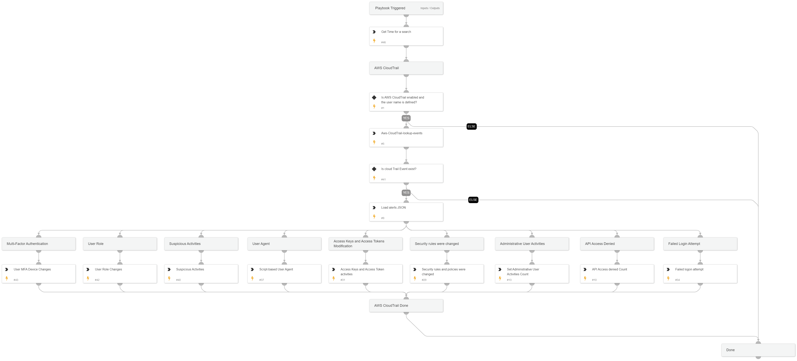

This playbook performs an investigation on a specific user in AWS environments, using queries and logs from AWS CloudTrail to locate the following activities performed by the user:
- Failed login attempt
- Suspicious activities 
- API access denied
- Administrative user activities
- Security rules and policies changes
- Access keys and access token activities
- Script-based user agent usage
- User role changes activities
- MFA device changes activities

## Dependencies

This playbook uses the following sub-playbooks, integrations, and scripts.

### Sub-playbooks

This playbook does not use any sub-playbooks.

### Integrations

AWS - CloudTrail

### Scripts

* LoadJSON
* GetTime
* Set

### Commands

aws-cloudtrail-lookup-events

## Playbook Inputs

---

| **Name** | **Description** | **Default Value** | **Required** |
| --- | --- | --- | --- |
| Username | The username to investigate.  Please enter the user's email. |  | Optional |
| AwsTimeSearchFrom | The Search Time for the \`GetTime\` task used by the AWS Cloud Trail search query.  This value represents the number of days to include in the search. Default value: 1.  \(1 Day\) | 1 | Optional |

## Playbook Outputs

---

| **Path** | **Description** | **Type** |
| --- | --- | --- |
| AwsMFAConfigCount | The number of MFA configurations performed by the user in the AWS environment. | unknown |
| AwsUserRoleChangesCount | The number of user roles that were changed by the user in the AWS environment. | unknown |
| AwsSuspiciousActivitiesCount | The number of suspicious activities performed by the user in the AWS environment. | unknown |
| AwsScriptBasedUserAgentCount | The number of script-based user agent usages by the user in the AWS environment. | unknown |
| AwsAccessKeyActivitiesCount | The number of access key activities performed by the user in the AWS environment. | unknown |
| AwsSecurityChangesCount | The number of security rules that were changed by the user in the AWS environment. | unknown |
| AwsAdminActivitiesCount | The number of administrative activities performed by the user in the AWS environment. | unknown |
| AwsApiAccessDeniedCount | The number of API accesses denied by the user in the AWS environment. | unknown |
| AwsFailedLogonCount | The number of failed logins by the user in the AWS environment. | unknown |

## Playbook Image

---

