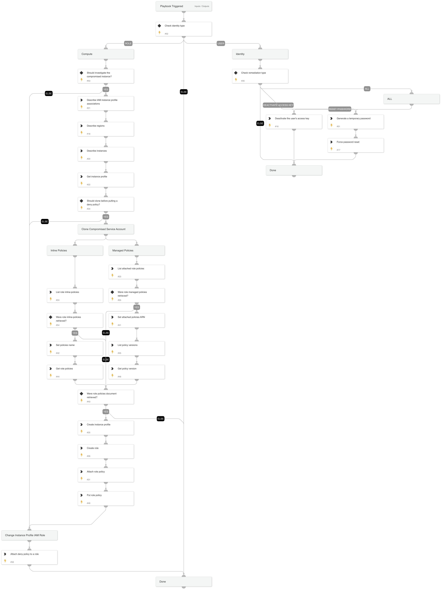

## **AWS Credentials Rotation Playbook**

### **Identity Remediation**
Secure compromised accounts by taking swift action:
- **Reset Password**: Resets the user password to halt any unauthorized access.

- **Access Key Deactivation**: Deactivate any suspicious or known-compromised access keys.

- **Combo Action**: In some cases, you may want to reset both the password and deactivate the access key for absolute security.

### **Role Remediation**
If a role is suspected to be compromised:
- **Deny Policy Implementation**: Attach a deny-all policy to the compromised role, thus preventing it from performing any further actions.

- **Role Cloning**: Before outright remediation, clone the role. This ensures that you have a backup with the same permissions, making transition smoother.

## Dependencies

This playbook uses the following sub-playbooks, integrations, and scripts.

### Sub-playbooks

This playbook does not use any sub-playbooks.

### Integrations

This playbook does not use any integrations.

### Scripts

* Set
* GeneratePassword

### Commands

* aws-ec2-describe-iam-instance-profile-associations
* aws-iam-list-attached-role-policies
* aws-iam-list-role-policies
* aws-iam-list-policy-versions
* aws-iam-create-instance-profile
* aws-iam-get-policy-version
* aws-iam-create-role
* aws-iam-attach-policy
* aws-iam-put-role-policy
* aws-iam-update-login-profile
* aws-iam-update-access-key
* aws-iam-get-instance-profile
* aws-ec2-describe-instances
* aws-iam-get-role-policy
* aws-ec2-describe-regions

## Playbook Inputs

---

| **Name** | **Description** | **Default Value** | **Required** |
| --- | --- | --- | --- |
| IAMRemediationType | The response playbook provides the following remediation actions for IAM users:  Reset - By entering "Reset" in the input, the playbook will execute password reset.  Deactivate - By entering "Deactivate" in the input, the playbook will execute access key deactivation.  ALL - By entering "ALL" in the input, the playbook will execute both password reset and access key deactivation. |  | Optional |
| shouldCloneSA | Whether to clone the compromised SA before putting a deny policy to it. True/False |  | Optional |
| identityType | The type of identity involved. Usually mapped to the incident field named 'cloudidentitytype'. e.g. USER,SERVICE_ACCOUNT,APPLICATION |  | Optional |
| newRoleName | The new role name to assign in the clone service account flow. | tempNewRoleName | Optional |
| newInstanceProfileName | The new instance profile name to assign in the clone service account flow. | tempNewInstanceProfileName | Optional |
| accessKeyID | The access key ID. |  | Optional |
| username | The user name. |  | Optional |
| instanceID | The instance ID. |  | Optional |
| roleNameToRestrict | If provided, the role will be attached with a deny policy without the compute instance analysis flow. |  | Optional |

## Playbook Outputs

---

| **Path** | **Description** | **Type** |
| --- | --- | --- |
| AWS.EC2.Instances | AWS EC2 instance information. | unknown |
| AWS.IAM.InstanceProfiles | AWS IAM instance profile information. | unknown |
| AWS.IAM.Roles.AttachedPolicies.Policies | A list of managed policy names. | unknown |
| AWS.IAM.Roles.RoleName.Policies | A list of policy names. | unknown |

## Playbook Image

---

