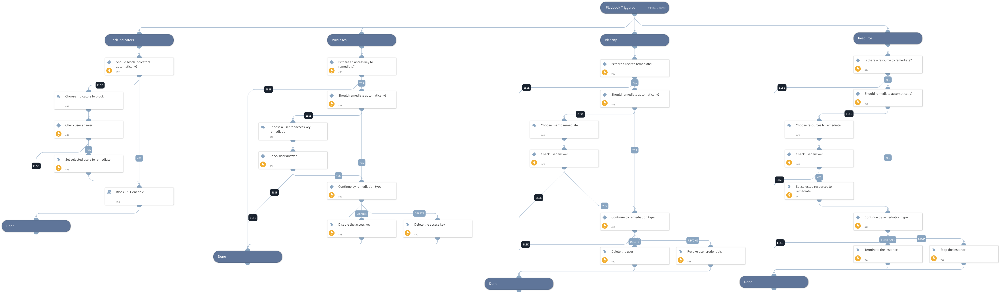

This playbook provides response actions to AWS. The following are available for execution automatically/manually:
 - Resource remediation:
   - Terminate the instance
   - Stop the instance
 - Identity remediation:
   - Delete the user
   - Revoke the user's credentials
- Access key remediation:
   - Disable the access key
   - Delete the access key
- Block indicators

## Dependencies
This playbook uses the following sub-playbooks, integrations, and scripts.

### Sub-playbooks
* Block IP - Generic v3

### Integrations
This playbook does not use any integrations.

### Scripts
* Set

### Commands
* aws-iam-delete-login-profile
* aws-iam-delete-user
* aws-iam-update-access-key
* aws-ec2-stop-instances
* aws-iam-delete-access-key
* aws-ec2-terminate-instances

## Playbook Inputs
---

| **Name** | **Description** | **Default Value** | **Required** |
| --- | --- | --- | --- |
| accessKeyRemediationType | Choose the remediation type for the user's access key. Disable - for disabling the user's access key. Delete - for the user's access key deletion. | Disable | Optional |
| userRemediationType | Choose the remediation type for the user involved. Delete - for the user deletion. Revoke - for revoking the user's credentials. | Revoke | Optional |
| resourceRemediationType | Choose the remediation type for the instances created. Stop - for stopping the instances. Terminate - for terminating the instances. | Stop | Optional |
| autoResourceRemediation | Whether to execute the resource remediation flow automatically. | False | Optional |
| autoUserRemediation | Whether to execute the user remediation flow automatically. | False | Optional |
| autoAccessKeyRemediation | Whether to execute the access key remediation flow automatically. | False | Optional |
| autoBlockIndicators | Whether to block the indicators automatically. | False | Optional |
| resourceName | The resource name to take action on. |  | Optional |
| region | The resource's region. |  | Optional |
| username | The username to take action on. |  | Optional |
| accessKeyId | The user's access key ID. |  | Optional |
| sourceIP | The source IP address of the attacker. |  | Optional |

## Playbook Outputs
---
There are no outputs for this playbook.

## Playbook Image
---
