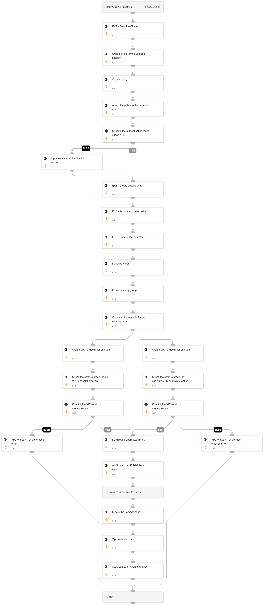

This playbook automates the deployment of an AWS Lambda function to manage resources within an Amazon EKS cluster. It ensures that all necessary configurations are created, updated, and verified.

### Setup

- **Describe EKS Cluster**: Gather essential details of the EKS cluster.
- **Create IAM Role**: Set up a new IAM role for the Lambda function.
- **Create and Attach Policy**: Define and attach a policy to the IAM role to grant necessary permissions.

### Authentication Mode Check

- **Verify Authentication Mode**: Ensure the current authentication mode allows API access.
  - **If not**: Update the cluster authentication mode to permit API access.

### Access Entry Configuration

- **Create Access Entry**: Establish a new access entry in the EKS cluster.
- **Associate Access Policy**: Link the access policy with the created access entry.
- **Update Access Entry**: Apply the latest configurations to the access entry.

### VPC and Security Group Setup

- **Describe VPCs**: Identify the appropriate VPC for the Lambda function.
- **Create Security Group**: Define a security group to manage Lambda function traffic.
- **Set Ingress Rules**: Configure ingress rules for the security group.

### VPC Endpoint Creation

- **Create VPC Endpoint for eks-auth**: Establish a VPC endpoint for EKS authentication.
- **Check for Errors**: Verify if there are any errors during the creation of the VPC endpoint.
  - **If errors**: Handle and log them.
- **Verify VPC Endpoint Existence**: Ensure the VPC endpoint already exists.
  - **If exists**: Proceed with the next steps.

### Lambda Function Deployment

- **Download Kubernetes Library**: Fetch the necessary Kubernetes library.
- **Publish AWS Lambda Layer**: Publish a new layer version for the AWS Lambda function.
- **Create Lambda Code**: Develop the Lambda function code.
- **Zip Lambda Code**: Compress the Lambda function code for deployment.
- **Create AWS Lambda Function**: Deploy the Lambda function using the zipped code.

### Resolution

- **Final Verification**: Ensure all operations have been successfully completed.
- **Completion**: Confirm the deployment process is finished, ensuring robust management of EKS authentication through AWS Lambda.

This playbook provides a comprehensive, automated approach to deploying an AWS Lambda function for managing resources within an EKS cluster, efficiently handling all configurations and potential errors.

### Required Integration

#### AWS IAM (Identity and Access Management)
- [AWS IAM API Documentation](https://docs.aws.amazon.com/IAM/latest/APIReference/Welcome.html)
- [Cortex XSOAR AWS IAM Integration](https://cortex.marketplace.pan.dev/marketplace/details/AWSIAM/)

#### AWS EC2 (Elastic Compute Cloud)
- [AWS EC2 API Documentation](https://docs.aws.amazon.com/AWSEC2/latest/APIReference/Welcome.html)
- [Cortex XSOAR AWS EC2 Integration](https://cortex.marketplace.pan.dev/marketplace/details/AWSEC2/)

#### AWS EKS (Elastic Kubernetes Service)
- [AWS EKS API Documentation](https://docs.aws.amazon.com/eks/latest/APIReference/Welcome.html)
- [Cortex XSOAR AWS EKS Integration](https://cortex.marketplace.pan.dev/marketplace/details/AWSEKS/)

#### AWS Lambda
- [AWS Lambda API Documentation](https://docs.aws.amazon.com/lambda/latest/dg/API_Reference.html)
- [Cortex XSOAR AWS Lambda Integration](https://cortex.marketplace.pan.dev/marketplace/details/AWSLambda/).

## Dependencies

This playbook uses the following sub-playbooks, integrations, and scripts.

### Sub-playbooks

This playbook does not use any sub-playbooks.

### Integrations

This playbook does not use any integrations.

### Scripts

* FileCreateAndUploadV2
* GetErrorsFromEntry
* ZipFile
* DownloadAndArchivePythonLibrary
* PrintErrorEntry

### Commands

* aws-eks-describe-cluster
* aws-ec2-create-security-group
* aws-eks-associate-access-policy
* aws-ec2-create-vpc-endpoint
* aws-eks-update-cluster-config
* aws-iam-attach-policy
* aws-eks-update-access-entry
* aws-ec2-describe-vpcs
* aws-ec2-authorize-security-group-ingress-rule
* aws-lambda-publish-layer-version
* aws-eks-create-access-entry
* aws-lambda-create-function
* aws-iam-create-policy
* aws-iam-create-role

## Playbook Inputs

---

| **Name** | **Description** | **Default Value** | **Required** |
| --- | --- | --- | --- |
| ClusterName | The name of the cluster. |  | Optional |
| region | The region of the cluster. |  | Optional |
| FunctionName | The name of the Lambda function. |  | Optional |
| FunctionCode | Entry ID of the uploaded base64-encoded contents of the deployment package. Amazon Web Services SDK and CLI clients handle the encoding for you. |  | Optional |
| FunctionRuntime | The runtime environment for the function.	 |  | Optional |
| FunctionHandler | The name of the method within your code that Lambda calls to execute your function.	 |  | Optional |
| LayerName | The name to assign to the new Lambda layer. |  | Optional |
| LayerRuntime | The name of the method within your code that Lambda calls to execute your function.	 |  | Optional |
| LayerArchitecture | A list of compatible architectures.	 |  | Optional |
| LibraryName | The Python library to download and attach to the Lambda Function.  e.g. To be able to use the kubernetes library, use 'kubernetes' and the script will download and pack its files. |  | Optional |
| LambdaRoleName | The lambda role name to create. |  | Optional |
| LambdaPolicyName | The lambda policy name to create. |  | Optional |
| SecurityGroupName | The security group name to create. |  | Optional |

## Playbook Outputs

---

| **Path** | **Description** | **Type** |
| --- | --- | --- |
| AWS.EKS.DescribeCluster.name | The name of your cluster. | unknown |
| AWS.EKS.DescribeCluster.arn | The Amazon Resource Name \(ARN\) of the cluster. | unknown |
| AWS.EKS.DescribeCluster.createdAt | The creation date of the object. | unknown |
| AWS.EKS.DescribeCluster.version | The Kubernetes server version for the cluster. | unknown |
| AWS.EKS.DescribeCluster.endpoint | The endpoint for your Kubernetes API server. | unknown |
| AWS.EKS.DescribeCluster.roleArn | The Amazon Resource Name \(ARN\) of the IAM role that provides permissions for the Kubernetes control plane to make calls to Amazon Web Services API operations on your behalf. | unknown |
| AWS.EKS.DescribeCluster.identity | The identity provider information for the cluster. | unknown |
| AWS.EKS.DescribeCluster.status | The current status of the cluster. | unknown |
| AWS.EKS.DescribeCluster.clientRequestToken | A unique, case-sensitive identifier that you provide to ensure the idempotency of the request. | unknown |
| AWS.EKS.DescribeCluster.platformVersion | The platform version of your Amazon EKS cluster. | unknown |
| AWS.EKS.DescribeCluster.tags | A dictionary containing metadata for categorization and organization. | unknown |
| AWS.EKS.DescribeCluster.id | The ID of your local Amazon EKS cluster on an Amazon Web Services Outpost. | unknown |
| AWS.EKS.DescribeCluster.resourcesVpcConfig.subnetIds | The subnets associated with your cluster. | unknown |
| AWS.EKS.DescribeCluster.resourcesVpcConfig.securityGroupIds | The security groups associated with the cross-account elastic network interfaces that are used to allow communication between your nodes and the Kubernetes control plane. | unknown |
| AWS.EKS.DescribeCluster.resourcesVpcConfig.clusterSecurityGroupId | The cluster security group that was created by Amazon EKS for the cluster. Managed node groups use this security group for control-plane-to-data-plane communication. | unknown |
| AWS.EKS.DescribeCluster.resourcesVpcConfig.vpcId | The VPC associated with your cluster. | unknown |
| AWS.EKS.DescribeCluster.resourcesVpcConfig.endpointPublicAccess | Whether the public API server endpoint is enabled. | unknown |
| AWS.EKS.DescribeCluster.resourcesVpcConfig.endpointPrivateAccess | This parameter indicates whether the Amazon EKS private API server endpoint is enabled. | unknown |
| AWS.EKS.DescribeCluster.resourcesVpcConfig.publicAccessCidrs | The CIDR blocks that are allowed access to your cluster’s public Kubernetes API server endpoint. | unknown |
| AWS.EKS.DescribeCluster.kubernetesNetworkConfig.serviceIpv4Cidr | The CIDR block that Kubernetes Pod and Service object IP addresses are assigned from. | unknown |
| AWS.EKS.DescribeCluster.kubernetesNetworkConfig.serviceIpv6Cidr | The CIDR block that Kubernetes Pod and Service IP addresses are assigned from if you created a 1.21 or later cluster with version 1.10.1 or later of the Amazon VPC CNI add-on and specified ipv6 for ipFamily when you created the cluster. | unknown |
| AWS.EKS.DescribeCluster.kubernetesNetworkConfig.ipFamily | The IP family used to assign Kubernetes Pod and Service objects IP addresses. | unknown |
| AWS.EKS.DescribeCluster.logging.clusterLogging | The cluster control plane logging configuration for your cluster. | unknown |
| AWS.EKS.DescribeCluster.certificateAuthority.data | The Base64-encoded certificate data required to communicate with your cluster. | unknown |
| AWS.EKS.DescribeCluster.encryptionConfig.resources | Specifies the resources to be encrypted. The only supported value is secrets. | unknown |
| AWS.EKS.DescribeCluster.encryptionConfig.provider | Key Management Service \(KMS\) key. | unknown |
| AWS.EKS.DescribeCluster.connectorConfig.activationId | A unique ID associated with the cluster for registration purposes. | unknown |
| AWS.EKS.DescribeCluster.connectorConfig.activationCode | A unique code associated with the cluster for registration purposes. | unknown |
| AWS.EKS.DescribeCluster.connectorConfig.activationExpiry | The expiration time of the connected cluster. | unknown |
| AWS.EKS.DescribeCluster.connectorConfig.provider | The cluster’s cloud service provider. | unknown |
| AWS.EKS.DescribeCluster.connectorConfig.roleArn | The Amazon Resource Name \(ARN\) of the role to communicate with services from the connected Kubernetes cluster. | unknown |
| AWS.EKS.DescribeCluster.health.issues | An object representing the health issues of your local Amazon EKS cluster on an Amazon Web Services Outpost. | unknown |
| AWS.EKS.DescribeCluster.outpostConfig.outpostArns | An object representing the configuration of your local Amazon EKS cluster on an Amazon Web Services Outpost. | unknown |
| AWS.EKS.DescribeCluster.outpostConfig.controlPlaneInstanceType | The Amazon EC2 instance type used for the control plane. | unknown |
| AWS.EKS.DescribeCluster.outpostConfig.controlPlanePlacement | An object representing the placement configuration for all the control plane instances of your local Amazon EKS cluster on an Amazon Web Services Outpost. | unknown |
| AWS.EKS.DescribeCluster.accessConfig.bootstrapClusterCreatorAdminPermissions | Specifies whether or not the cluster creator IAM principal was set as a cluster admin access entry during cluster creation time. | unknown |
| AWS.EKS.DescribeCluster.accessConfig.authenticationMode | The current authentication mode of the cluster. | unknown |
| AWS.IAM.Roles.RoleName | The friendly name that identifies the role. | unknown |
| AWS.IAM.Roles.RoleId | The stable and unique string identifying the role. | unknown |
| AWS.IAM.Roles.Arn | The Amazon Resource Name \(ARN\) specifying the role. | unknown |
| AWS.IAM.Roles.CreateDate | The date and time, when the role was created. | unknown |
| AWS.IAM.Roles.Path | The path to the role. | unknown |
| AWS.IAM.Roles.AssumeRolePolicyDocument | he policy that grants an entity permission to assume the role. | unknown |
| AWS.IAM.Roles.Description | A description of the role that you provide. | unknown |
| AWS.IAM.Roles.MaxSessionDuration | The maximum session duration \(in seconds\) for the specified role. | unknown |
| AWS.IAM.Policies.PolicyName | The friendly name \(not ARN\) identifying the policy. | unknown |
| AWS.IAM.Policies.PolicyId | The stable and unique string identifying the policy. | unknown |
| AWS.IAM.Policies.Arn | The Amazon Resource Name \(ARN\). ARNs are unique identifiers for AWS resources. | unknown |
| AWS.IAM.Policies.Path | The path to the policy. | unknown |
| AWS.IAM.Policies.DefaultVersionId | The identifier for the version of the policy that is set as the default version. | unknown |
| AWS.IAM.Policies.Description | A friendly description of the policy. | unknown |
| AWS.IAM.Policies.CreateDate | The date and time, in ISO 8601 date-time format , when the policy was created. | unknown |
| AWS.IAM.Policies.UpdateDate | The date and time, in ISO 8601 date-time format , when the policy was last updated. | unknown |
| AWS.EKS.CreateAccessEntry.clusterName | The name of the cluster. | unknown |
| AWS.EKS.CreateAccessEntry.principalArn | The ARN of the IAM principal for the access entry. | unknown |
| AWS.EKS.CreateAccessEntry.kubernetesGroups | A list of names that you’ve specified in a Kubernetes RoleBinding or ClusterRoleBinding object so that Kubernetes authorizes the principalARN access to cluster objects. | unknown |
| AWS.EKS.CreateAccessEntry.accessEntryArn | The ARN of the access entry. | unknown |
| AWS.EKS.CreateAccessEntry.createdAt | The creation date of the object. | unknown |
| AWS.EKS.CreateAccessEntry.modifiedAt | The date and time for the last modification to the object. | unknown |
| AWS.EKS.CreateAccessEntry.tags | A dictionary containing metadata for categorization and organization. | unknown |
| AWS.EKS.CreateAccessEntry.username | The name of a user that can authenticate to the cluster. | unknown |
| AWS.EKS.CreateAccessEntry.type | The type of the access entry. | unknown |
| AWS.EKS.AssociatedAccessPolicy.clusterName | The name of your cluster. | unknown |
| AWS.EKS.AssociatedAccessPolicy.principalArn | The ARN of the IAM principal for the AccessEntry. | unknown |
| AWS.EKS.AssociatedAccessPolicy.policyArn | The ARN of the AccessPolicy. | unknown |
| AWS.EKS.AssociatedAccessPolicy.associatedAt | The date and time the AccessPolicy was associated with an AccessEntry. | unknown |
| AWS.EKS.AssociatedAccessPolicy.modifiedAt | The date and time for the last modification to the object. | unknown |
| AWS.EKS.AssociatedAccessPolicy.accessScope.type | The scope type of an access policy. | unknown |
| AWS.EKS.AssociatedAccessPolicy.accessScope.namespaces | A Kubernetes namespace that an access policy is scoped to. | unknown |
| AWS.EKS.UpdateAccessEntry.clusterName | The name of your cluster. | unknown |
| AWS.EKS.UpdateAccessEntry.principalArn | The ARN of the IAM principal for the access entry. | unknown |
| AWS.EKS.UpdateAccessEntry.kubernetesGroups | A list of names that you’ve specified in a Kubernetes RoleBinding or ClusterRoleBinding object so that Kubernetes authorizes the principalARN access to cluster objects. | unknown |
| AWS.EKS.UpdateAccessEntry.accessEntryArn | The ARN of the access entry. | unknown |
| AWS.EKS.UpdateAccessEntry.createdAt | The creation date of the object. | unknown |
| AWS.EKS.UpdateAccessEntry.modifiedAt | The date and time for the last modification to the object. | unknown |
| AWS.EKS.UpdateAccessEntry.tags | Metadata that assists with categorization and organization. Each tag consists of a key and an optional value. | unknown |
| AWS.EKS.UpdateAccessEntry.username | The name of a user that can authenticate to your cluster. | unknown |
| AWS.EKS.UpdateAccessEntry.type | The type of the access entry. | unknown |
| AWS.Lambda.Layers.LayerVersionArn | The ARN of the layer version. | unknown |
| AWS.Lambda.Layers.LayerArn | The ARN of the layer. | unknown |
| AWS.Lambda.Layers.Description | The description of the version. | unknown |
| AWS.Lambda.Layers.CreatedDate | The date that the layer version was created, in ISO-8601 format \(YYYY-MM-DDThh:mm:ss.sTZD\). | unknown |
| AWS.Lambda.Layers.Version | The version number. | unknown |
| AWS.Lambda.Layers.CompatibleRuntimes | The layer’s compatible runtimes. | unknown |
| AWS.Lambda.Layers.CompatibleArchitectures | The layer’s compatible architectures. | unknown |
| AWS.Lambda.Functions.FunctionName | The name of the function. | unknown |
| AWS.Lambda.Functions.FunctionArn | The function’s Amazon Resource Name \(ARN\). | unknown |
| AWS.Lambda.Functions.Runtime | The identifier of the function’s runtime. Runtime is required if the deployment package is a .zip file archive. | unknown |
| AWS.Lambda.Functions.Role | The function’s execution role. | unknown |
| AWS.Lambda.Functions.Handler | The function that Lambda calls to begin running your function. | unknown |
| AWS.Lambda.Functions.Description | The function’s description. | unknown |
| AWS.Lambda.Functions.PackageType | The type of deployment package. Set to Image for container image and set Zip for .zip file archive. | unknown |
| AWS.Lambda.Functions.LastModified | The date and time that the function was last updated, in ISO-8601 format \(YYYY-MM-DDThh:mm:ss.sTZD\). | unknown |
| AWS.Lambda.Functions.Timeout | The amount of time in seconds that Lambda allows a function to run before stopping it. | unknown |
| AWS.Lambda.Functions.VpcConfig.SubnetIds | A list of VPC subnet IDs. | unknown |
| AWS.Lambda.Functions.VpcConfig.SecurityGroupIds | A list of VPC security group IDs. | unknown |
| AWS.Lambda.Functions.VpcConfig.VpcId | The ID of the VPC. | unknown |
| AWS.Lambda.Functions.VpcConfig.Ipv6AllowedForDualStack | Allows outbound IPv6 traffic on VPC functions that are connected to dual-stack subnets. | unknown |
| AWS.EKS.UpdateCluster.clusterName | The name of the cluster. | unknown |
| AWS.EKS.UpdateCluster.id | The ID of the update. | unknown |
| AWS.EKS.UpdateCluster.status | The status of the update. | unknown |
| AWS.EKS.UpdateCluster.type | The type of the update. | unknown |
| AWS.EKS.UpdateCluster.params | The parameters of the update. | unknown |
| AWS.EKS.UpdateCluster.createdAt | The creation date of the object. | unknown |
| File.Name | The name of the file. | String |
| File.EntryID | The entry ID of the file. | String |
| File.Type | The file type. | String |
| File.Extension | The file extension. | String |
| File.SHA256 | The SHA256 hash of the file. | String |
| ZipFile.ZippedFile | The zipped file. | string |
| AWS.EC2.Vpcs.VpcEndpoint.VpcEndpointId | The ID of the endpoint. | unknown |
| AWS.EC2.Vpcs.VpcEndpoint.State | The state of the VPC endpoint. | unknown |
| AWS.EC2.Vpcs.VpcEndpoint.ServiceName | The service name of the VPC endpoint. | unknown |
| AWS.EC2.Vpcs.VpcEndpoint.VpcId | The ID of the VPC to which the endpoint is associated. | unknown |
| AWS.EC2.Vpcs.VpcEndpoint.EndpointType | The type of the VPC endpoint. | unknown |
| AWS.EC2.Vpcs.VpcId | The ID of the VPC. | unknown |
| AWS.EC2.Vpcs.AccountId | The ID of the AWS account with which the EC2 instance is associated. This key is only present when the parameter "AWS organization accounts" is provided. | unknown |
| AWS.EC2.Vpcs.State | The current state of the VPC. | unknown |
| AWS.EC2.Vpcs.CidrBlock | The primary IPv4 CIDR block for the VPC. | unknown |
| AWS.EC2.Vpcs.Tags.Key | The key of the tag. | unknown |
| AWS.EC2.Vpcs.Tags.Value | The value of the tag. | unknown |
| AWS.EC2.Vpcs.Tags.Ipv6CidrBlockAssociationSet.AssociationId | The association ID for the IPv6 CIDR block. | unknown |
| AWS.EC2.Vpcs.Tags.Ipv6CidrBlockAssociationSet.Ipv6CidrBlock | The IPv6 CIDR block. | unknown |
| AWS.EC2.Vpcs.Tags.Ipv6CidrBlockAssociationSet.Ipv6CidrBlockState.State | The state of the CIDR block. | unknown |
| AWS.EC2.Vpcs.Tags.Ipv6CidrBlockAssociationSet.Ipv6CidrBlockState.StatusMessage | A message about the status of the CIDR block, if applicable. | unknown |
| AWS.EC2.Vpcs.Tags.CidrBlockAssociationSet.AssociationId | The association ID for the IPv4 CIDR block. | unknown |
| AWS.EC2.Vpcs.Tags.CidrBlockAssociationSet.CidrBlock | The IPv4 CIDR block. | unknown |
| AWS.EC2.Vpcs.Tags.CidrBlockAssociationSet.CidrBlockState.State | The state of the CIDR block. | unknown |
| AWS.EC2.Vpcs.Tags.CidrBlockAssociationSet.CidrBlockState.StatusMessage | A message about the status of the CIDR block, if applicable. | unknown |
| AWS.EC2.SecurityGroups.GroupName | The name of the security group. | unknown |
| AWS.EC2.SecurityGroups.Description | A description for the security group. | unknown |
| AWS.EC2.SecurityGroups.VpcId | The ID of the VPC. | unknown |
| AWS.EC2.SecurityGroups.GroupId | The ID of the security group. | unknown |
| AWS.EC2.SecurityGroups.AccountId | The ID of the AWS account with which the EC2 instance is associated. This key is only present when the parameter "AWS organization accounts" is provided. | unknown |
| ErrorEntries | Contents of the errors associated with the entry/entries. | unknown |

## Playbook Image

---

