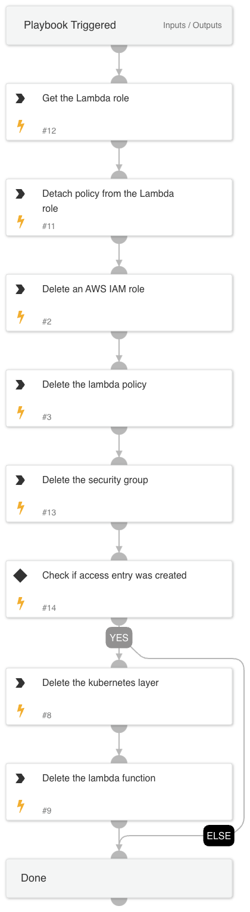

This playbook automates the removal of an AWS Lambda function and its associated resources used for managing resources within an Amazon EKS cluster. It ensures all related roles, policies, and security configurations are properly detached and deleted.

**Resource Detachment and Deletion**

- **Get the Lambda Role**: Retrieve the IAM role associated with the Lambda function.
- **Detach Policy from Lambda Role**: Remove the policy attached to the Lambda role.
- **Delete IAM Role**: Delete the IAM role that was used for the Lambda function.
- **Delete Lambda Policy**: Remove the policy specifically created for the Lambda function.
- **Delete Security Group**: Delete the security group that was managing the Lambda function's traffic.

**Access Entry Check**

- **Check if Access Entry was Created**: Verify if the access entry for the EKS cluster was created.
  - **If YES**: Proceed to delete additional resources.
  - **If NO**: Skip the deletion of additional resources.

**Additional Resource Deletion**

- **Delete Kubernetes Layer**: Remove the Kubernetes layer that was used by the Lambda function.
- **Delete Lambda Function**: Delete the Lambda function itself, ensuring all related code and configurations are removed.

**Conclusion**

- **Final Cleanup**: Ensure all specified resources have been deleted successfully.
- **Completion**: Confirm that the removal process is complete, providing a clean environment free from the previously deployed Lambda function and its configurations.

This playbook provides a comprehensive, automated approach to removing an AWS Lambda function and its related resources, ensuring all configurations and dependencies are properly managed and deleted.

## Dependencies

This playbook uses the following sub-playbooks, integrations, and scripts.

### Sub-playbooks

This playbook does not use any sub-playbooks.

### Integrations

This playbook does not use any integrations.

### Scripts

This playbook does not use any scripts.

### Commands

* aws-iam-detach-policy
* aws-iam-delete-role
* aws-iam-get-role
* aws-lambda-delete-layer-version
* aws-ec2-delete-security-group
* aws-iam-delete-policy
* aws-lambda-delete-function

## Playbook Inputs

---

| **Name** | **Description** | **Default Value** | **Required** |
| --- | --- | --- | --- |
| region | The region of the resource. |  | Optional |
| LambdaFunctionName | The Lambda function name. |  | Optional |
| LambdaLayerVersion | The Lambda layer version. |  | Optional |
| LambdaLayerName | The Lambda layer name. |  | Optional |
| LambdaRoleName | The lambda role name to delete. |  | Optional |
| LambdaRolePolicyARN | The ARN of the policy to delete. |  | Optional |
| SecurityGroupID | The security group ID. |  | Optional |

## Playbook Outputs

---
There are no outputs for this playbook.

## Playbook Image

---

