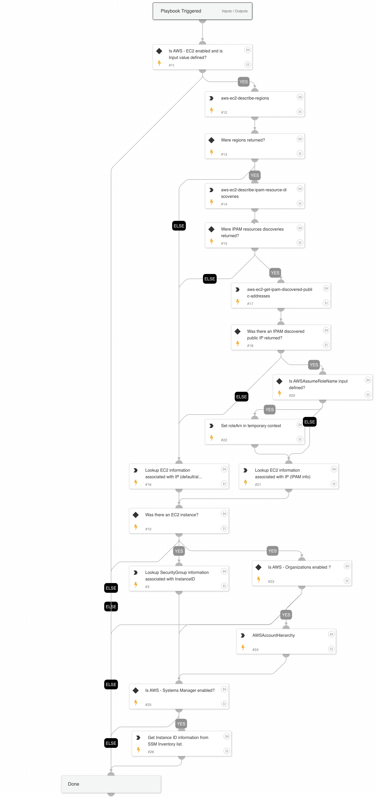

Introduction

##### What does this pack do?

The integration allows Cortex XSOAR to ingest phishing threats from Cofense Triage and run response playbooks based on email attributes.
- 
- 

### Playbooks

Users are only able to run the playbook in v6.5.0 or higher as it requires commands to execute the task.
This content pack includes the following playbooks: 
1. AWS - Enrichment

#### AWS - Enrichment
AWS - Enrichment playbook reports EC2 and IAM information Given an IP address of an EC2 instance.

