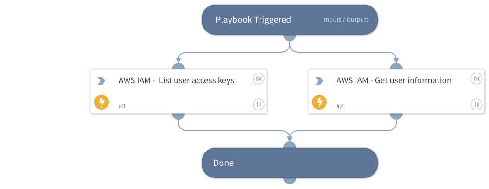

Enrich AWS IAM user information from AWS Identity and Access Management.
- List user access keys
- Get user information

## Dependencies
This playbook uses the following sub-playbooks, integrations, and scripts.

### Sub-playbooks
This playbook does not use any sub-playbooks.

### Integrations
* AWS - IAM

### Scripts
This playbook does not use any scripts.

### Commands
* aws-iam-get-user
* aws-iam-list-access-keys-for-user

## Playbook Inputs
---

| **Name** | **Description** | **Default Value** | **Required** |
| --- | --- | --- | --- |
| username | Name of the AWS IAM user to enrich. |  | Optional |

## Playbook Outputs
---
There are no outputs for this playbook.

## Playbook Image
---
