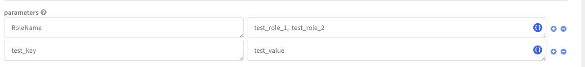
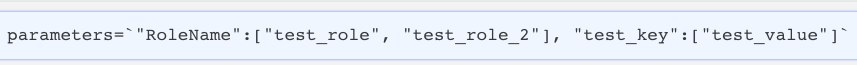
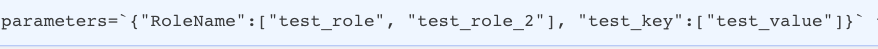

AWS Systems Manager is the operations hub for your AWS applications and resources and a secure end-to-end management solution for hybrid cloud environments that enables safe and secure operations at scale.
This integration was integrated and tested with Boto3 version 1.28.30 (AWS SDK).

For detailed instructions about setting up authentication, see: [AWS Integrations - Authentication](https://xsoar.pan.dev/docs/reference/articles/aws-integrations---authentication).

## Configure AWS - System Manager in Cortex


| **Parameter** | **Description** | **Required** |
| --- | --- | --- |
| AWS Default Region |  | True |
| Role Arn |  | False |
| Role Session Name |  | False |
| Role Session Duration |  | False |
| Access Key |  | False |
| Secret Key |  | False |
| Timeout | The time in seconds till a timeout exception is reached. You can specify just the read timeout \(for example 60\) or also the connect timeout followed after a comma \(for example 60,10\). If a connect timeout is not specified, a default of 10 seconds will be used. | False |
| Retries | The maximum number of retry attempts when connection or throttling errors are encountered. Set to 0 to disable retries. The default value is 5 and the limit is 10. Note: Increasing the number of retries will increase the execution time. | False |
| Trust any certificate (not secure) |  | False |
| Use system proxy settings |  | False |


## Commands

You can execute these commands from the CLI, as part of an automation, or in a playbook.
After you successfully execute a command, a DBot message appears in the War Room with the command details.

### aws-ssm-tag-add

***
Adds or overwrites one tag for the specified resource.
Tags are metadata that you can assign to the automations, documents, managed nodes, maintenance windows, Parameter Store parameters, and patch baselines.
Tags enable you to categorize the resources in different ways, for example, by purpose, owner, or environment.
Each tag consists of a key and an optional value, both of which you define.
For example, you could define a set of tags for the account’s managed nodes that helps you track each node’s owner and stack level, Key=Owner Value=SysAdmin.

#### Base Command

`aws-ssm-tag-add`

#### Input

| **Argument Name** | **Description** | **Required** |
| --- | --- | --- |
| region | The AWS Region. If not specified, the default region will be used. Possible values are: us-east-1, us-east-2, us-west-1, us-west-2, ca-central-1, eu-west-1, eu-central-1, eu-west-2, ap-northeast-1, ap-northeast-2, ap-southeast-1, ap-southeast-2, ap-south-1, sa-east-1, eu-north-1, eu-west-3. | Optional | 
| roleArn | The Amazon Resource Name (ARN) of the role to assume. | Optional | 
| roleSessionName | An identifier for the assumed role session. | Optional | 
| roleSessionDuration | The duration, in seconds, of the role session. The value can range from 900 seconds (15 minutes) up to the maximum session duration setting for the role. | Optional | 
| resource_type | Specifies the type of resource for tagging.<br/>Note: The ManagedInstance type for this API operation is for on-premises managed nodes. Possible values are: Association, Automation, Document, Maintenance Window, Managed Instance, Ops Item, Ops Metadata, Patch Baseline, Parameter. | Required | 
| resource_id | The resource ID to be tagged.<br/> Note: The format of the id depends on the selected resource type (e.g.. MaintenanceWindow: mw-012345abcde, PatchBaseline: pb-012345abcde). | Required | 
| tag_key | The name of the tag. Note: Don’t enter personally identifiable information in this field. | Required | 
| tag_value | The value of the tag. Note: Don’t enter personally identifiable information in this field. | Required | 

#### Context Output

There is no context output for this command.

#### Command example

```!aws-ssm-tag-add resource_id=demo resource_type=Document tag_key=test_key tag_value=test_value```

#### Human Readable Output

>Tags successfully added to resource demo.

### aws-ssm-tag-remove

***
Removes tag keys from the specified resource.

#### Base Command

`aws-ssm-tag-remove`

#### Input

| **Argument Name** | **Description** | **Required** |
| --- | --- | --- |
| region | The AWS Region. If not specified, the default region will be used. Possible values are: us-east-1, us-east-2, us-west-1, us-west-2, ca-central-1, eu-west-1, eu-central-1, eu-west-2, ap-northeast-1, ap-northeast-2, ap-southeast-1, ap-southeast-2, ap-south-1, sa-east-1, eu-north-1, eu-west-3. | Optional | 
| roleArn | The Amazon Resource Name (ARN) of the role to assume. | Optional | 
| roleSessionName | An identifier for the assumed role session. | Optional | 
| roleSessionDuration | The duration, in seconds, of the role session. The value can range from 900 seconds (15 minutes) up to the maximum session duration setting for the role. | Optional | 
| resource_type | Specifies the type of resource for tagging.<br/>Note: The ManagedInstance type for this API operation is for on-premises managed nodes. Possible values are: Association, Automation, Document, Maintenance Window, Managed Instance, Ops Item, Ops Metadata, Patch Baseline, Parameter. | Required | 
| resource_id | 'The ID of the resource to remove tags.<br/> Note: The format of the id depends on the selected resource type (e.g.. MaintenanceWindow: mw-012345abcde, PatchBaseline: pb-012345abcde).' | Required | 
| tag_key | The name of the tag to remove. | Required | 

#### Context Output

There is no context output for this command.

#### Command example

```!aws-ssm-tag-remove resource_id=demo resource_type=Document tag_key=test_key```

#### Human Readable Output

>Tag test_key removed from resource demo successfully.

### aws-ssm-tag-list

***
Returns a list of the tags assigned to the specified resource.

#### Base Command

`aws-ssm-tag-list`

#### Input

| **Argument Name** | **Description** | **Required** |
| --- | --- | --- |
| region | The AWS Region. If not specified, the default region will be used. Possible values are: us-east-1, us-east-2, us-west-1, us-west-2, ca-central-1, eu-west-1, eu-central-1, eu-west-2, ap-northeast-1, ap-northeast-2, ap-southeast-1, ap-southeast-2, ap-south-1, sa-east-1, eu-north-1, eu-west-3. | Optional | 
| roleArn | The Amazon Resource Name (ARN) of the role to assume. | Optional | 
| roleSessionName | An identifier for the assumed role session. | Optional | 
| roleSessionDuration | The duration, in seconds, of the role session. The value can range from 900 seconds (15 minutes) up to the maximum session duration setting for the role. | Optional | 
| resource_type | Returns a list of tags for a specific resource type. Possible values are: Association, Automation, Document, Maintenance Window, Managed Instance, Ops Item, Ops Metadata, Patch Baseline, Parameter. | Required | 
| resource_id | 'The ID of the resource to list tags.<br/> Note: The format of the id depends on the selected resource type (e.g.. MaintenanceWindow: mw-012345abcde, PatchBaseline: pb-012345abcde).' | Required | 

#### Context Output

| **Path** | **Type** | **Description** |
| --- | --- | --- |
| AWS.SSM.Tag.ResourceId | String | The ID of the resource to list tags. |
| AWS.SSM.Tag.Key | String | The name of the tag. | 
| AWS.SSM.Tag.Value | String | The value of the tag. | 

#### Command example

```!aws-ssm-tag-list resource_id=demo resource_type=Document```

#### Context Example

```json
{
    "AWS": {
        "SSM": {
            "Tag": {
                "ResourceId": "demo",
                "TagList": [
                    {
                        "Key": "DemoKey",
                        "Value": "DemoValue"
                    }
                ]
            }
        }
    }
}
```

#### Human Readable Output

>### Tags for demo

>|Key|Value|
>|---|---|
>| DemoKey  | DemoValue |


### aws-ssm-inventory-list

***
Query inventory information. This includes the managed node status, such as Stopped or Terminated.

#### Base Command

`aws-ssm-inventory-list`

#### Input

| **Argument Name** | **Description** | **Required** |
| --- | --- | --- |
| region | The AWS Region. If not specified, the default region will be used. Possible values are: us-east-1, us-east-2, us-west-1, us-west-2, ca-central-1, eu-west-1, eu-central-1, eu-west-2, ap-northeast-1, ap-northeast-2, ap-southeast-1, ap-southeast-2, ap-south-1, sa-east-1, eu-north-1, eu-west-3. | Optional | 
| roleArn | The Amazon Resource Name (ARN) of the role to assume. | Optional | 
| roleSessionName | An identifier for the assumed role session. | Optional | 
| roleSessionDuration | The duration, in seconds, of the role session. The value can range from 900 seconds (15 minutes) up to the maximum session duration setting for the role. | Optional | 
| limit | The maximum number of items to return for this call,. The default and max is 50. The call also returns a token that you can specify in a subsequent call to get the next set of results. | Optional | 
| next_token | The token for the next set of items to return. (Received this token from a previous call). | Optional | 
| include_inactive_instance | Determines whether to include inactive instances in the query results. (if is true the command use a filter to get also the instance with the status Stopped, Terminated, ConnectionLost). Possible values are: true, false. Default is false. | Optional | 

#### Context Output

| **Path** | **Type** | **Description** |
| --- | --- | --- |
| AWS.SSM.InventoryNextToken.NextToken | String | The token for the next set of items to return. | 
| AWS.SSM.Inventory.Id | String | ID of the inventory result entity. For example, for managed node inventory the result will be the managed node ID. For EC2 instance inventory, the result will be the instance ID. | 
| AWS.SSM.Inventory.TypeName | String | The name of the inventory result item type. | 
| AWS.SSM.Inventory.SchemaVersion | String | The schema version for the inventory result item. | 
| AWS.SSM.Inventory.CaptureTime | String | The time inventory item data was captured. | 
| AWS.SSM.Inventory.ContentHash | String | MD5 hash of the inventory item type contents. The content hash is used to determine whether to update inventory information. The PutInventory API doesn’t update the inventory item type contents if the MD5 hash hasn’t changed since last update. | 
| AWS.SSM.Inventory.Content.AgentType | String | The type of SSM agent running on the instance. | 
| AWS.SSM.Inventory.Content.AgentVersion | String | The version of the SSM agent running on the instance. | 
| AWS.SSM.Inventory.Content.ComputerName | String | The fully qualified host name of the managed node. | 
| AWS.SSM.Inventory.Content.IpAddress | String | The IP address of the managed node. | 
| AWS.SSM.Inventory.Content.PlatformName | String | The name of the operating system platform running on the managed node. | 
| AWS.SSM.Inventory.Content.PlatformType | String | The operating system platform type. | 
| AWS.SSM.Inventory.Content.PlatformVersion | String | The version of the OS platform running on the managed node. | 
| AWS.SSM.Inventory.Content.ResourceType | String | The type of instance. Instances are either EC2 instances or managed instances. | 
| AWS.SSM.Inventory.Content.InstanceId | String | The managed node ID. | 

#### Command example

```!aws-ssm-inventory-list limit=2```

#### Context Example

```json
{
    "AWS": {
        "SSM": {
            "Inventory": {
                "CaptureTime": "2023-09-13T06:13:11Z",
                "Content": [
                    {
                        "AgentType": "agent",
                        "AgentVersion": "AgentVersion",
                        "ComputerName": "ComputerName",
                        "InstanceId": "instance id",
                        "InstanceStatus": "Active",
                        "IpAddress": "ip address",
                        "PlatformName": "Linux",
                        "PlatformType": "Linux",
                        "PlatformVersion": "2",
                        "ResourceType": "EC2"
                    }
                ],
                "Id": "instance id",
                "SchemaVersion": "1.0",
                "TypeName": "AWS:InstanceInformation"
            }
        }
    }
}
```

#### Human Readable Output

>### AWS SSM Inventory

>|Agent version|Computer Name|IP address|Id|Instance Id|Platform Name|Platform Type|Resource Type|
>|---|---|---|---|---|---|---|---|
>| Agent version | Computer Name | ip address | instance id | instance id | Amazon Linux | Linux | EC2 |


### aws-ssm-inventory-entry-list

***
A list of inventory items returned by the request.

#### Base Command

`aws-ssm-inventory-entry-list`

#### Input

| **Argument Name** | **Description** | **Required** |
| --- | --- | --- |
| region | The AWS Region. If not specified, the default region will be used. Possible values are: us-east-1, us-east-2, us-west-1, us-west-2, ca-central-1, eu-west-1, eu-central-1, eu-west-2, ap-northeast-1, ap-northeast-2, ap-southeast-1, ap-southeast-2, ap-south-1, sa-east-1, eu-north-1, eu-west-3. | Optional | 
| roleArn | The Amazon Resource Name (ARN) of the role to assume. | Optional | 
| roleSessionName | An identifier for the assumed role session. | Optional | 
| roleSessionDuration | The duration, in seconds, of the role session. The value can range from 900 seconds (15 minutes) up to the maximum session duration setting for the role. | Optional | 
| instance_id | The managed node ID to get inventory information for. Note: to get the instance ID, run the aws-ssm-inventory-get command. | Required | 
| type_name | The type of inventory item to get information for. Possible values are: Instance Information, File, Process, Windows Update, Network, Patch Summary, Patch Compliance, Compliance Item, Instance Detailed Information, Service, Windows Registry, Windows Role, Tag, Resource Group, Billing Info, Application, AWS Components. | Required | 
| limit | The maximum number of items to return for this call. The default and max is 50. The call also returns a token that you can specify in a subsequent call to get the next set of results. | Optional | 
| next_token | The token for the next set of items to return. (Received this token from a previous call). | Optional | 

#### Context Output

| **Path** | **Type** | **Description** |
| --- | --- | --- |
| AWS.SSM.InventoryEntryNextToken.NextToken | String | The token for the next set of items to return. | 
| AWS.SSM.InventoryEntry.TypeName | String | The type of inventory item returned by the request. | 
| AWS.SSM.InventoryEntry.InstanceId | String | The managed node ID targeted by the request to query inventory information. | 
| AWS.SSM.InventoryEntry.SchemaVersion | String | The inventory schema version used by the managed node\(s\). | 
| AWS.SSM.InventoryEntry.CaptureTime | String | The time that inventory information was collected for the managed node\(s\). | 
| AWS.SSM.InventoryEntry.Entries.AgentVersion | String | The version of the SSM agent running on the instance. | 
| AWS.SSM.InventoryEntry.Entries.AgentType | String | The type of SSM agent running on the instance. | 
| AWS.SSM.InventoryEntry.Entries.ComputerName | String | The fully qualified host name of the managed node. | 
| AWS.SSM.InventoryEntry.Entries.IpAddress | String | The IP address of the managed node. | 
| AWS.SSM.InventoryEntry.Entries.PlatformName | String | The name of the operating system platform running on the managed node. | 
| AWS.SSM.InventoryEntry.Entries.PlatformType | String | The operating system platform type. | 
| AWS.SSM.InventoryEntry.Entries.PlatformVersion | String | The version of the OS platform running on the managed node. | 
| AWS.SSM.InventoryEntry.Entries.ResourceType | String | The type of instance. Instances are either EC2 instances or managed instances. | 
| AWS.SSM.InventoryEntry.Name | String | The name of the application. | 
| AWS.SSM.InventoryEntry.ApplicationType | String | The type of application. | 
| AWS.SSM.InventoryEntry.Publisher | String | The publisher of the application. | 
| AWS.SSM.InventoryEntry.Version | String | The version of the application. | 
| AWS.SSM.InventoryEntry.Release | String | The release version of the application. | 
| AWS.SSM.InventoryEntry.Epoch | String | The epoch value of the application version. | 
| AWS.SSM.InventoryEntry.InstalledTime | String | The time when the application was installed. | 
| AWS.SSM.InventoryEntry.Architecture | String | The architecture of the installed application. | 
| AWS.SSM.InventoryEntry.URL | String | The URL of the application. | 
| AWS.SSM.InventoryEntry.Summary | String | The summary information of the application. | 
| AWS.SSM.InventoryEntry.PackageId | String | The package ID of the application. | 
| AWS.SSM.InventoryEntry.Name | String | The name of the file. | 
| AWS.SSM.InventoryEntry.Size | String | The size of the file in bytes. | 
| AWS.SSM.InventoryEntry.Description | String | The description of the file. | 
| AWS.SSM.InventoryEntry.FileVersion | String | The version of the file. | 
| AWS.SSM.InventoryEntry.InstalledDate | String | The date when the file was installed. | 
| AWS.SSM.InventoryEntry.ModificationTime | String | The date and time the file was last modified. | 
| AWS.SSM.InventoryEntry.LastAccessTime | String | The date and time the file was last accessed. | 
| AWS.SSM.InventoryEntry.ProductName | String | The name of the product the file belongs to. | 
| AWS.SSM.InventoryEntry.InstalledDir | String | The directory where the file is installed. | 
| AWS.SSM.InventoryEntry.ProductLanguage | String | The language of the product the file belongs to. | 
| AWS.SSM.InventoryEntry.CompanyName | String | The name of the company that created the file. | 
| AWS.SSM.InventoryEntry.ProductVersion | String | The version of the product the file belongs to. | 
| AWS.SSM.InventoryEntry.StartTime | String | The date and time the process started. | 
| AWS.SSM.InventoryEntry.CommandLine | String | The full command line used to start the process. | 
| AWS.SSM.InventoryEntry.User | String | The user account that ran the process. | 
| AWS.SSM.InventoryEntry.FileName | String | The name of the executable file for the process. | 
| AWS.SSM.InventoryEntry.FileVersion | String | The version number of the executable file. | 
| AWS.SSM.InventoryEntry.FileDescription | String | A description of the executable file. | 
| AWS.SSM.InventoryEntry.FileSize | String | The size in bytes of the executable file. | 
| AWS.SSM.InventoryEntry.CompanyName | String | The name of the company that released the process. | 
| AWS.SSM.InventoryEntry.ProductName | String | The name of the product the process belongs to. | 
| AWS.SSM.InventoryEntry.ProductVersion | String | The version of the product the process belongs to. | 
| AWS.SSM.InventoryEntry.InstalledDate | String | The date the process was installed. | 
| AWS.SSM.InventoryEntry.InstalledDir | String | The directory where the process is installed. | 
| AWS.SSM.InventoryEntry.UsageId | String | The usage ID for the process. | 
| AWS.SSM.InventoryEntry.Name | String | The name of the AWS component. | 
| AWS.SSM.InventoryEntry.ApplicationType | String | The application type of the AWS component. | 
| AWS.SSM.InventoryEntry.Publisher | String | The publisher of the AWS component. | 
| AWS.SSM.InventoryEntry.Version | String | The version of the AWS component. | 
| AWS.SSM.InventoryEntry.InstalledTime | String | The time the AWS component was installed. | 
| AWS.SSM.InventoryEntry.Architecture | String | The architecture of the AWS component. | 
| AWS.SSM.InventoryEntry.URL | String | The URL for the AWS component. | 
| AWS.SSM.InventoryEntry.HotFixId | String | The ID of the Windows hotfix. | 
| AWS.SSM.InventoryEntry.Description | String | The description of the Windows hotfix. | 
| AWS.SSM.InventoryEntry.InstalledTime | String | The time the Windows hotfix was installed. | 
| AWS.SSM.InventoryEntry.InstalledBy | String | Who installed the Windows hotfix. | 
| AWS.SSM.InventoryEntry.Name | String | The name of the network interface. | 
| AWS.SSM.InventoryEntry.SubnetMask | String | The subnet mask of the network interface. | 
| AWS.SSM.InventoryEntry.Gateway | String | The gateway for the network interface. | 
| AWS.SSM.InventoryEntry.DHCPServer | String | The DHCP server for the network interface. | 
| AWS.SSM.InventoryEntry.DNSServer | String | The DNS server for the network interface. | 
| AWS.SSM.InventoryEntry.MacAddress | String | The MAC address of the network interface. | 
| AWS.SSM.InventoryEntry.IPV4 | String | The IPv4 address of the network interface. | 
| AWS.SSM.InventoryEntry.IPV6 | String | The IPv6 address of the network interface. | 
| AWS.SSM.InventoryEntry.PatchGroup | String | The patch group for the patch summary. | 
| AWS.SSM.InventoryEntry.BaselineId | String | The baseline ID for the patch summary. | 
| AWS.SSM.InventoryEntry.SnapshotId | String | The snapshot ID for the patch summary. | 
| AWS.SSM.InventoryEntry.OwnerInformation | String | The owner information for the patch summary. | 
| AWS.SSM.InventoryEntry.InstalledCount | String | The number of patches installed for the patch summary. | 
| AWS.SSM.InventoryEntry.InstalledPendingRebootCount | String | The number of patches installed pending reboot for the patch summary. | 
| AWS.SSM.InventoryEntry.InstalledOtherCount | String | The number of other patches installed for the patch summary. | 
| AWS.SSM.InventoryEntry.InstalledRejectedCount | String | The number of patches installed but rejected for the patch summary. | 
| AWS.SSM.InventoryEntry.NotApplicableCount | String | The number of not applicable patches for the patch summary. | 
| AWS.SSM.InventoryEntry.UnreportedNotApplicableCount | String | The number of unreported not applicable patches for the patch summary. | 
| AWS.SSM.InventoryEntry.MissingCount | String | The number of missing patches for the patch summary. | 
| AWS.SSM.InventoryEntry.FailedCount | String | The number of patches that failed for the patch summary. | 
| AWS.SSM.InventoryEntry.OperationType | String | The type of operation for the patch summary. | 
| AWS.SSM.InventoryEntry.OperationStartTime | String | The start time of the operation for the patch summary. | 
| AWS.SSM.InventoryEntry.OperationEndTime | String | The end time of the operation for the patch summary. | 
| AWS.SSM.InventoryEntry.InstallOverrideList | String | The override list for patch installation for the patch summary. | 
| AWS.SSM.InventoryEntry.RebootOption | String | The reboot option for the patch summary. | 
| AWS.SSM.InventoryEntry.LastNoRebootInstallOperationTime | String | The time of the last no-reboot patch installation operation for the patch summary. | 
| AWS.SSM.InventoryEntry.ExecutionId | String | The execution ID for the patch summary. | 
| AWS.SSM.InventoryEntry.NonCompliantSeverity | String | The severity level for non-compliant patches in the patch summary. | 
| AWS.SSM.InventoryEntry.SecurityNonCompliantCount | String | The number of security patches that are non-compliant in the patch summary. | 
| AWS.SSM.InventoryEntry.CriticalNonCompliantCount | String | The number of critical patches that are non-compliant in the patch summary. | 
| AWS.SSM.InventoryEntry.OtherNonCompliantCount | String | The number of other patches that are non-compliant in the patch summary. | 
| AWS.SSM.InventoryEntry.Title | String | The title of the patch compliance item. | 
| AWS.SSM.InventoryEntry.KBId | String | The KB ID for the patch compliance item. | 
| AWS.SSM.InventoryEntry.Classification | String | The classification for the patch compliance item. | 
| AWS.SSM.InventoryEntry.Severity | String | The severity level for the patch compliance item. | 
| AWS.SSM.InventoryEntry.State | String | The state of the patch compliance item. | 
| AWS.SSM.InventoryEntry.InstalledTime | String | The time the patch was installed for the patch compliance item. | 
| AWS.SSM.InventoryEntry.ComplianceType | String | The compliance type for the compliance item. | 
| AWS.SSM.InventoryEntry.ExecutionId | String | The execution ID for the compliance item. | 
| AWS.SSM.InventoryEntry.ExecutionType | String | The execution type for the compliance item. | 
| AWS.SSM.InventoryEntry.ExecutionTime | String | The execution time for the compliance item. | 
| AWS.SSM.InventoryEntry.Id | String | The ID for the compliance item. | 
| AWS.SSM.InventoryEntry.Title | String | The title of the compliance item. | 
| AWS.SSM.InventoryEntry.Status | String | The status of the compliance item. | 
| AWS.SSM.InventoryEntry.Severity | String | The severity of the compliance item. | 
| AWS.SSM.InventoryEntry.DocumentName | String | The name of the document for the compliance item. | 
| AWS.SSM.InventoryEntry.DocumentVersion | String | The version of the document for the compliance item. | 
| AWS.SSM.InventoryEntry.Classification | String | The classification of the compliance item. | 
| AWS.SSM.InventoryEntry.PatchBaselineId | String | The ID of the patch baseline for the compliance item. | 
| AWS.SSM.InventoryEntry.PatchSeverity | String | The severity of the patch for the compliance item. | 
| AWS.SSM.InventoryEntry.PatchState | String | The patch state for the compliance item. | 
| AWS.SSM.InventoryEntry.PatchGroup | String | The patch group for the compliance item. | 
| AWS.SSM.InventoryEntry.InstalledTime | String | The time the patch was installed for the compliance item. | 
| AWS.SSM.InventoryEntry.InstallOverrideList | String | The override list for installing the patch for the compliance item. | 
| AWS.SSM.InventoryEntry.DetailedText | String | Detailed text about the compliance item. | 
| AWS.SSM.InventoryEntry.DetailedLink | String | A detailed link related to the compliance item. | 
| AWS.SSM.InventoryEntry.CVEIds | String | CVE IDs associated with the compliance item. | 
| AWS.SSM.InventoryEntry.ComplianceType | String | The type of compliance summary. | 
| AWS.SSM.InventoryEntry.PatchGroup | String | The patch group for the compliance summary. | 
| AWS.SSM.InventoryEntry.PatchBaselineId | String | The ID of the patch baseline for the compliance summary. | 
| AWS.SSM.InventoryEntry.Status | String | The compliance status for the compliance summary. | 
| AWS.SSM.InventoryEntry.OverallSeverity | String | The overall severity level for the compliance summary. | 
| AWS.SSM.InventoryEntry.ExecutionId | String | The execution ID for the compliance scan in the compliance summary. | 
| AWS.SSM.InventoryEntry.ExecutionType | String | The execution type for the compliance scan in the compliance summary. | 
| AWS.SSM.InventoryEntry.ExecutionTime | String | The time the compliance scan was executed for the compliance summary. | 
| AWS.SSM.InventoryEntry.CompliantCriticalCount | String | The number of compliant critical severity findings in the compliance summary. | 
| AWS.SSM.InventoryEntry.CompliantHighCount | String | The number of compliant findings with high severity in the compliance summary. | 
| AWS.SSM.InventoryEntry.CompliantMediumCount | String | The number of compliant findings with medium severity in the compliance summary. | 
| AWS.SSM.InventoryEntry.CompliantLowCount | String | The number of compliant findings with low severity in the compliance summary. | 
| AWS.SSM.InventoryEntry.CompliantInformationalCount | String | The number of compliant findings with informational severity in the compliance summary. | 
| AWS.SSM.InventoryEntry.CompliantUnspecifiedCount | String | The number of compliant findings with unspecified severity in the compliance summary. | 
| AWS.SSM.InventoryEntry.NonCompliantCriticalCount | String | The number of non-compliant findings with critical severity in the compliance summary. | 
| AWS.SSM.InventoryEntry.NonCompliantHighCount | String | The number of non-compliant findings with high severity in the compliance summary. | 
| AWS.SSM.InventoryEntry.NonCompliantMediumCount | String | The number of non-compliant findings with medium severity in the compliance summary. | 
| AWS.SSM.InventoryEntry.NonCompliantLowCount | String | The number of non-compliant findings with low severity in the compliance summary. | 
| AWS.SSM.InventoryEntry.NonCompliantInformationalCount | String | The number of non-compliant findings with informational severity in the compliance summary. | 
| AWS.SSM.InventoryEntry.NonCompliantUnspecifiedCount | String | The number of non-compliant findings with unspecified severity in the compliance summary. | 
| AWS.SSM.InventoryEntry.CPUModel | String | The model name of the CPU. | 
| AWS.SSM.InventoryEntry.CPUCores | String | The number of CPU cores. | 
| AWS.SSM.InventoryEntry.CPUs | String | The number of CPUs. | 
| AWS.SSM.InventoryEntry.CPUSpeedMHz | String | The clock speed of the CPU in MHz. | 
| AWS.SSM.InventoryEntry.CPUSockets | String | The number of CPU sockets. | 
| AWS.SSM.InventoryEntry.CPUHyperThreadEnabled | String | Whether hyperthreading is enabled on the CPU. | 
| AWS.SSM.InventoryEntry.OSServicePack | String | The service pack version of the operating system. | 
| AWS.SSM.InventoryEntry.Name | String | The name of the service. | 
| AWS.SSM.InventoryEntry.DisplayName | String | The display name of the service. | 
| AWS.SSM.InventoryEntry.ServiceType | String | The type of the service. | 
| AWS.SSM.InventoryEntry.Status | String | The status of the service. | 
| AWS.SSM.InventoryEntry.DependentServices | String | List of services that this service depends on. | 
| AWS.SSM.InventoryEntry.ServicesDependedOn | String | List of services that depend on this service. | 
| AWS.SSM.InventoryEntry.StartType | String | The startup type of the service. | 
| AWS.SSM.InventoryEntry.KeyPath | String | The path of the registry key. | 
| AWS.SSM.InventoryEntry.ValueName | String | The name of the registry value. | 
| AWS.SSM.InventoryEntry.ValueType | String | The type of the registry value. | 
| AWS.SSM.InventoryEntry.Value | String | The data contained in the registry value. | 
| AWS.SSM.InventoryEntry.Name | String | The name of the Windows role. | 
| AWS.SSM.InventoryEntry.DisplayName | String | The display name of the Windows role. | 
| AWS.SSM.InventoryEntry.Path | String | The path of the Windows role. | 
| AWS.SSM.InventoryEntry.FeatureType | String | The feature type of the Windows role. | 
| AWS.SSM.InventoryEntry.DependsOn | String | List of Windows roles that this role depends on. | 
| AWS.SSM.InventoryEntry.Description | String | Description of the Windows role. | 
| AWS.SSM.InventoryEntry.Installed | String | Whether the Windows role is installed. | 
| AWS.SSM.InventoryEntry.InstalledState | String | Install state of the Windows role. | 
| AWS.SSM.InventoryEntry.SubFeatures | String | List of subfeatures for the Windows role. | 
| AWS.SSM.InventoryEntry.ServerComponentDescriptor | String | Server component descriptor for the Windows role. | 
| AWS.SSM.InventoryEntry.Parent | String | Parent Windows role. | 
| AWS.SSM.InventoryEntry.Tag.Key | String | The name of the tag. | 
| AWS.SSM.InventoryEntry.Tag.Value | String | The value of the tag. | 
| AWS.SSM.InventoryEntry.Name | String | The name of the resource group. | 
| AWS.SSM.InventoryEntry.Arn | String | The Amazon Resource Name \(ARN\) of the resource group. | 
| AWS.SSM.InventoryEntry.BillingProductId | String | The ID of the billing product. | 

#### Command example

```!aws-ssm-inventory-entry-list instance_id=instance id	type_name="Instance Information"```

#### Context Example

```json
{
    "AWS": {
        "SSM": {
            "InventoryEntry": {
                "CaptureTime": "2023-09-13T06:13:11Z",
                "Entries": [
                    {
                        "AgentType": "agent",
                        "AgentVersion": "AgentVersion",
                        "ComputerName": "Computer Name",
                        "InstanceId": "instance id",
                        "InstanceStatus": "Active",
                        "IpAddress": "ip address",
                        "PlatformName": "Amazon Linux",
                        "PlatformType": "Linux",
                        "PlatformVersion": "2",
                        "ResourceType": "EC2Instance"
                    }
                ],
                "InstanceId": "instance id",
                "SchemaVersion": "1.0",
                "TypeName": "AWS:InstanceInformation"
            }
        }
    }
}
```

#### Human Readable Output

>### AWS SSM Inventory Entry

>|AgentType|AgentVersion|ComputerName|InstanceId|InstanceStatus|IpAddress|PlatformName|PlatformType|PlatformVersion|ResourceType|
>|---|---|---|---|---|---|---|---|---|---|
>| agent | AgentVersion | Computer Name | instance id | Active | ip address | Amazon Linux | Linux | 2 | EC2Instance |


### aws-ssm-association-list

***
Returns all State Manager associations in the current Amazon Web Services account and Amazon Web Services Region. Note: An association is a binding between a document and a set of targets with a schedule.

#### Base Command

`aws-ssm-association-list`

#### Input

| **Argument Name** | **Description** | **Required** |
| --- | --- | --- |
| region | The AWS Region. If not specified, the default region will be used. Possible values are: us-east-1, us-east-2, us-west-1, us-west-2, ca-central-1, eu-west-1, eu-central-1, eu-west-2, ap-northeast-1, ap-northeast-2, ap-southeast-1, ap-southeast-2, ap-south-1, sa-east-1, eu-north-1, eu-west-3. | Optional | 
| roleArn | The Amazon Resource Name (ARN) of the role to assume. | Optional | 
| roleSessionName | An identifier for the assumed role session. | Optional | 
| roleSessionDuration | The duration, in seconds, of the role session. The value can range from 900 seconds (15 minutes) up to the maximum session duration setting for the role. | Optional | 
| limit | The maximum number of items to return for this call. The default and max is 50. The call also returns a token that you can specify in a subsequent call to get the next set of results. | Optional | 
| next_token | The token for the next set of items to return. (Received this token from a previous call). | Optional | 

#### Context Output

| **Path** | **Type** | **Description** |
| --- | --- | --- |
| AWS.SSM.AssociationNextToken.NextToken | String | The token for the next set of items to return. | 
| AWS.SSM.Association.Name | String | The name of the SSM document. | 
| AWS.SSM.Association.AssociationName | String | The association name. | 
| AWS.SSM.Association.InstanceId | String | The managed node ID. | 
| AWS.SSM.Association.AssociationId | String | The ID created by the system when creating an association. An association is a binding between a document and a set of targets with a schedule. | 
| AWS.SSM.Association.AssociationVersion | String | The association version. | 
| AWS.SSM.Association.DocumentVersion | String | The version of the document used in the association. | 
| AWS.SSM.Association.Targets.Key | String | User-defined criteria for sending commands that target managed nodes that meet the criteria. | 
| AWS.SSM.Association.Targets.Values | String | User-defined criteria that maps to Key. | 
| AWS.SSM.Association.LastExecutionDate | String | The date on which the association was last run. | 
| AWS.SSM.Association.Overview.Status | String | The status of the association. Status can be: Pending, Success, or Failed. | 
| AWS.SSM.Association.Overview.DetailedStatus | String | A detailed status of the association. | 
| AWS.SSM.Association.Overview.AssociationStatusAggregatedCount | String | Returns the number of targets for the association status. For example, if you created an association with two managed nodes, and one of them was successful, this would return the count of managed nodes by status. | 
| AWS.SSM.Association.ScheduleExpression | String | A cron expression that specifies a schedule when the association runs. The schedule runs in Coordinated Universal Time \(UTC\). | 
| AWS.SSM.Association.ScheduleOffset | Number | Number of days to wait after the scheduled day to run an association. | 

#### Command example

```!aws-ssm-association-list limit=1```

#### Context Example

```json
{
    "AWS": {
        "SSM": {
            "Association": {
                "AssociationId": "id",
                "AssociationName": "Inventory-Association-test",
                "AssociationVersion": "1",
                "LastExecutionDate": "2023-09-14T09:53:37.838000+00:00",
                "Name": "AWS",
                "Overview": {
                    "AssociationStatusAggregatedCount": {
                        "Failed": 1
                    },
                    "DetailedStatus": "Failed",
                    "Status": "Failed"
                },
                "ScheduleExpression": "rate(30 minutes)",
                "Targets": [
                    {
                        "Key": "InstanceIds",
                        "Values": [
                            "instance id"
                        ]
                    }
                ]
            },
            "InventoryNextToken": {
                "NextToken": "AAM"
            }
        }
    }
}
```

#### Human Readable Output

>### AWS SSM Associations

>|Association id|Association version|Document name|Last execution date|Resource status count|Status|
>|---|---|---|---|---|---|
>| id | 1 | AWS | 2023-09-14T09:53:37.838000+00:00 | Failed: 1 | Failed |


### aws-ssm-association-get

***
Describes the association for the specified target or managed node. If the association was established using the Targets parameter, the association details must be retrieved using the associated ID. This command must provide either an association ID, or instance_id and document_name.

#### Base Command

`aws-ssm-association-get`

#### Input

| **Argument Name** | **Description** | **Required** |
| --- | --- | --- |
| region | The AWS Region. If not specified, the default region will be used. Possible values are: us-east-1, us-east-2, us-west-1, us-west-2, ca-central-1, eu-west-1, eu-central-1, eu-west-2, ap-northeast-1, ap-northeast-2, ap-southeast-1, ap-southeast-2, ap-south-1, sa-east-1, eu-north-1, eu-west-3. | Optional | 
| roleArn | The Amazon Resource Name (ARN) of the role to assume. | Optional | 
| roleSessionName | An identifier for the assumed role session. | Optional | 
| roleSessionDuration | The duration, in seconds, of the role session. The value can range from 900 seconds (15 minutes) up to the maximum session duration setting for the role. | Optional | 
| document_name | The name of the SSM document. | Optional | 
| instance_id | The managed node ID. | Optional | 
| association_id | The association ID for which information is requested. | Optional | 
| association_version | Specify the association version to retrieve. To view the latest version, either specify $LATEST for this parameter, or omit this parameter. | Optional | 

#### Context Output

| **Path** | **Type** | **Description** |
| --- | --- | --- |
| AWS.SSM.Association.Name | String | The name of the SSM document. | 
| AWS.SSM.Association.InstanceId | String | The managed node ID. | 
| AWS.SSM.Association.AssociationVersion | String | The association version. | 
| AWS.SSM.Association.Date | String | The date when the association was made. | 
| AWS.SSM.Association.LastUpdateAssociationDate | String | The date when the association was last updated. | 
| AWS.SSM.Association.Status.Date | String | The date when the status changed. | 
| AWS.SSM.Association.Status.Name | String | The status. | 
| AWS.SSM.Association.Status.Message | String | The reason for the status. | 
| AWS.SSM.Association.Status.AdditionalInfo | String | A user-defined string. | 
| AWS.SSM.Association.Overview.Status | String | The status of the association. Status can be: Pending, Success, or Failed. | 
| AWS.SSM.Association.Overview.DetailedStatus | String | A detailed status of the association. | 
| AWS.SSM.Association.Overview.AssociationStatusAggregatedCount | Number | Returns the number of targets for the association status. For example, if an association was created with two managed nodes, and one of them was successful, this would return the count of managed nodes by status. | 
| AWS.SSM.Association.DocumentVersion | String | The document version. | 
| AWS.SSM.Association.AutomationTargetParameterName | String | Choose the parameter that will define how the automation will branch out. This target is required for associations that use an Automation runbook and target resources by using rate controls. Automation is a capability of Amazon Web Services Systems Manager. | 
| AWS.SSM.Association.Parameters | Dictionary | A description of the parameters for a document. | 
| AWS.SSM.Association.AssociationId | String | The association ID. | 
| AWS.SSM.Association.Targets.Key | String | User-defined criteria for sending commands that target managed nodes that meet the criteria. | 
| AWS.SSM.Association.Targets.Values | String | User-defined criteria that maps to Key. | 
| AWS.SSM.Association.ScheduleExpression | String | A cron expression that specifies a schedule when the association runs. | 
| AWS.SSM.Association.OutputLocation | unknown | An S3 bucket where to store the output details of the request. | 
| AWS.SSM.Association.OutputLocation.S3Location.OutputS3Region | String | The Amazon Web Services Region of the S3 bucket. | 
| AWS.SSM.Association.OutputLocation.S3Location.OutputS3BucketName | String | The name of the S3 bucket. | 
| AWS.SSM.Association.OutputLocation.S3Location.OutputS3KeyPrefix | String | The S3 bucket subfolder. | 
| AWS.SSM.Association.LastExecutionDate | String | The date on which the association was last run. | 
| AWS.SSM.Association.LastSuccessfulExecutionDate | String | The last date on which the association was successfully run. | 
| AWS.SSM.Association.AssociationName | String | The association name. | 
| AWS.SSM.Association.MaxErrors | String | The number of errors that are allowed before the system stops sending requests to run the association on additional targets. | 
| AWS.SSM.Association.MaxConcurrency | String | The maximum number of targets allowed to run the association at the same time. | 
| AWS.SSM.Association.ComplianceSeverity | String | The severity level that is assigned to the association. | 
| AWS.SSM.Association.SyncCompliance | String | The mode for generating association compliance - AUTO or MANUAL. In AUTO mode, the system uses the status of the association execution to determine the compliance status. If the association execution runs successfully, then the association is COMPLIANT. If the association execution doesn’t run successfully, the association is NON-COMPLIANT. In MANUAL mode, must specify the AssociationId as a parameter for the PutComplianceItems API operation. In this case, compliance data isn’t managed by State Manager, a capability of Amazon Web Services Systems Manager. It is managed by a direct call to the PutComplianceItems API operation. By default, all associations use AUTO mode. | 
| AWS.SSM.Association.ApplyOnlyAtCronInterval | Boolean | By default, when creating a new association, the system runs it immediately after it is created and then according to the schedule that was specified. This parameter isn’t supported for rate expressions. | 
| AWS.SSM.Association.CalendarNames | String | The names or Amazon Resource Names \(ARNs\) of the Change Calendar type documents the associations are gated under. The associations only run when that change calendar is open. | 
| AWS.SSM.Association.TargetLocations.Accounts | String | The Amazon Web Services accounts targeted by the current Automation execution. | 
| AWS.SSM.Association.TargetLocations.Regions | String | The Amazon Web Services Regions targeted by the current Automation execution. | 
| AWS.SSM.Association.TargetLocations.TargetLocationMaxConcurrency | String | The maximum number of Amazon Web Services Regions and Amazon Web Services accounts allowed to run the Automation concurrently. | 
| AWS.SSM.Association.TargetLocations.TargetLocationMaxErrors | String | The maximum number of errors allowed before the system stops queueing additional Automation executions for the currently running Automation. | 
| AWS.SSM.Association.TargetLocations.ExecutionRoleName | String | The Automation execution role used by the currently running Automation. If not specified, the default value is AWS-SystemsManager-AutomationExecutionRole. | 
| AWS.SSM.Association.TargetLocations.TargetLocationAlarmConfiguration.IgnorePollAlarmFailure | Boolean | When this value is true, the automation or command continues to run in cases where we can’t retrieve alarm status information from CloudWatch. In cases where we successfully retrieve an alarm status of OK or INSUFFICIENT_DATA, the automation or command continues to run, regardless of this value. Default is false. | 
| AWS.SSM.Association.TargetLocations.TargetLocationAlarmConfiguration.Alarms.Name | String | The name of the CloudWatch alarm. | 
| AWS.SSM.Association.ScheduleOffset | Number | Number of days to wait after the scheduled day to run an association. | 
| AWS.SSM.Association.TargetMaps | List | A key-value mapping of document parameters to target resources. Both Targets and TargetMaps can’t be specified together. | 
| AWS.SSM.Association.AlarmConfiguration.IgnorePollAlarmFailure | Boolean | When this value is true, the automation or command continues to run in cases where we can’t retrieve alarm status information from CloudWatch. In cases where we successfully retrieve an alarm status of OK or INSUFFICIENT_DATA, the automation or command continues to run, regardless of this value. Default is false. | 
| AWS.SSM.Association.AlarmConfiguration.Alarms.Name | String | The name of the CloudWatch alarm. | 
| AWS.SSM.Association.TriggeredAlarms.Name | String | The CloudWatch alarm that was invoked during the association. | 
| AWS.SSM.Association.TriggeredAlarms.State | String | The state of the CloudWatch alarm. | 

#### Command example

```!aws-ssm-association-get association_id=id```

#### Context Example

```json
{
    "AWS": {
        "SSM": {
            "Association": {
                "ApplyOnlyAtCronInterval": false,
                "AssociationId": "id",
                "AssociationName": "name",
                "AssociationVersion": "1",
                "Date": "2023-07-18T10:50:27.691000+00:00",
                "DocumentVersion": "$DEFAULT",
                "LastExecutionDate": "2023-07-25T15:51:28.607000+00:00",
                "LastSuccessfulExecutionDate": "2023-07-25T15:51:28.607000+00:00",
                "LastUpdateAssociationDate": "2023-07-18T10:50:27.691000+00:00",
                "Name": "AWS",
                "Overview": {
                    "DetailedStatus": "Associated",
                    "Status": "Pending"
                },
                "Parameters": {
                    "applications": [
                        "Enabled"
                    ],
                    "awsComponents": [
                        "Enabled"
                    ]
                },
                "ScheduleExpression": "rate(30 minutes)",
                "Targets": [
                    {
                        "Key": "InstanceIds",
                        "Values": [
                            "id",
                            "id_2"
                        ]
                    }
                ]
            }
        }
    }
}
```

#### Human Readable Output

>### AWS SSM Association

>|Association id|Association name|Association version|Create date|Document name|Document version|Last execution date|Resource status count|Schedule expression|Status|
>|---|---|---|---|---|---|---|---|---|---|
>| id | name | 1 | 2023-07-18T10:50:27.691000+00:00 | AWS | $DEFAULT | 2023-07-25T15:51:28.607000+00:00 |  | rate(30 minutes) | Pending |


### aws-ssm-association-version-list

***
Retrieves all versions of an association for a specific association ID.

#### Base Command

`aws-ssm-association-version-list`

#### Input

| **Argument Name** | **Description** | **Required** |
| --- | --- | --- |
| region | The AWS Region. If not specified, the default region will be used. Possible values are: us-east-1, us-east-2, us-west-1, us-west-2, ca-central-1, eu-west-1, eu-central-1, eu-west-2, ap-northeast-1, ap-northeast-2, ap-southeast-1, ap-southeast-2, ap-south-1, sa-east-1, eu-north-1, eu-west-3. | Optional | 
| roleArn | The Amazon Resource Name (ARN) of the role to assume. | Optional | 
| roleSessionName | An identifier for the assumed role session. | Optional | 
| roleSessionDuration | The duration, in seconds, of the role session. The value can range from 900 seconds (15 minutes) up to the maximum session duration setting for the role. | Optional | 
| association_id | The association ID for which to view all versions. | Required | 
| limit | The maximum number of items to return for this call. The default and max is 50. The call also returns a token that you can specify in a subsequent call to get the next set of results. | Optional | 
| next_token | The token for the next set of items to return. (Received this token from a previous call). | Optional | 

#### Context Output

| **Path** | **Type** | **Description** |
| --- | --- | --- |
| AWS.SSM.AssociationVersionNextToken.NextToken | String | The token for the next set of items to return. Use this token to get the next set of results. | 
| AWS.SSM.AssociationVersion.AssociationId | String | The ID created by the system when the association was created. | 
| AWS.SSM.AssociationVersion.AssociationVersion | String | The association version. | 
| AWS.SSM.AssociationVersion.CreatedDate | String | The date the association version was created. | 
| AWS.SSM.AssociationVersion.Name | String | The name specified when the association was created. | 
| AWS.SSM.AssociationVersion.DocumentVersion | String | The version of an Amazon Web Services Systems Manager document \(SSM document\) used when the association version was created. | 
| AWS.SSM.AssociationVersion.Parameters | Dictionary | Parameters specified when the association version was created. | 
| AWS.SSM.AssociationVersion.Targets.Key | String | User-defined criteria for sending commands that target managed nodes that meet the criteria. | 
| AWS.SSM.AssociationVersion.Targets.Values | String | User-defined criteria that maps to Key, Depending on the type of target, the maximum number of values for a key might be lower than the global maximum of 50. | 
| AWS.SSM.AssociationVersion.ScheduleExpression | String | The cron or rate schedule specified for the association when the association version was created. | 
| AWS.SSM.AssociationVersion.OutputLocation.S3Location | Dictionary | An S3 bucket where to store the output details of the request. | 
| AWS.SSM.AssociationVersion.OutputLocation.S3Location.OutputS3Region | String | The Amazon Web Services Region of the S3 bucket. | 
| AWS.SSM.AssociationVersion.OutputLocation.S3Location.OutputS3BucketName | String | The name of the S3 bucket. | 
| AWS.SSM.AssociationVersion.OutputLocation.S3Location.OutputS3KeyPrefix | String | The S3 bucket subfolder. | 
| AWS.SSM.AssociationVersion.AssociationName | String | The name specified for the association version when the association version was created. | 
| AWS.SSM.AssociationVersion.MaxErrors | String | The number of errors that are allowed before the system stops sending requests to run the association on additional targets. Executions that are already running an association when MaxErrors is reached are allowed to complete, but some of these executions may fail as well. | 
| AWS.SSM.AssociationVersion.MaxConcurrency | String | The maximum number of targets allowed to run the association at the same time. If a new managed node starts and attempts to run an association while Systems Manager is running MaxConcurrency associations, the association is allowed to run. During the next association interval, the new managed node will process its association within the limit specified for MaxConcurrency. | 
| AWS.SSM.AssociationVersion.ComplianceSeverity | String | The severity level that is assigned to the association. | 
| AWS.SSM.AssociationVersion.SyncCompliance | String | The mode for generating association compliance.. Can be AUTO or MANUAL. In AUTO mode, the system uses the status of the association execution to determine the compliance status. If the association execution runs successfully, then the association is COMPLIANT. If the association execution doesn’t run successfully, the association is NON-COMPLIANT. By default, all associations use AUTO mode. In MANUAL mode, the AssociationId must be specified as a parameter for the PutComplianceItems API operation. In this case, compliance data isn’t managed by State Manager, a capability of Amazon Web Services Systems Manager. It is managed by the direct call to the PutComplianceItems API operation. | 
| AWS.SSM.AssociationVersion.ApplyOnlyAtCronInterval | Boolean | By default, when creating a new association, the system runs it immediately after it is created and then according to the schedule that was specified. This parameter isn’t supported for rate expressions. | 
| AWS.SSM.AssociationVersion.CalendarNames | String | The names or Amazon Resource Names \(ARNs\) of the Change Calendar type documents the associations are gated under. The associations for this version only run when that Change Calendar is open. | 
| AWS.SSM.AssociationVersion.TargetLocations.Accounts | String | The Amazon Web Services accounts targeted by the current Automation execution. | 
| AWS.SSM.AssociationVersion.TargetLocations.Regions | String | The Amazon Web Services Regions targeted by the current Automation execution. | 
| AWS.SSM.AssociationVersion.TargetLocations.TargetLocationMaxConcurrency | String | The maximum number of Amazon Web Services Regions and Amazon Web Services accounts allowed to run the Automation concurrently. | 
| AWS.SSM.AssociationVersion.TargetLocations.TargetLocationMaxErrors | String | The maximum number of errors allowed before the system stops queueing additional Automation executions for the currently running Automation. | 
| AWS.SSM.AssociationVersion.TargetLocations.ExecutionRoleName | String | The Automation execution role used by the currently running Automation. If not specified, the default value is AWS-SystemsManager-AutomationExecutionRole. | 
| AWS.SSM.AssociationVersion.TargetLocations.TargetLocationAlarmConfiguration.IgnorePollAlarmFailure | Boolean | When this value is true, the automation or command continues to run in cases where we can’t retrieve alarm status information from CloudWatch. In cases where we successfully retrieve an alarm status of OK or INSUFFICIENT_DATA, the automation or command continues to run, regardless of this value. Default is false. | 
| AWS.SSM.AssociationVersion.TargetLocations.TargetLocationAlarmConfiguration.Alarms.Name | String | The name of the CloudWatch alarm. | 
| AWS.SSM.AssociationVersion.ScheduleOffset | Number | Number of days to wait after the scheduled day to run an association. | 
| AWS.SSM.AssociationVersion.TargetMaps | Dictionary | A key-value mapping of document parameters to target resources. Both Targets and TargetMaps can’t be specified together. | 

#### Command example

```!aws-ssm-association-version-list association_id=id```

#### Context Example

```json
{
    "AWS": {
        "SSM": {
            "AssociationVersion": {
                "ApplyOnlyAtCronInterval": false,
                "AssociationId": "id",
                "AssociationName": "name",
                "AssociationVersion": "1",
                "CalendarNames": [],
                "CreatedDate": "2023-07-18T10:50:27.691000+00:00",
                "Name": "AWS",
                "Parameters": {
                    "applications": [
                        "Enabled"
                    ],
                    "awsComponents": [
                        "Enabled"
                    ]
                },
                "ScheduleExpression": "rate(30 minutes)",
                "Targets": [
                    {
                        "Key": "InstanceIds",
                        "Values": [
                            "id",
                            "id_2"
                        ]
                    }
                ]
            }
        }
    }
}
```

#### Human Readable Output

>### Association Versions

>|Association id|Create date|Document version|MaxConcurrency|MaxErrors|Name|Output location|Parameters|Schedule expression|Targets|Version|
>|---|---|---|---|---|---|---|---|---|---|---|
>| id | 2023-07-18T10:50:27.691000+00:00 |  |  |  | AWS |  | **applications**:<br/>	***values***: Enabled<br/>**awsComponents**:<br/>	***values***: Enabled<br/>**billingInfo**:<br/>	***values***: Enabled<br/>| rate(30 minutes) | **-**	***Key***: InstanceIds<br/>	**Values**:<br/>		***values***: id, id_2 | 1 |


### aws-ssm-document-list

***
Returns all Systems Manager (SSM) documents in the current Amazon Web Services account and Amazon Web Services Region.

#### Base Command

`aws-ssm-document-list`

#### Input

| **Argument Name** | **Description** | **Required** |
| --- | --- | --- |
| region | The AWS Region. If not specified, the default region will be used. Possible values are: us-east-1, us-east-2, us-west-1, us-west-2, ca-central-1, eu-west-1, eu-central-1, eu-west-2, ap-northeast-1, ap-northeast-2, ap-southeast-1, ap-southeast-2, ap-south-1, sa-east-1, eu-north-1, eu-west-3. | Optional | 
| roleArn | The Amazon Resource Name (ARN) of the role to assume. | Optional | 
| roleSessionName | An identifier for the assumed role session. | Optional | 
| roleSessionDuration | The duration, in seconds, of the role session. The value can range from 900 seconds (15 minutes) up to the maximum session duration setting for the role. | Optional | 
| limit | The maximum number of items to return for this call. The default and max is 50. The call also returns a token that you can specify in a subsequent call to get the next set of results. | Optional | 
| next_token | The token for the next set of items to return. (Received this token from a previous call). | Optional | 

#### Context Output

| **Path** | **Type** | **Description** |
| --- | --- | --- |
| AWS.SSM.DocumentNextToken.NextToken | String | The token to use when requesting the next set of items. If there are no additional items to return, the string is empty. | 
| AWS.SSM.Document.Name | String | The name of the SSM document. | 
| AWS.SSM.Document.CreatedDate | String | The date the SSM document was created. | 
| AWS.SSM.Document.DisplayName | String | An optional field allowing the specification of a user-defined, friendly name for the SSM document. This value can vary across different versions of the document. | 
| AWS.SSM.Document.Owner | String | The Amazon Web Services user that created the document. | 
| AWS.SSM.Document.VersionName | String | An optional field specifying the version of the artifact associated with the document. For example, “Release 12, Update 6”. This value is unique across all versions of a document, and can’t be changed. | 
| AWS.SSM.Document.PlatformTypes | String | The operating system platform. | 
| AWS.SSM.Document.DocumentVersion | String | The document version. | 
| AWS.SSM.Document.DocumentType | String | The document type. | 
| AWS.SSM.Document.SchemaVersion | String | The schema version. | 
| AWS.SSM.Document.DocumentFormat | String | The document format, either JSON or YAML. | 
| AWS.SSM.Document.TargetType | String | The target type which defines the kinds of resources the document can run on. For example, /AWS:EC2:Instance. For a list of valid resource types, see Amazon Web Services resource and property types reference in the \[CloudFormation User Guide\]\(https://docs.aws.amazon.com/AWSCloudFormation/latest/UserGuide/aws-template-resource-type-ref.html\). | 
| AWS.SSM.Document.Tags.Key | String | The name of the tag. | 
| AWS.SSM.Document.Tags.Value | String | The value of the tag. | 
| AWS.SSM.Document.Requires.Name | String | The name of the required SSM document. The name can be an Amazon Resource Name \(ARN\). | 
| AWS.SSM.Document.Requires.Version | String | The document version required by the current document. | 
| AWS.SSM.Document.Requires.RequireType | String | The document type of the required SSM document. | 
| AWS.SSM.Document.Requires.VersionName | String | An optional field specifying the version of the artifact associated with the document. For example, “Release 12, Update 6”. This value is unique across all versions of a document, and can’t be changed. | 
| AWS.SSM.Document.ReviewStatus | String | The current status of a document review. | 
| AWS.SSM.Document.Author | String | The user in the organization who created the document. | 

#### Command example

```!aws-ssm-document-list limit=2```

#### Context Example

```json
{
    "AWS": {
        "SSM": {
            "Document": [
                {
                    "CreatedDate": "2018-02-15T03:03:20.597000+00:00",
                    "DocumentFormat": "JSON",
                    "DocumentType": "Automation",
                    "DocumentVersion": "1",
                    "Name": "AWS",
                    "Owner": "Amazon",
                    "PlatformTypes": [
                        "Windows",
                        "Linux",
                        "MacOS"
                    ],
                    "SchemaVersion": "0.3",
                    "Tags": [
                        {
                            "Key": "test_key",
                            "Value": "test_value"
                        }
                    ],
                    "TargetType": "Instance"
                },
                {
                    "CreatedDate": "2018-02-15T03:03:23.277000+00:00",
                    "DocumentFormat": "JSON",
                    "DocumentType": "Automation",
                    "DocumentVersion": "1",
                    "Name": "AWS",
                    "Owner": "Amazon",
                    "PlatformTypes": [
                        "Windows",
                        "Linux",
                        "MacOS"
                    ],
                    "SchemaVersion": "0.3",
                    "Tags": [
                        {
                            "Key": "test_key",
                            "Value": "test_value"
                        }
                    ],
                    "TargetType": "Instance"
                }
            ],
            "DocumentNextToken": {
                "NextToken": "AA"
            }
        }
    }
}
```

#### Human Readable Output

>### AWS SSM Documents

>|Name|Owner|Document version|Document type|Platform types|Created date|
>|---|---|---|---|---|---|
>| AWS | Amazon | 1 | Automation | Windows,<br/>Linux,<br/>MacOS | 2018-02-15T03:03:20.597000+00:00 |
>| AWS | Amazon | 1 | Automation | Windows,<br/>Linux,<br/>MacOS | 2018-02-15T03:03:23.277000+00:00 |


### aws-ssm-document-get

***
Describes the specified Amazon Web Services Systems Manager document (SSM document).

#### Base Command

`aws-ssm-document-get`

#### Input

| **Argument Name** | **Description** | **Required** |
| --- | --- | --- |
| region | The AWS Region. If not specified, the default region will be used. Possible values are: us-east-1, us-east-2, us-west-1, us-west-2, ca-central-1, eu-west-1, eu-central-1, eu-west-2, ap-northeast-1, ap-northeast-2, ap-southeast-1, ap-southeast-2, ap-south-1, sa-east-1, eu-north-1, eu-west-3. | Optional | 
| roleArn | The Amazon Resource Name (ARN) of the role to assume. | Optional | 
| roleSessionName | An identifier for the assumed role session. | Optional | 
| roleSessionDuration | The duration, in seconds, of the role session. The value can range from 900 seconds (15 minutes) up to the maximum session duration setting for the role. | Optional | 
| document_name | The name of the SSM document. | Required | 
| document_version | The document version. Can be a specific version or the default version. Valid Values: 'default' 'latest' or a specific version number. | Optional | 
| version_name | Specifying the version of the artifact associated with the document. For example, “Release 12, Update 6”. This value is unique across all versions of a document, and can’t be changed. | Optional | 

#### Context Output

| **Path** | **Type** | **Description** |
| --- | --- | --- |
| AWS.SSM.Document.Sha1 | String | The SHA1 hash of the document, which you can use for verification. | 
| AWS.SSM.Document.Hash | String | The SHA256 or SHA1 hash created by the system when the document was created. | 
| AWS.SSM.Document.HashType | String | The hash type of the document. Valid values include SHA256 or SHA1. | 
| AWS.SSM.Document.Name | String | The name of the SSM document. | 
| AWS.SSM.Document.DisplayName | String | The friendly name of the SSM document. This value can differ for each version of the document. | 
| AWS.SSM.Document.VersionName | String | The version of the artifact associated with the document. | 
| AWS.SSM.Document.Owner | String | The Amazon Web Services user that created the document. | 
| AWS.SSM.Document.CreatedDate | String | The date when the document was created. | 
| AWS.SSM.Document.Status | String | The status of the SSM document. | 
| AWS.SSM.Document.StatusInformation | String | A message returned by Amazon Web Services Systems Manager that explains the Status value. For example, a Failed status might be explained by the StatusInformation message, “The specified S3 bucket doesn’t exist. Verify that the URL of the S3 bucket is correct.”. | 
| AWS.SSM.Document.DocumentVersion | String | The document version. | 
| AWS.SSM.Document.Description | String | A description of the document. | 
| AWS.SSM.Document.Parameters.Name | String | The name of the parameter. | 
| AWS.SSM.Document.Parameters.Type | String | The type of parameter. The type can be either String or StringList. | 
| AWS.SSM.Document.Parameters.Description | String | A description of what the parameter does, how to use it, the default value, and whether or not the parameter is optional. | 
| AWS.SSM.Document.Parameters.DefaultValue | String | If specified, the default values for the parameters. Parameters without a default value are required. Parameters with a default value are optional. | 
| AWS.SSM.Document.PlatformTypes | String | The list of operating system \(OS\) platforms compatible with this SSM document. | 
| AWS.SSM.Document.DocumentType | String | The type of document. | 
| AWS.SSM.Document.SchemaVersion | String | The schema version. | 
| AWS.SSM.Document.LatestVersion | String | The latest version of the document. | 
| AWS.SSM.Document.DefaultVersion | String | The default version. | 
| AWS.SSM.Document.DocumentFormat | String | The document format, either JSON or YAML. | 
| AWS.SSM.Document.TargetType | String | The target type which defines the kinds of resources the document can run on. | 
| AWS.SSM.Document.Tags.Key | String | The name of the tag. | 
| AWS.SSM.Document.Tags.Value | String | The value of the tag. | 
| AWS.SSM.Document.AttachmentsInformation.Name | String | The name of the attachment. | 
| AWS.SSM.Document.Requires.Name | String | The name of the required SSM document. The name can be an Amazon Resource Name \(ARN\). | 
| AWS.SSM.Document.Requires.Version | String | The document version required by the current document. | 
| AWS.SSM.Document.Requires.RequireType | String | The document type of the required SSM document. | 
| AWS.SSM.Document.Requires.VersionName | String | An optional field specifying the version of the artifact associated with the document. | 
| AWS.SSM.Document.Author | String | The user in the organization who created the document. | 
| AWS.SSM.Document.ReviewInformation.ReviewedTime | String | The time when the reviewer took action on the document review request. | 
| AWS.SSM.Document.ReviewInformation.Status | String | The current status of the document review request. | 
| AWS.SSM.Document.ReviewInformation.Reviewer | String | The reviewer assigned to take action on the document review request. | 
| AWS.SSM.Document.ApprovedVersion | String | The version of the document currently approved for use in the organization. | 
| AWS.SSM.Document.PendingReviewVersion | String | The version of the document that is currently under review. | 
| AWS.SSM.Document.ReviewStatus | String | The current status of the review. | 
| AWS.SSM.Document.Category | String | The classification of a document to help you identify and categorize its use. | 
| AWS.SSM.Document.CategoryEnum | String | The value that identifies a document’s category. | 

#### Command example

```!aws-ssm-document-get document_name=AWS```

#### Context Example

```json
{
    "AWS": {
        "SSM": {
            "Document": {
                "Category": [
                    "Instance management"
                ],
                "CategoryEnum": [
                    "InstanceManagement"
                ],
                "CreatedDate": "2022-10-10T22:06:56.878000+00:00",
                "DefaultVersion": "1",
                "Description": "Change the ...",
                "DocumentFormat": "JSON",
                "DocumentType": "Automation",
                "DocumentVersion": "1",
                "Hash": "Hash",
                "HashType": "Sha256",
                "LatestVersion": "1",
                "Name": "AWS",
                "Owner": "Amazon",
                "Parameters": [
                    {
                        "Description": "(Required) ID of ...",
                        "Name": "InstanceId",
                        "Type": "String"
                    },
                    {
                        "DefaultValue": "",
                        "Description": "(Optional) The ARN of the ...",
                        "Name": "LambdaRoleArn",
                        "Type": "String"
                    },
                    {
                        "DefaultValue": "",
                        "Description": "(Optional) The ARN of the ...",
                        "Name": "AutomationAssumeRole",
                        "Type": "String"
                    }
                ],
                "PlatformTypes": [
                    "Windows",
                    "Linux",
                    "MacOS"
                ],
                "SchemaVersion": "0.3",
                "Status": "Active",
                "Tags": [
                    {
                        "Key": "test_key",
                        "Value": "test_value"
                    }
                ],
                "TargetType": "Instance"
            }
        }
    }
}
```

#### Human Readable Output

>### AWS SSM Document

>|Created date|Description|Display Name|Document version|Name|Owner|Platform types|Status|
>|---|---|---|---|---|---|---|---|
>| 2022-10-10T22:06:56.878000+00:00 | Change the ... |  |  | AWS | Amazon | Windows,<br/>Linux,<br/>MacOS | Active |


### aws-ssm-automation-execution-run

***
Initiates execution of an Automation runbook.

#### Base Command

`aws-ssm-automation-execution-run`

#### Input

| **Argument Name** | **Description** | **Required** |
| --- | --- | --- |
| region | The AWS Region. If not specified, the default region will be used. Possible values are: us-east-1, us-east-2, us-west-1, us-west-2, ca-central-1, eu-west-1, eu-central-1, eu-west-2, ap-northeast-1, ap-northeast-2, ap-southeast-1, ap-southeast-2, ap-south-1, sa-east-1, eu-north-1, eu-west-3. | Optional | 
| roleArn | The Amazon Resource Name (ARN) of the role to assume. | Optional | 
| roleSessionName | An identifier for the assumed role session. | Optional | 
| roleSessionDuration | The duration, in seconds, of the role session. The value can range from 900 seconds (15 minutes) up to the maximum session duration setting for the role. | Optional | 
| document_name | The name of the SSM document to run. This can be a public document or a custom document. To run a shared document belonging to another account, specify the document ARN. Note: To get the document name, use the aws-ssm-document-list command. | Required | 
| client_token | User-provided idempotency token. The token must be unique, is case insensitive, enforces the UUID format, and can’t be reused. | Optional | 
| document_version | The version of the Automation runbook to use for this execution. Can be a specific version or the default version. Valid Values: 'default' 'latest' or a specific version number. | Optional | 
| max_concurrency | The maximum number of targets allowed to run this task in parallel. You can specify a number, such as 10, or a percentage, such as 10%. The default value is 10. | Optional | 
| max_errors | The number of errors that are allowed before the system stops running the automation on additional targets. You can specify either an absolute number of errors, for example 10, or a percentage of the target set, for example 10%. | Optional | 
| mode | The execution mode of the automation. The default mode is Auto. Possible values are: Auto, Interactive. | Optional | 
| tag_key | The name of the tag. | Optional | 
| tag_value | The value of the tag. | Optional | 
| interval_in_seconds | The interval in seconds between each poll. Default is 30. | Optional | 
| parameters | 'A key-value map of execution parameters, which match the declared parameters in the Automation runbook. Note: to run on instance(s) use the target_parameter_name argument instead of specifying instances here, e.g. target_parameter_name=InstanceIds.'<br/>Example for execute the command in the war-room:<br/>- `"Role":["Admin", "User"]"`.<br/>Example for execute the command in the playbook (see screenshot below):<br/>in the first input box:<br/>Role (without a  quote)<br/>in the second input box:<br/>Admin, User (without a quote, and with a comma between values). | Optional | 
| execution_id | The ID of the execution. This is for the polling to work, not for the user. | Optional | 
| timeout | The timeout in seconds until polling ends. Default is 600. | Optional | 
| target_parameter_name | The name of the parameter used as the target resource for the rate-controlled execution. Required if you specify target_key and target_values arguments. For example, instanceIds, LambdaRoleArn. | Optional | 
| target_key | User-defined criteria for sending commands that target managed nodes that meet the criteria. Required if you specify target_parameter_name argument. Possible values are: Parameter Values, Tag Key, Resource Group. | Optional | 
| target_values | User-defined criteria that maps to target_key.<br/>For example:<br/> - target_key=ResourceGroup target_values=MyResourceGroup.<br/> - target_key=TagKey target_values=&lt;my-tag-key-1&gt;,&lt;my-tag-key-2&gt;<br/> Note: Depending on the type of target, the maximum number of values for a key might be lower than the global maximum of 50. | Optional | 


##### How to use parameters argument:

###### in playbook:



###### in the war room:




#### Context Output

| **Path** | **Type** | **Description** |
| --- | --- | --- |
| AWS.SSM.AutomationExecution.AutomationExecutionId | String | The unique ID of a newly scheduled automation execution. | 

#### Command example

```!aws-ssm-automation-execution-run document_name=AWS target_parameter_name=InstanceId target_key="Parameter Values" target_values=instance id   parameters=`{"RoleName":"role_name"}````

#### Context Example

```json
{
    "AWS": {
        "SSM": {
            "AutomationExecution": {
                "AutomationExecutionId": "bbbbbb"
            }
        }
    }
}
```

#### Human Readable Output

>Execution bbbbbb is in progress

### aws-ssm-automation-execution-cancel

***
Stop an Automation execution.

#### Base Command

`aws-ssm-automation-execution-cancel`

#### Input

| **Argument Name** | **Description** | **Required** |
| --- | --- | --- |
| region | The AWS Region. If not specified, the default region will be used. Possible values are: us-east-1, us-east-2, us-west-1, us-west-2, ca-central-1, eu-west-1, eu-central-1, eu-west-2, ap-northeast-1, ap-northeast-2, ap-southeast-1, ap-southeast-2, ap-south-1, sa-east-1, eu-north-1, eu-west-3. | Optional | 
| roleArn | The Amazon Resource Name (ARN) of the role to assume. | Optional | 
| roleSessionName | An identifier for the assumed role session. | Optional | 
| roleSessionDuration | The duration, in seconds, of the role session. The value can range from 900 seconds (15 minutes) up to the maximum session duration setting for the role. | Optional | 
| interval_in_seconds | The interval in seconds between each poll. Default is 30. | Optional | 
| automation_execution_id | The execution ID of the Automation to stop. | Required | 
| type | The stop request type. The default type is Cancel. Can get the value by running the aws-ssm-automation-list command. Possible values are: Cancel, Complete. | Optional | 
| include_polling | When set to true, will keep polling results until the command returns that the status of the automation execution is updated to Cancelled. Possible values are: true, false. Default is false. | Optional | 
| first_run | This argument is used to determine whether the current execution of the command is the initial run. After the command is executed, the argument is updated to 'false.' During polling, the code checks the status only for the first execution. Default is True. | Optional | 
| timeout | The timeout in seconds until polling ends. Default is 600. | Optional | 

#### Context Output

There is no context output for this command.

#### Command example

```!aws-ssm-automation-execution-cancel  automation_execution_id=0d66c10f```

#### Human Readable Output

>Cancellation command was sent successfully.

### aws-ssm-automation-execution-list

***
If the argument execution_id is provided, the command returns detailed information about a particular Automation execution. if not provided, the command provides details about all active and terminated Automation executions.

#### Base Command

`aws-ssm-automation-execution-list`

#### Input

| **Argument Name** | **Description** | **Required** |
| --- | --- | --- |
| region | The AWS Region. If not specified, the default region will be used. Possible values are: us-east-1, us-east-2, us-west-1, us-west-2, ca-central-1, eu-west-1, eu-central-1, eu-west-2, ap-northeast-1, ap-northeast-2, ap-southeast-1, ap-southeast-2, ap-south-1, sa-east-1, eu-north-1, eu-west-3. | Optional | 
| roleArn | The Amazon Resource Name (ARN) of the role to assume. | Optional | 
| roleSessionName | An identifier for the assumed role session. | Optional | 
| roleSessionDuration | The duration, in seconds, of the role session. The value can range from 900 seconds (15 minutes) up to the maximum session duration setting for the role. | Optional | 
| execution_id | The unique identifier for an existing automation execution to examine. The execution ID is returned by aws-ssm-automation-execution-run command when the execution of an Automation runbook is initiated. Note: if execution_id not provide the command return a list of executions. | Optional | 
| limit | The maximum number of items to return for this command. The command also returns a token that can specify in a subsequent command to get the next set of results. Default is 50. | Optional | 
| next_token | The token for the next set of items to return. (Received this token from a previous call). | Optional | 

#### Context Output

| **Path** | **Type** | **Description** |
| --- | --- | --- |
| AWS.SSM.AutomationExecutionNextToken.NextToken | String | The token for the next set of items to return. | 
| AWS.SSM.AutomationExecution.AutomationExecutionId | String | The execution ID. | 
| AWS.SSM.AutomationExecution.DocumentName | String | The name of the Automation runbook used during the execution. | 
| AWS.SSM.AutomationExecution.DocumentVersion | String | The version of the document to use during execution. | 
| AWS.SSM.AutomationExecution.ExecutionStartTime | String | The time the execution started. | 
| AWS.SSM.AutomationExecution.ExecutionEndTime | String | The time the execution finished. | 
| AWS.SSM.AutomationExecution.AutomationExecutionStatus | String | The execution status of the Automation. | 
| AWS.SSM.AutomationExecution.StepExecutions.StepName | String | The name of this execution step. | 
| AWS.SSM.AutomationExecution.StepExecutions.Action | String | The action this step performs. The action determines the behavior of the step. | 
| AWS.SSM.AutomationExecution.StepExecutions.TimeoutSeconds | Number | The timeout seconds of the step. | 
| AWS.SSM.AutomationExecution.StepExecutions.OnFailure | String | The action to take if the step fails. The default value is Abort. | 
| AWS.SSM.AutomationExecution.StepExecutions.MaxAttempts | Number | The maximum number of tries to run the action of the step. The default value is 1. | 
| AWS.SSM.AutomationExecution.StepExecutions.ExecutionStartTime | String | If a step has begun execution, this contains the time the step started. If the step is in Pending status, this field isn’t populated. | 
| AWS.SSM.AutomationExecution.StepExecutions.ExecutionEndTime | String | If a step has finished execution, this contains the time the execution ended. If the step hasn’t yet concluded, this field isn’t populated. | 
| AWS.SSM.AutomationExecution.StepExecutions.StepStatus | String | The execution status for this step. | 
| AWS.SSM.AutomationExecution.StepExecutions.ResponseCode | String | The response code returned by the execution of the step. | 
| AWS.SSM.AutomationExecution.StepExecutions.Inputs | Dictionary | Fully-resolved values passed into the step before execution. | 
| AWS.SSM.AutomationExecution.StepExecutions.Outputs | Dictionary | Returned values from the execution of the step. | 
| AWS.SSM.AutomationExecution.StepExecutions.Response | String | A message associated with the response code for an execution. | 
| AWS.SSM.AutomationExecution.StepExecutions.FailureMessage | String | If a step failed, this message explains why the execution failed. | 
| AWS.SSM.AutomationExecution.StepExecutions.FailureDetails.FailureStage | String | The stage of the Automation execution when the failure occurred. The stages include the following: InputValidation, PreVerification, Invocation, PostVerification. | 
| AWS.SSM.AutomationExecution.StepExecutions.FailureDetails.FailureType | String | The type of Automation failure. Failure types include the following: Action, Permission, Throttling, Verification, Internal. | 
| AWS.SSM.AutomationExecution.StepExecutions.FailureDetails.Details | Dictionary | Detailed information about the Automation step failure. | 
| AWS.SSM.AutomationExecution.StepExecutions.StepExecutionId | String | The unique ID of a step execution. | 
| AWS.SSM.AutomationExecution.StepExecutions.OverriddenParameters | Dictionary | A user-specified list of parameters to override when running a step. | 
| AWS.SSM.AutomationExecution.StepExecutions.IsEnd | Boolean | The flag which can be used to end automation no matter whether the step succeeds or fails. | 
| AWS.SSM.AutomationExecution.StepExecutions.NextStep | String | The next step after the step succeeds. | 
| AWS.SSM.AutomationExecution.StepExecutions.IsCritical | Boolean | The flag which can be used to help decide whether the failure of the current step leads to the Automation failure. | 
| AWS.SSM.AutomationExecution.StepExecutions.ValidNextSteps | String | Strategies used when a step fails. Supports Continue and Abort. Abort will fail the automation when the step fails. Continue will ignore the failure of the current step and allow automation to run the next step. With conditional branching, AWS added step:stepName to support the automation to go to another specific step. | 
| AWS.SSM.AutomationExecution.StepExecutions.Targets.Key | String | User-defined criteria for sending commands that target managed nodes that meet the criteria. | 
| AWS.SSM.AutomationExecution.StepExecutions.Targets.Values | String | User-defined criteria that maps to Key. | 
| AWS.SSM.AutomationExecution.StepExecutions.TargetLocation.Accounts | String | The Amazon Web Services accounts targeted by the current Automation execution. | 
| AWS.SSM.AutomationExecution.StepExecutions.TargetLocation.Regions | String | The Amazon Web Services Regions targeted by the current Automation execution. | 
| AWS.SSM.AutomationExecution.StepExecutions.TargetLocation.TargetLocationMaxConcurrency | String | The maximum number of Amazon Web Services Regions and Amazon Web Services accounts allowed to run the Automation concurrently. | 
| AWS.SSM.AutomationExecution.StepExecutions.TargetLocation.TargetLocationMaxErrors | String | The maximum number of errors allowed before the system stops queueing additional Automation executions for the currently running Automation. | 
| AWS.SSM.AutomationExecution.StepExecutions.TargetLocation.ExecutionRoleName | String | The Automation execution role used by the currently running Automation. If not specified, the default value is AWS-SystemsManager-AutomationExecutionRole. | 
| AWS.SSM.AutomationExecution.StepExecutions.TargetLocation.TargetLocationAlarmConfiguration.IgnorePollAlarmFailure | Boolean | When this value is true, the automation or command continues to run in cases where we can’t retrieve alarm status information from CloudWatch. In cases where we successfully retrieve an alarm status of OK or INSUFFICIENT_DATA, the automation or command continues to run, regardless of this value. Default is false. | 
| AWS.SSM.AutomationExecution.StepExecutions.TargetLocation.TargetLocationAlarmConfiguration.Alarms.Name | String | The name of the CloudWatch alarm. | 
| AWS.SSM.AutomationExecution.StepExecutions.TriggeredAlarms.Name | String | The name of the CloudWatch alarm. | 
| AWS.SSM.AutomationExecution.StepExecutions.TriggeredAlarms.State | String | The state of the CloudWatch alarm. | 
| AWS.SSM.AutomationExecution.StepExecutionsTruncated | Boolean | A boolean value that indicates if the response contains the full list of the Automation step executions. If true, use the DescribeAutomationStepExecutions API operation to get the full list of step executions. | 
| AWS.SSM.AutomationExecution.Parameters. | Dictionary | The key-value map of execution parameters, which were supplied when calling StartAutomationExecution. | 
| AWS.SSM.AutomationExecution.Outputs | Dictionary | The list of execution outputs as defined in the Automation runbook. | 
| AWS.SSM.AutomationExecution.FailureMessage | String | A message describing why an execution has failed, if the status is set to Failed. | 
| AWS.SSM.AutomationExecution.Mode | String | The automation execution mode. | 
| AWS.SSM.AutomationExecution.ParentAutomationExecutionId | String | The AutomationExecutionId of the parent automation. | 
| AWS.SSM.AutomationExecution.ExecutedBy | String | The Amazon Resource Name \(ARN\) of the user who ran the automation. | 
| AWS.SSM.AutomationExecution.CurrentStepName | String | The name of the step that is currently running. | 
| AWS.SSM.AutomationExecution.CurrentAction | String | The action of the step that is currently running. | 
| AWS.SSM.AutomationExecution.TargetParameterName | String | The parameter name. | 
| AWS.SSM.AutomationExecution.Targets.Key | String | User-defined criteria for sending commands that target managed nodes that meet the criteria. | 
| AWS.SSM.AutomationExecution.Targets.Values | String | User-defined criteria that maps to Key. | 
| AWS.SSM.AutomationExecution.TargetMaps | List Of Dictionaries | The specified key-value mapping of document parameters to target resources. | 
| AWS.SSM.AutomationExecution.ResolvedTargets.ParameterValues | String | A list of parameter values sent to targets that resolved during the Automation execution. | 
| AWS.SSM.AutomationExecution.ResolvedTargets.Truncated | Boolean | A boolean value indicating whether the resolved target list is truncated. | 
| AWS.SSM.AutomationExecution.MaxConcurrency | String | The MaxConcurrency value specified by the user when the execution started. | 
| AWS.SSM.AutomationExecution.MaxErrors | String | The MaxErrors value specified by the user when the execution started. | 
| AWS.SSM.AutomationExecution.Target | String | The target of the execution. | 
| AWS.SSM.AutomationExecution.TargetLocations.Accounts | String | The Amazon Web Services accounts targeted by the current Automation execution. | 
| AWS.SSM.AutomationExecution.TargetLocations.Regions | String | The Amazon Web Services Regions targeted by the current Automation execution. | 
| AWS.SSM.AutomationExecution.TargetLocations.TargetLocationMaxConcurrency | String | The maximum number of Amazon Web Services Regions and Amazon Web Services accounts allowed to run the Automation concurrently. | 
| AWS.SSM.AutomationExecution.TargetLocations.TargetLocationMaxErrors | String | The maximum number of errors allowed before the system stops queueing additional Automation executions for the currently running Automation. | 
| AWS.SSM.AutomationExecution.TargetLocations.ExecutionRoleName | String | The Automation execution role used by the currently running Automation. If not specified, the default value is AWS-SystemsManager-AutomationExecutionRole. | 
| AWS.SSM.AutomationExecution.TargetLocations.TargetLocationAlarmConfiguration.IgnorePollAlarmFailure | Boolean | When this value is true, the automation or command continues to run in cases where we can’t retrieve alarm status information from CloudWatch. In cases where we successfully retrieve an alarm status of OK or INSUFFICIENT_DATA, the automation or command continues to run, regardless of this value. Default is false. | 
| AWS.SSM.AutomationExecution.TargetLocations.TargetLocationAlarmConfiguration.Alarms.Name | String | The name of the CloudWatch alarm. | 
| AWS.SSM.AutomationExecution.ProgressCounters.TotalSteps | Number | The total number of steps run in all specified Amazon Web Services Regions and Amazon Web Services accounts for the current Automation execution. | 
| AWS.SSM.AutomationExecution.ProgressCounters.SuccessSteps | Number | The total number of steps that successfully completed in all specified Amazon Web Services Regions and Amazon Web Services accounts for the current Automation execution. | 
| AWS.SSM.AutomationExecution.ProgressCounters.FailedSteps | Number | The total number of steps that failed to run in all specified Amazon Web Services Regions and Amazon Web Services accounts for the current Automation execution. | 
| AWS.SSM.AutomationExecution.ProgressCounters.CancelledSteps | Number | The total number of steps that the system cancelled in all specified Amazon Web Services Regions and Amazon Web Services accounts for the current Automation execution. | 
| AWS.SSM.AutomationExecution.ProgressCounters.TimedOutSteps | Number | The total number of steps that timed out in all specified Amazon Web Services Regions and Amazon Web Services accounts for the current Automation execution. | 
| AWS.SSM.AutomationExecution.AlarmConfiguration.IgnorePollAlarmFailure | Boolean | When this value is true, the automation or command continues to run in cases where we can’t retrieve alarm status information from CloudWatch. In cases where we successfully retrieve an alarm status of OK or INSUFFICIENT_DATA, the automation or command continues to run, regardless of this value. Default is false. | 
| AWS.SSM.AutomationExecution.AlarmConfiguration.Alarms.Name | String | The name of the CloudWatch alarm. | 
| AWS.SSM.AutomationExecution.TriggeredAlarms.Name | String | The name of the CloudWatch alarm. | 
| AWS.SSM.AutomationExecution.TriggeredAlarms.State | String | The state of the CloudWatch alarm. | 
| AWS.SSM.AutomationExecution.AutomationSubtype | String | The subtype of the Automation operation. Currently, the only supported value is ChangeRequest. | 
| AWS.SSM.AutomationExecution.ScheduledTime | String | The date and time the Automation operation is scheduled to start. | 
| AWS.SSM.AutomationExecution.Runbooks.DocumentName | String | The name of the Automation runbook used in a runbook workflow. | 
| AWS.SSM.AutomationExecution.Runbooks.DocumentVersion | String | The version of the Automation runbook used in a runbook workflow. | 
| AWS.SSM.AutomationExecution.Runbooks.Parameters | Dictionary | The key-value map of execution parameters, which were supplied when calling StartChangeRequestExecution. | 
| AWS.SSM.AutomationExecution.Runbooks.TargetParameterName | String | The name of the parameter used as the target resource for the rate-controlled runbook workflow. Required if you specify Targets. | 
| AWS.SSM.AutomationExecution.Runbooks.Targets.Key | String | User-defined criteria for sending commands that target managed nodes that meet the criteria. | 
| AWS.SSM.AutomationExecution.Runbooks.Targets.Values | String | User-defined criteria that maps to Key. For example, if you specified tag:ServerRole, you could specify value:WebServer to run a command on instances that include EC2 tags of ServerRole,WebServer. | 
| AWS.SSM.AutomationExecution.Runbooks.TargetMaps | List Of Dictionaries | A key-value mapping of runbook parameters to target resources. Both Targets and TargetMaps can’t be specified together. | 
| AWS.SSM.AutomationExecution.Runbooks.MaxConcurrency | String | The MaxConcurrency value specified by the user when the operation started, indicating the maximum number of resources that the runbook operation can run on at the same time. | 
| AWS.SSM.AutomationExecution.Runbooks.MaxErrors | String | The MaxErrors value specified by the user when the execution started, indicating the maximum number of errors that can occur during the operation before the updates are stopped or rolled back. | 
| AWS.SSM.AutomationExecution.Runbooks.TargetLocations.Accounts | String | The Amazon Web Services accounts targeted by the current Automation execution. | 
| AWS.SSM.AutomationExecution.Runbooks.TargetLocations.Regions | String | The Amazon Web Services Regions targeted by the current Automation execution. | 
| AWS.SSM.AutomationExecution.Runbooks.TargetLocations.TargetLocationMaxConcurrency | String | The maximum number of Amazon Web Services Regions and Amazon Web Services accounts allowed to run the Automation concurrently. | 
| AWS.SSM.AutomationExecution.Runbooks.TargetLocations.TargetLocationMaxErrors | String | The maximum number of errors allowed before the system stops queueing additional Automation executions for the currently running Automation. | 
| AWS.SSM.AutomationExecution.Runbooks.TargetLocations.ExecutionRoleName | String | The Automation execution role used by the currently running Automation. If not specified, the default value is AWS-SystemsManager-AutomationExecutionRole. | 
| AWS.SSM.AutomationExecution.Runbooks.TargetLocations.TargetLocationAlarmConfiguration.IgnorePollAlarmFailure | Boolean | When this value is true, the automation or command continues to run in cases where we can’t retrieve alarm status information from CloudWatch. In cases where we successfully retrieve an alarm status of OK or INSUFFICIENT_DATA, the automation or command continues to run, regardless of this value. Default is false. | 
| AWS.SSM.AutomationExecution.Runbooks.TargetLocations.TargetLocationAlarmConfiguration.Alarms.Name | String | The name of the CloudWatch alarm. | 
| AWS.SSM.AutomationExecution.OpsItemId | String | The ID of an OpsItem that is created to represent a Change Manager change request. | 
| AWS.SSM.AutomationExecution.AssociationId | String | The ID of a State Manager association used in the Automation operation. | 
| AWS.SSM.AutomationExecution.ChangeRequestName | String | The name of the Change Manager change request. | 

#### Command example

```!aws-ssm-automation-execution-list limit=2```

#### Context Example

```json
{
    "AWS": {
        "SSM": {
            "AutomationExecution": [
                {
                    "AutomationExecutionId": "aaaaaa",
                    "AutomationExecutionStatus": "Failed",
                    "AutomationType": "Local",
                    "DocumentName": "AWS",
                    "DocumentVersion": "1",
                    "ExecutedBy": "arn",
                    "ExecutionEndTime": "2023-09-17T21:41:10.509000+00:00",
                    "ExecutionStartTime": "2023-09-17T21:41:08.659000+00:00",
                    "FailureMessage": "Step fails when it ...",
                    "LogFile": "",
                    "Mode": "Auto",
                    "Outputs": {
                        "AttachIAMProfileToInstance.AssociationId": [
                            "No output available yet because the step is not successfully executed"
                        ],
                        "AttachIAMProfileToInstanceWithRetry.AssociationId": [
                            "No output available yet because the step is not successfully executed"
                        ],
                        "GetInstanceProfile.InstanceProfileArn": [
                            "No output available yet because the step is not successfully executed"
                        ],
                        "GetInstanceProfile.InstanceProfileName": [
                            "No output available yet because the step is not successfully executed"
                        ],
                        "ListInstanceProfilesForRole.InstanceProfileArn": [
                            "No output available yet because the step is not successfully executed"
                        ],
                        "ListInstanceProfilesForRole.InstanceProfileName": [
                            "No output available yet because the step is not successfully executed"
                        ]
                    },
                    "ParentAutomationExecutionId": "bbbbbb",
                    "ResolvedTargets": {
                        "ParameterValues": [],
                        "Truncated": false
                    },
                    "Target": "instance id",
                    "Targets": []
                },
                {
                    "AutomationExecutionId": "bbbbbb",
                    "AutomationExecutionStatus": "Failed",
                    "AutomationType": "Local",
                    "DocumentName": "AWS",
                    "DocumentVersion": "1",
                    "ExecutedBy": "arn",
                    "ExecutionEndTime": "2023-09-17T21:41:10.985000+00:00",
                    "ExecutionStartTime": "2023-09-17T21:41:08.340000+00:00",
                    "LogFile": "",
                    "MaxConcurrency": "10",
                    "MaxErrors": "100%",
                    "Mode": "Auto",
                    "Outputs": {
                        "AttachIAMProfileToInstance.AssociationId": [
                            "No output available yet because the step is not successfully executed"
                        ],
                        "AttachIAMProfileToInstanceWithRetry.AssociationId": [
                            "No output available yet because the step is not successfully executed"
                        ],
                        "GetInstanceProfile.InstanceProfileArn": [
                            "No output available yet because the step is not successfully executed"
                        ],
                        "GetInstanceProfile.InstanceProfileName": [
                            "No output available yet because the step is not successfully executed"
                        ],
                        "ListInstanceProfilesForRole.InstanceProfileArn": [
                            "No output available yet because the step is not successfully executed"
                        ],
                        "ListInstanceProfilesForRole.InstanceProfileName": [
                            "No output available yet because the step is not successfully executed"
                        ]
                    },
                    "ResolvedTargets": {
                        "ParameterValues": [],
                        "Truncated": false
                    },
                    "TargetParameterName": "InstanceId",
                    "Targets": [
                        {
                            "Key": "ParameterValues",
                            "Values": [
                                "instance id"
                            ]
                        }
                    ]
                }
            ],
            "AutomationExecutionNextToken": {
                "NextToken": "AA"
            }
        }
    }
}
```

#### Human Readable Output

>### AWS SSM Automation Executions

>|Automation Execution Id|Document Name|Document Version|Start Time|End Time|Automation Execution Status|Mode|Executed By|
>|---|---|---|---|---|---|---|---|
>| aaaaaa | AWS | 1 | 2023-09-17T21:41:08.659000+00:00 | 2023-09-17T21:41:10.509000+00:00 | Failed | Auto | arn |
>| bbbbbb | AWS | 1 | 2023-09-17T21:41:08.340000+00:00 | 2023-09-17T21:41:10.985000+00:00 | Failed | Auto | arn |


### aws-ssm-command-list

***
Lists the commands requested by users of the Amazon Web Services account.

#### Base Command

`aws-ssm-command-list`

#### Input

| **Argument Name** | **Description** | **Required** |
| --- | --- | --- |
| region | The AWS Region. If not specified, the default region will be used. Possible values are: us-east-1, us-east-2, us-west-1, us-west-2, ca-central-1, eu-west-1, eu-central-1, eu-west-2, ap-northeast-1, ap-northeast-2, ap-southeast-1, ap-southeast-2, ap-south-1, sa-east-1, eu-north-1, eu-west-3. | Optional | 
| roleArn | The Amazon Resource Name (ARN) of the role to assume. | Optional | 
| roleSessionName | An identifier for the assumed role session. | Optional | 
| roleSessionDuration | The duration, in seconds, of the role session. The value can range from 900 seconds (15 minutes) up to the maximum session duration setting for the role. | Optional | 
| command_id | A unique identifier for this command. If provided, lists only the specified command. | Optional | 
| limit | The maximum number of items to return for this call. Default is 50. | Optional | 
| next_token | The token for the next set of items to return. (Received this token from a previous call). | Optional | 

#### Context Output

| **Path** | **Type** | **Description** |
| --- | --- | --- |
| AWS.SSM.CommandNextToken.NextToken | String | The token for the next set of items to return. \(Received this token from a previous call\). | 
| AWS.SSM.Command.CommandId | String | A unique identifier for this command. | 
| AWS.SSM.Command.DocumentName | String | The name of the document requested for execution. | 
| AWS.SSM.Command.DocumentVersion | String | The Systems Manager document \(SSM document\) version. | 
| AWS.SSM.Command.Comment | String | User-specified information about the command, such as a brief description of what the command should do. | 
| AWS.SSM.Command.ExpiresAfter | String | If a command expires, it changes status to DeliveryTimedOut for all invocations that have the status InProgress, Pending, or Delayed. ExpiresAfter is calculated based on the total timeout for the overall command. | 
| AWS.SSM.Command.Parameters | String | The parameter values to be inserted in the document when running the command. | 
| AWS.SSM.Command.InstanceIds | String | The managed node IDs against which this command was requested. | 
| AWS.SSM.Command.Targets.Key | String | User-defined criteria for sending commands that target managed nodes that meet the criteria. | 
| AWS.SSM.Command.Targets.Values | String | User-defined criteria that maps to Key. | 
| AWS.SSM.Command.RequestedDateTime | String | The date and time the command was requested. | 
| AWS.SSM.Command.Status | String | The status of the command. | 
| AWS.SSM.Command.StatusDetails | String | A detailed status of the command execution. StatusDetails includes more information than Status because it includes states resulting from error and concurrency control parameters. StatusDetails can show different results than Status. | 
| AWS.SSM.Command.OutputS3Region | String | \(Deprecated\) The system ignores it. Instead, Systems Manager automatically determines the Amazon Web Services Region of the S3 bucket. | 
| AWS.SSM.Command.OutputS3BucketName | String | The S3 bucket where the responses to the command executions should be stored. This was requested when issuing the command. | 
| AWS.SSM.Command.OutputS3KeyPrefix | String | The S3 directory path inside the bucket where the responses to the command executions should be stored. This was requested when issuing the command. | 
| AWS.SSM.Command.MaxConcurrency | String | The maximum number of managed nodes that are allowed to run the command at the same time. | 
| AWS.SSM.Command.MaxErrors | String | The maximum number of errors allowed before the system stops sending the command to additional targets. | 
| AWS.SSM.Command.TargetCount | Number | The number of targets for the command. | 
| AWS.SSM.Command.CompletedCount | Number | The number of targets for which the command invocation reached a terminal state. Terminal states include the following: Success, Failed, Execution Timed Out, Delivery Timed Out, Cancelled, Terminated, or Undeliverable. | 
| AWS.SSM.Command.ErrorCount | Number | The number of targets for which the status is Failed or Execution Timed Out. | 
| AWS.SSM.Command.DeliveryTimedOutCount | Number | The number of targets for which the status is Delivery Timed Out. | 
| AWS.SSM.Command.ServiceRole | String | The Identity and Access Management \(IAM\) service role that Run Command, a capability of Amazon Web Services Systems Manager, uses to act on your behalf when sending notifications about command status changes. | 
| AWS.SSM.Command.NotificationConfig.NotificationArn | String | An Amazon Resource Name \(ARN\) for an Amazon Simple Notification Service \(Amazon SNS\) topic. | 
| AWS.SSM.Command.NotificationConfig.NotificationEvents | String | The different events for receive notifications. | 
| AWS.SSM.Command.NotificationConfig.NotificationType | String | The type of notification. | 
| AWS.SSM.Command.CloudWatchOutputConfig.CloudWatchLogGroupName | String | The name of the CloudWatch Logs log group where to send command output. If a group name is not specified, Amazon Web Services Systems Manager automatically creates a log group. The log group uses the following naming format: \`aws/ssm/SystemsManagerDocumentName\`. | 
| AWS.SSM.Command.CloudWatchOutputConfig.CloudWatchOutputEnabled | Boolean | Enables Systems Manager to send command output to CloudWatch Logs. | 
| AWS.SSM.Command.TimeoutSeconds | Number | The TimeoutSeconds value specified for a command. | 
| AWS.SSM.Command.AlarmConfiguration.IgnorePollAlarmFailure | Boolean | When this value is true, the automation or command continues to run in cases where we can’t retrieve alarm status information from CloudWatch. In cases where we successfully retrieve an alarm status of OK or INSUFFICIENT_DATA, the automation or command continues to run, regardless of this value. Default is false. | 
| AWS.SSM.Command.AlarmConfiguration.Alarms.Name | String | The name of the CloudWatch alarm specified in the configuration. | 
| AWS.SSM.Command.TriggeredAlarms.Name | String | The name of the CloudWatch alarm. | 
| AWS.SSM.Command.TriggeredAlarms.State | String | The name of the CloudWatch alarm. | 

#### Command example

```!aws-ssm-command-list limit=2```

#### Context Example

```json
{
    "AWS": {
        "SSM": {
            "Command": {
                "AlarmConfiguration": {
                    "Alarms": [],
                    "IgnorePollAlarmFailure": false
                },
                "CloudWatchOutputConfig": {
                    "CloudWatchLogGroupName": "",
                    "CloudWatchOutputEnabled": false
                },
                "CommandId": "bbbbbb",
                "Comment": "",
                "CompletedCount": 0,
                "DeliveryTimedOutCount": 0,
                "DocumentName": "AWS",
                "DocumentVersion": "$DEFAULT",
                "ErrorCount": 0,
                "ExpiresAfter": "2023-09-17T23:41:31.607000+00:00",
                "InstanceIds": [],
                "MaxConcurrency": "50",
                "MaxErrors": "0",
                "NotificationConfig": {
                    "NotificationArn": "",
                    "NotificationEvents": [],
                    "NotificationType": ""
                },
                "OutputS3BucketName": "",
                "OutputS3KeyPrefix": "",
                "OutputS3Region": "eu",
                "Parameters": {},
                "RequestedDateTime": "2023-09-17T21:41:31.607000+00:00",
                "ServiceRole": "",
                "Status": "InProgress",
                "StatusDetails": "InProgress",
                "TargetCount": 1,
                "Targets": [
                    {
                        "Key": "InstanceIds",
                        "Values": [
                            "instance id"
                        ]
                    }
                ],
                "TimeoutSeconds": 3600,
                "TriggeredAlarms": []
            },
            "CommandNextToken": {
                "NextToken": "AA"
            }
        }
    }
}
```

#### Human Readable Output

>### AWS SSM Commands

>|Command Id|Status|Requested date|Document name|Comment|Target Count|Error Count|Delivery Timed Out Count|Completed Count|
>|---|---|---|---|---|---|---|---|---|
>| bbbbbb | InProgress | 2023-09-17T21:41:31.607000+00:00 | AWS |  | 1 | 0 | 0 | 0 |


### aws-ssm-command-run

***
Runs commands on one or more managed nodes.

#### Base Command

`aws-ssm-command-run`

#### Input

| **Argument Name** | **Description** | **Required** |
| --- | --- | --- |
| region | The AWS Region. If not specified, the default region will be used. Possible values are: us-east-1, us-east-2, us-west-1, us-west-2, ca-central-1, eu-west-1, eu-central-1, eu-west-2, ap-northeast-1, ap-northeast-2, ap-southeast-1, ap-southeast-2, ap-south-1, sa-east-1, eu-north-1, eu-west-3. | Optional | 
| roleArn | The Amazon Resource Name (ARN) of the role to assume. | Optional | 
| roleSessionName | An identifier for the assumed role session. | Optional | 
| roleSessionDuration | The duration, in seconds, of the role session. The value can range from 900 seconds (15 minutes) up to the maximum session duration setting for the role. | Optional | 
| document_name | The name of the Amazon Web Services Systems Manager document (SSM document) to run. Can get from the aws-ssm-document-list command. This can be a public document or a custom document. To run a shared document belonging to another account, specify the document Amazon Resource Name (ARN). | Required | 
| target_key | User-defined criteria for sending commands that target managed nodes that meet the criteria.<br/>For example:<br/> - target_key=InstanceIds target_values=&lt;instance-id-1&gt;,&lt;instance-id-2&gt;.<br/> - target_key=tag:&lt;my-tag-key&gt; target_values=&lt;my-tag-value-1&gt;,&lt;my-tag-value-2&gt;.<br/> - target_key=resource-groups:Name target_values=&lt;resource-group-name&gt;. Possible values are: Instance Ids, Tag Key, Resource Group. | Required | 
| target_values | The value of target_values is determined by what is provided in the "target_key" argument.<br/>Note: the maximum number of values for a key might be lower than the global maximum of 50.           . | Required | 
| document_version | The SSM document version to use in the request. Can specify $DEFAULT, $LATEST, or a specific version number. | Optional | 
| max_concurrency | The maximum number of managed nodes that are allowed to run the command at the same time. can specify a number such as 10 or a percentage such as 10%. Default is 50. | Optional | 
| max_errors | The maximum number of errors allowed without the command failing. When the command fails one more time beyond the value of MaxErrors, the systems stops sending the command to additional targets. Can specify a number like 10 or a percentage like 10%. | Optional | 
| parameters | The required and optional parameters specified in the document being run.| Optional | 
| comment | User-specified information about the command, such as a brief description of what the command should do. | Optional | 
| output_s3_bucket_name | The name of the S3 bucket where command execution responses should be stored. | Optional | 
| output_s3_key_prefix | The directory structure within the S3 bucket where the responses should be stored. | Optional | 
| interval_in_seconds | The interval in seconds between each poll. Default is 30. | Optional | 
| command_id | A unique identifier for this command. This is for the polling to work, not for the user. | Optional | 
| polling_timeout | The timeout in seconds until polling ends. Default is 600. | Optional | 
| command_timeout | If this time is reached and the command hasn’t already started running, it won’t run. Valid Range: Minimum value of 30 seconds. Maximum value of 2592000 seconds (30 days). | Optional | 


##### How to use parameters argument:

###### in playbook:


###### in the war room:


#### Context Output

| **Path** | **Type** | **Description** |
| --- | --- | --- |
| AWS.SSM.Command.CommandId | String | A unique identifier for this command. | 
| AWS.SSM.Command.DocumentName | String | The name of the document requested for execution. | 
| AWS.SSM.Command.DocumentVersion | String | The Systems Manager document \(SSM document\) version. | 
| AWS.SSM.Command.Comment | String | User-specified information about the command, such as a brief description of what the command should do. | 
| AWS.SSM.Command.ExpiresAfter | String | If a command expires, it changes status to DeliveryTimedOut for all invocations that have the status InProgress, Pending, or Delayed. ExpiresAfter is calculated based on the total timeout for the overall command. | 
| AWS.SSM.Command.Parameters.string | String | The parameter values to be inserted in the document when running the command. | 
| AWS.SSM.Command.InstanceIds | String | The managed node IDs against which this command was requested. | 
| AWS.SSM.Command.Targets.Key | String | User-defined criteria for sending commands that target managed nodes that meet the criteria. | 
| AWS.SSM.Command.Targets.Values | String | User-defined criteria that maps to Key. | 
| AWS.SSM.Command.RequestedDateTime | String | The date and time the command was requested. | 
| AWS.SSM.Command.Status | String | The status of the command. | 
| AWS.SSM.Command.StatusDetails | String | A detailed status of the command execution. StatusDetails includes more information than Status because it includes states resulting from error and concurrency control parameters. StatusDetails can show different results than Status. | 
| AWS.SSM.Command.OutputS3Region | String | \(Deprecated\) You can no longer specify this parameter. The system ignores it. Instead, Systems Manager automatically determines the Amazon Web Services Region of the S3 bucket. | 
| AWS.SSM.Command.OutputS3BucketName | String | The S3 bucket where the responses to the command executions should be stored. This was requested when issuing the command. | 
| AWS.SSM.Command.OutputS3KeyPrefix | String | The S3 directory path inside the bucket where the responses to the command executions should be stored. This was requested when issuing the command. | 
| AWS.SSM.Command.MaxConcurrency | String | The maximum number of managed nodes that are allowed to run the command at the same time. | 
| AWS.SSM.Command.MaxErrors | String | The maximum number of errors allowed before the system stops sending the command to additional targets. | 
| AWS.SSM.Command.TargetCount | Number | The number of targets for the command. | 
| AWS.SSM.Command.CompletedCount | Number | The number of targets for which the command invocation reached a terminal state. Terminal states include the following: Success, Failed, Execution Timed Out, Delivery Timed Out, Cancelled, Terminated, or Undeliverable. | 
| AWS.SSM.Command.ErrorCount | Number | The number of targets for which the status is Failed or Execution Timed Out. | 
| AWS.SSM.Command.DeliveryTimedOutCount | Number | The number of targets for which the status is Delivery Timed Out. | 
| AWS.SSM.Command.ServiceRole | String | The Identity and Access Management \(IAM\) service role that Run Command, a capability of Amazon Web Services Systems Manager, uses to act on your behalf when sending notifications about command status changes. | 
| AWS.SSM.Command.NotificationConfig.NotificationArn | String | An Amazon Resource Name \(ARN\) for an Amazon Simple Notification Service \(Amazon SNS\) topic. Run Command pushes notifications about command status changes to this topic. | 
| AWS.SSM.Command.NotificationConfig.NotificationEvents | String | The different events for which you can receive notifications. | 
| AWS.SSM.Command.NotificationConfig.NotificationType | String | The type of notification. | 
| AWS.SSM.Command.CloudWatchOutputConfig.CloudWatchLogGroupName | String | The name of the CloudWatch Logs log group where you want to send command output. If you don’t specify a group name, Amazon Web Services Systems Manager automatically creates a log group for you. The log group uses the following naming format: aws/ssm/SystemsManagerDocumentName. | 
| AWS.SSM.Command.CloudWatchOutputConfig.CloudWatchOutputEnabled | Boolean | Enables Systems Manager to send command output to CloudWatch Logs. | 
| AWS.SSM.Command.TimeoutSeconds | Number | The TimeoutSeconds value specified for a command. | 
| AWS.SSM.Command.AlarmConfiguration.IgnorePollAlarmFailure | Boolean | When this value is true, your automation or command continues to run in cases where we can’t retrieve alarm status information from CloudWatch. | 
| AWS.SSM.Command.AlarmConfiguration.Alarms.Name | String | The name of the CloudWatch alarm. | 
| AWS.SSM.Command.TriggeredAlarms.Name | String | The name of the CloudWatch alarm. | 
| AWS.SSM.Command.TriggeredAlarms.State | String | The state of the CloudWatch alarm. | 

#### Command example

```!aws-ssm-command-run document_name=AWS target_key="Instance Ids" target_values=instance id```

#### Context Example

```json
{
    "AWS": {
        "SSM": {
            "Command": {
                "AlarmConfiguration": {
                    "Alarms": [],
                    "IgnorePollAlarmFailure": false
                },
                "CloudWatchOutputConfig": {
                    "CloudWatchLogGroupName": "",
                    "CloudWatchOutputEnabled": false
                },
                "CommandId": "bbbbbb",
                "Comment": "",
                "CompletedCount": 0,
                "DeliveryTimedOutCount": 0,
                "DocumentName": "AWS",
                "DocumentVersion": "$DEFAULT",
                "ErrorCount": 0,
                "ExpiresAfter": "2023-09-17T23:41:31.607000+00:00",
                "InstanceIds": [],
                "MaxConcurrency": "50",
                "MaxErrors": "0",
                "NotificationConfig": {
                    "NotificationArn": "",
                    "NotificationEvents": [],
                    "NotificationType": ""
                },
                "OutputS3BucketName": "",
                "OutputS3KeyPrefix": "",
                "OutputS3Region": "eu",
                "Parameters": {},
                "RequestedDateTime": "2023-09-17T21:41:31.607000+00:00",
                "ServiceRole": "",
                "Status": "Pending",
                "StatusDetails": "Pending",
                "TargetCount": 0,
                "Targets": [
                    {
                        "Key": "InstanceIds",
                        "Values": [
                            "instance id"
                        ]
                    }
                ],
                "TimeoutSeconds": 3600,
                "TriggeredAlarms": []
            }
        }
    }
}
```

#### Human Readable Output

>Command bbbbbb was sent successful.

### aws-ssm-command-cancel

***
Attempts to cancel the command specified by the Command ID. There is no guarantee that the command will be terminated and the underlying process stopped.

#### Base Command

`aws-ssm-command-cancel`

#### Input

| **Argument Name** | **Description** | **Required** |
| --- | --- | --- |
| region | The AWS Region. If not specified, the default region will be used. Possible values are: us-east-1, us-east-2, us-west-1, us-west-2, ca-central-1, eu-west-1, eu-central-1, eu-west-2, ap-northeast-1, ap-northeast-2, ap-southeast-1, ap-southeast-2, ap-south-1, sa-east-1, eu-north-1, eu-west-3. | Optional | 
| roleArn | The Amazon Resource Name (ARN) of the role to assume. | Optional | 
| roleSessionName | An identifier for the assumed role session. | Optional | 
| roleSessionDuration | The duration, in seconds, of the role session. The value can range from 900 seconds (15 minutes) up to the maximum session duration setting for the role. | Optional | 
| command_id | The ID of the command to cancel. Can get from the aws-ssm-command-list command. | Required | 
| instance_ids | A list of managed node IDs on which you want to cancel the command. If not provided, the command is canceled on every node on which it was requested. | Optional | 
| include_polling | When set to true, will keep polling results until the command return that the  status of the command execution is updated to Cancelled. Possible values are: true, false. Default is false. | Optional | 
| interval_in_seconds | The interval in seconds between each poll. Default is 30. | Optional | 
| first_run | This argument is used to determine whether the current execution of the command is the initial run. After the command is executed, the argument is updated to 'false.' During polling, the code checks the status only for the first execution. Default is True. | Optional | 
| timeout | The timeout in seconds until polling ends. Default is 600. | Optional | 

#### Context Output

There is no context output for this command.

#### Command example

```!aws-ssm-command-cancel command_id=test```

#### Human Readable Output

>Cancellation command was sent successful.