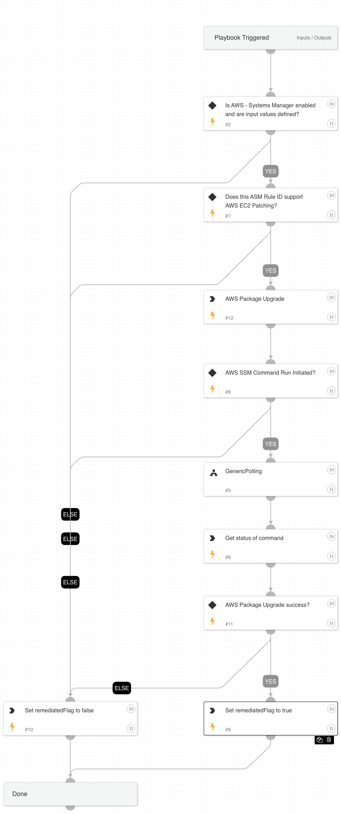

This playbook upgrades supported packages on an AWS EC2 instance using AWS Systems manager.

## Dependencies

This playbook uses the following sub-playbooks, integrations, and scripts.

### Sub-playbooks

* GenericPolling

### Integrations

* AWS - System Manager

### Scripts

* AWSPackageUpgrade
* Set

### Commands

* aws-ssm-command-list

## Playbook Inputs

---

| **Name** | **Description** | **Default Value** | **Required** |
| --- | --- | --- | --- |
| ASM Rule ID | ASM rule ID. | ${alert.asmattacksurfaceruleid} | Required |
| Instance ID | Instance ID of the EC2. |  | Required |
| Region | AWS region of the EC2 instance. |  | Required |
| Assume Role | AWS role to be assumed. |  | Optional |
| Account ID | AWS account ID. |  | Optional |

## Playbook Outputs

---

| **Path** | **Description** | **Type** |
| --- | --- | --- |
| remediatedFlag | Whether package is upgraded. | unknown |

## Playbook Image

---

