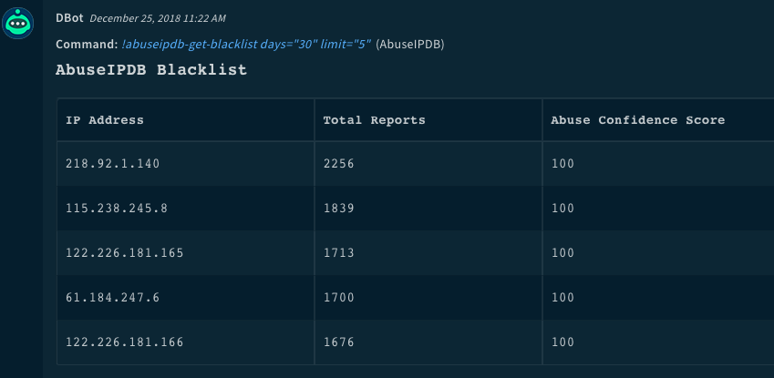
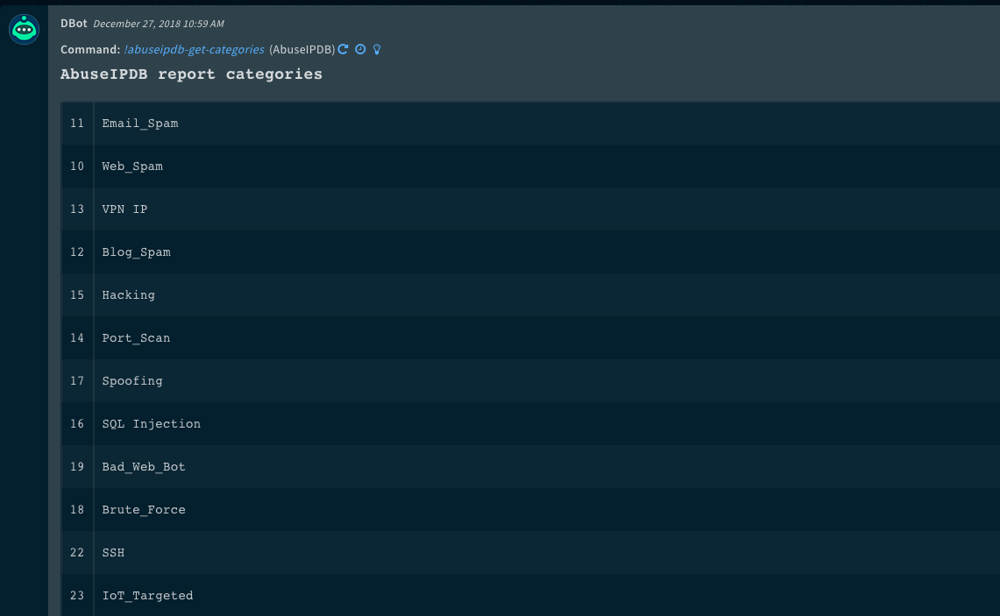

<!-- HTML_DOC -->

Use the AbuseIPDB integration to report and identify IP addresses that have been associated with malicious activity online.

<h2>Use Cases</h2>

Check, Report, and get block list of top malicious IPs.

<h2>Configure AbuseIPDB on Cortex XSOAR</h2>
<ol>
<li>Navigate to <strong>Settings</strong> &gt; <strong>Integrations</strong> &gt; <strong>Servers &amp; Services</strong>.</li>
<li>Search for AbuseIPDB.</li>
<li>Click <strong>Add instance</strong> to create and configure a new integration instance.
<ul>
<li>
<strong>Name</strong>: a textual name for the integration instance.</li>
<li><strong>API Key (v2).</strong></li>
<li><strong>Source Reliability</strong>: Reliability of the source providing the intelligence data.</li>
<li><strong>IP Threshold. Minimum score from AbuseIPDB analysis to consider the IP malicious. (&gt;20).</strong></li>
<li><strong>Max reports age.</strong></li>
<li><strong>Disable reputation lookups for private IP addresses</strong>: To reduce the number of lookups made to the AbuseIPDB API.</li>
<li><strong>Disregard quota errors.</strong></li>
</ul>
</li>
<li>Click <strong>Test</strong> to validate the API Key, and connection.</li>
</ol>
<h2>Commands</h2>

You can execute these commands from the Cortex XSOAR CLI, as part of an automation, or in a playbook. After you successfully execute a command, a DBot message appears in the War Room with the command details.

<ol>
<li><a href="#h_52262055641545911025223">Check if an IP address is in the AbuseIP database: ip</a></li>
<li><a href="#h_130633879481545911083799">Query a block of IP addresses: abuseipdb-check-cidr-block</a></li>
<li><a href="#h_720330259911545911111279">Report an IP address: abuseipdb-report-ip</a></li>
<li><a href="#h_5900568011321545911147791">Get a list of the most reported IP addresses: abuseipdb-get-blacklist</a></li>
<li><a href="#h_7763511091731545911176964">Get a list of report categories: abuseipdb-get-categories</a></li>
</ol>
<h3 id="h_52262055641545911025223">1. Check if an IP address is in the AbuseIP database</h3>

Checks the specified IP address against the AbuseIP database.

<h5>Base Command</h5>

<code>ip</code>

<h5>Input</h5>
<table style="width: 749px;">
<thead>
<tr>
<th style="width: 137px;"><strong>Argument Name</strong></th>
<th style="width: 532px;"><strong>Description</strong></th>
<th style="width: 71px;"><strong>Required</strong></th>
</tr>
</thead>
<tbody>
<tr>
<td style="width: 137px;">ip</td>
<td style="width: 532px;">IP address to check</td>
<td style="width: 71px;">Required</td>
</tr>
<tr>
<td style="width: 137px;">days</td>
<td style="width: 532px;">Time range to return reports for (in days), default is 30</td>
<td style="width: 71px;">Optional</td>
</tr>
<tr>
<td style="width: 137px;">verbose</td>
<td style="width: 532px;">Report length, "true" returns the full report, "false" does not return reported categories, default is "true"</td>
<td style="width: 71px;">Optional</td>
</tr>
<tr>
<td style="width: 137px;">threshold</td>
<td style="width: 532px;">Minimum score from AbuseIPDB to consider the IP malicious (must be greater than 20), default is 80</td>
<td style="width: 71px;">Optional</td>
</tr>
<tr>
<td style="width: 137px;">override_private_lookup</td>
<td style="width: 532px;">Enrichment of private IP addresses will be conducted even if it has been disabled at the integration level, default is "false"</td>
<td style="width: 71px;">Optional</td>
</tr>
</tbody>
</table>

 

<h5>Context Output</h5>
<table style="width: 749px;">
<thead>
<tr>
<th style="width: 268px;"><strong>Path</strong></th>
<th style="width: 58px;"><strong>Type</strong></th>
<th style="width: 414px;"><strong>Description</strong></th>
</tr>
</thead>
<tbody>
<tr>
<td style="width: 268px;">AbuseIPDB.IP.Address</td>
<td style="width: 58px;">unknown</td>
<td style="width: 414px;">IP address</td>
</tr>
<tr>
<td style="width: 268px;">AbuseIPDB.IP.AbuseConfidenceScore</td>
<td style="width: 58px;">unknown</td>
<td style="width: 414px;">Confidence score fetched from AbuseIPDB</td>
</tr>
<tr>
<td style="width: 268px;">AbuseIPDB.IP.TotalReports</td>
<td style="width: 58px;">unknown</td>
<td style="width: 414px;">The number of times this address has been reported</td>
</tr>
<tr>
<td style="width: 268px;">AbuseIPDB.IP.Geo.Country</td>
<td style="width: 58px;">String</td>
<td style="width: 414px;">Country associated with this IP Address</td>
</tr>
<tr>
<td style="width: 268px;">AbuseIPDB.IP.Geo.CountryCode</td>
<td style="width: 58px;">String</td>
<td style="width: 414px;">Country code associated with this IP Address</td>
</tr>
<tr>
<td style="width: 268px;">AbuseIPDB.IP.Hostnames</td>
<td style="width: 58px;">String</td>
<td style="width: 414px;">The hostame(s) of the IP address.</td>
</tr>
<tr>
<td style="width: 268px;">AbuseIPDB.IP.IpVersion</td>
<td style="width: 58px;">String</td>
<td style="width: 414px;">The version of the IP address.</td>
</tr>
<tr>
<td style="width: 268px;">AbuseIPDB.IP.IsPublic</td>
<td style="width: 58px;">String</td>
<td style="width: 414px;">Is the IP address public.</td>
</tr>
<tr>
<td style="width: 268px;">AbuseIPDB.IP.IsTor</td>
<td style="width: 58px;">String</td>
<td style="width: 414px;">Is the IP address a Tor IP.</td>
</tr>
<tr>
<td style="width: 268px;">AbuseIPDB.IP.IsWhitelisted</td>
<td style="width: 58px;">String</td>
<td style="width: 414px;">Is the IP address whitelisted.</td>
</tr>
<tr>
<td style="width: 268px;">AbuseIPDB.IP.LastReportedAt</td>
<td style="width: 58px;">String</td>
<td style="width: 414px;">When the IP address was last reported.</td>
</tr>
<tr>
<td style="width: 268px;">AbuseIPDB.IP.NumDistinctUsers</td>
<td style="width: 58px;">String</td>
<td style="width: 414px;">The distinct number of users.</td>
</tr>
<tr>
<td style="width: 268px;">AbuseIPDB.IP.Address.Reports</td>
<td style="width: 58px;">unknown</td>
<td style="width: 414px;">Reports summary (for "verbose" reports)</td>
</tr>
<tr>
<td style="width: 268px;">DBotScore.Score</td>
<td style="width: 58px;">unknown</td>
<td style="width: 414px;">Analysis score</td>
</tr>
<tr>
<td style="width: 268px;">DBotScore.Vendor</td>
<td style="width: 58px;">unknown</td>
<td style="width: 414px;">Vendor name (AbuseIPDB)</td>
</tr>
<tr>
<td style="width: 268px;">DBotScore.Indicator</td>
<td style="width: 58px;">unknown</td>
<td style="width: 414px;">The IP address</td>
</tr>
<tr>
<td style="width: 268px;">DBotScore.Type</td>
<td style="width: 58px;">unknown</td>
<td style="width: 414px;">The type (ip)</td>
</tr>
<tr>
<td style="width: 268px;">AbuseIPDB.IP.Malicious.Vendor</td>
<td style="width: 58px;">unknown</td>
<td style="width: 414px;">The vendor that determined this IP address to be malicious</td>
</tr>
<tr>
<td style="width: 268px;">AbuseIPDB.IP.Malicious.Detections</td>
<td style="width: 58px;">unknown</td>
<td style="width: 414px;">The Detections that led to the verdict</td>
</tr>
<tr>
<td style="width: 271px;">AbuseIPDB.IP.UsageType</td>
<td style="width: 55px;">String</td>
<td style="width: 414px;">Usage type of the IP.</td>
</tr>
<tr>
<td style="width: 271px;">AbuseIPDB.IP.Domain</td>
<td style="width: 55px;">String</td>
<td style="width: 414px;">Domain of the IP.</td>
</tr>
</tbody>
</table>

 

<h5>Command Example</h5>

<code>!ip ip=8.8.8.8 days=30 verbose=true</code>

<h5>Context Example</h5>
<h5>Human Readable Output</h5>

<h3 id="h_130633879481545911083799">2. Query a block of IP addresses</h3>

Queries a block of IPs to check against the database

<h5>Base Command</h5>

<code>abuseipdb-check-cidr-block</code>

<h5>Input</h5>
<table style="width: 749px;">
<thead>
<tr>
<th style="width: 135px;"><strong>Argument Name</strong></th>
<th style="width: 534px;"><strong>Description</strong></th>
<th style="width: 71px;"><strong>Required</strong></th>
</tr>
</thead>
<tbody>
<tr>
<td style="width: 135px;">network</td>
<td style="width: 534px;">IPv4 Address Block in CIDR notation.</td>
<td style="width: 71px;">Required</td>
</tr>
<tr>
<td style="width: 135px;">days</td>
<td style="width: 534px;">Time range to return reports for (in days), default is 30</td>
<td style="width: 71px;">Optional</td>
</tr>
<tr>
<td style="width: 135px;">limit</td>
<td style="width: 534px;">Maximum number of IPs to check, default is 40</td>
<td style="width: 71px;">Optional</td>
</tr>
<tr>
<td style="width: 135px;">threshold</td>
<td style="width: 534px;">Minimum score from AbuseIPDB to consider the IP malicious (must be greater than 20), default is 80</td>
<td style="width: 71px;">Optional</td>
</tr>
</tbody>
</table>

 

<h5>Context Output</h5>
<table style="width: 749px;">
<thead>
<tr>
<th style="width: 271px;"><strong>Path</strong></th>
<th style="width: 55px;"><strong>Type</strong></th>
<th style="width: 414px;"><strong>Description</strong></th>
</tr>
</thead>
<tbody>
<tr>
<td style="width: 271px;">AbuseIPDB.IP.Address</td>
<td style="width: 55px;">unknown</td>
<td style="width: 414px;">IP address</td>
</tr>
<tr>
<td style="width: 271px;">AbuseIPDB.IP.AbuseConfidenceScore</td>
<td style="width: 55px;">unknown</td>
<td style="width: 414px;">Confidence score fetched from AbuseIPDB</td>
</tr>
<tr>
<td style="width: 268px;">AbuseIPDB.IP.Geo.Country</td>
<td style="width: 58px;">String</td>
<td style="width: 414px;">Country associated with this IP Address</td>
</tr>
<tr>
<td style="width: 268px;">AbuseIPDB.IP.Geo.CountryCode</td>
<td style="width: 58px;">String</td>
<td style="width: 414px;">Country code associated with this IP Address</td>
</tr>
<tr>
<td style="width: 268px;">AbuseIPDB.IP.Hostnames</td>
<td style="width: 58px;">String</td>
<td style="width: 414px;">The hostame(s) of the IP address.</td>
</tr>
<tr>
<td style="width: 268px;">AbuseIPDB.IP.IpVersion</td>
<td style="width: 58px;">String</td>
<td style="width: 414px;">The version of the IP address.</td>
</tr>
<tr>
<td style="width: 268px;">AbuseIPDB.IP.IsPublic</td>
<td style="width: 58px;">String</td>
<td style="width: 414px;">Is the IP address public.</td>
</tr>
<tr>
<td style="width: 268px;">AbuseIPDB.IP.IsTor</td>
<td style="width: 58px;">String</td>
<td style="width: 414px;">Is the IP address a Tor IP.</td>
</tr>
<tr>
<td style="width: 268px;">AbuseIPDB.IP.IsWhitelisted</td>
<td style="width: 58px;">String</td>
<td style="width: 414px;">Is the IP address whitelisted.</td>
</tr>
<tr>
<td style="width: 268px;">AbuseIPDB.IP.LastReportedAt</td>
<td style="width: 58px;">String</td>
<td style="width: 414px;">When the IP address was last reported.</td>
</tr>
<tr>
<td style="width: 268px;">AbuseIPDB.IP.NumDistinctUsers</td>
<td style="width: 58px;">String</td>
<td style="width: 414px;">The distinct number of users.</td>
</tr>
<tr>
<td style="width: 271px;">AbuseIPDB.IP.TotalReports</td>
<td style="width: 55px;">unknown</td>
<td style="width: 414px;">The number of times this address has been reported</td>
</tr>
<tr>
<td style="width: 271px;">DBotScore.Score</td>
<td style="width: 55px;">unknown</td>
<td style="width: 414px;">Analysis score</td>
</tr>
<tr>
<td style="width: 271px;">DBotScore.Vendor</td>
<td style="width: 55px;">unknown</td>
<td style="width: 414px;">Vendor name (AbuseIPDB)</td>
</tr>
<tr>
<td style="width: 271px;">DBotScore.Indicator</td>
<td style="width: 55px;">unknown</td>
<td style="width: 414px;">The IP address</td>
</tr>
<tr>
<td style="width: 271px;">DBotScore.Type</td>
<td style="width: 55px;">unknown</td>
<td style="width: 414px;">The type (ip)</td>
</tr>
<tr>
<td style="width: 271px;">AbuseIPDB.IP.Malicious.Vendor</td>
<td style="width: 55px;">unknown</td>
<td style="width: 414px;">The vendor that determined this IP address to be malicious</td>
</tr>
<tr>
<td style="width: 271px;">AbuseIPDB.IP.Malicious.Detections</td>
<td style="width: 55px;">unknown</td>
<td style="width: 414px;">The Detections that led to the verdict</td>
</tr>
<tr>
<td style="width: 271px;">AbuseIPDB.IP.UsageType</td>
<td style="width: 55px;">String</td>
<td style="width: 414px;">Usage type of the IP.</td>
</tr>
<tr>
<td style="width: 271px;">AbuseIPDB.IP.Domain</td>
<td style="width: 55px;">String</td>
<td style="width: 414px;">Domain of the IP.</td>
</tr>
</tbody>
</table>

 

<h5>Command Example</h5>

<code>!abuseipdb-check-cidr-block network="127.0.0.2/24" days="30" limit="40" threshold="80"</code>

 

<h5>Human Readable Output</h5>

<h3 id="h_720330259911545911111279">3. Report an IP address</h3>

Report an IP address to AbuseIPDB

<h5>Base Command</h5>

<code>abuseipdb-report-ip</code>

<h5>Input</h5>
<table style="width: 749px;">
<thead>
<tr>
<th style="width: 150px;"><strong>Argument Name</strong></th>
<th style="width: 512px;"><strong>Description</strong></th>
<th style="width: 78px;"><strong>Required</strong></th>
</tr>
</thead>
<tbody>
<tr>
<td style="width: 150px;">ip</td>
<td style="width: 512px;">The IP address to report</td>
<td style="width: 78px;">Required</td>
</tr>
<tr>
<td style="width: 150px;">categories</td>
<td style="width: 512px;">CSV list of category IDs (numerical representation or in their name)</td>
<td style="width: 78px;">Required</td>
</tr>
</tbody>
</table>

 

<h5>Context Output</h5>

There is no context output for this command.

<h5>Command Example</h5>

<code>!abuseipdb-report-ip ip=8.8.8.8 categories="18,22,23"</code>

<h5>Human Readable Output</h5>

<h3 id="h_5900568011321545911147791">4. Get a list of the most reported IP addresses</h3>

Returns a list of the most reported IP addresses

<h5>Base Command</h5>

<code>abuseipdb-get-blacklist</code>

<h5>Input</h5>
<table style="width: 749px;">
<thead>
<tr>
<th style="width: 169px;"><strong>Argument Name</strong></th>
<th style="width: 481px;"><strong>Description</strong></th>
<th style="width: 90px;"><strong>Required</strong></th>
</tr>
</thead>
<tbody>
<tr>
<td style="width: 169px;">days</td>
<td style="width: 481px;">Time range to return reports for (in days), default is 30</td>
<td style="width: 90px;">Optional</td>
</tr>
<tr>
<td style="width: 169px;">limit</td>
<td style="width: 481px;">Maximum number of IPs to retrieve, default is 50</td>
<td style="width: 90px;">Optional</td>
</tr>
<tr>
<td style="width: 169px;">confidence</td>
<td style="width: 481px;">The Minimum confidence required for the retrieved IPs. Default is 100</td>
<td style="width: 90px;">Optional</td>
</tr>
</tbody>
</table>

 

<h5>Context Output</h5>
<table style="width: 749px;">
<thead>
<tr>
<th style="width: 288px;"><strong>Path</strong></th>
<th style="width: 141px;"><strong>Type</strong></th>
<th style="width: 311px;"><strong>Description</strong></th>
</tr>
</thead>
<tbody>
<tr>
<td style="width: 288px;">AbuseIPDB.Blacklist</td>
<td style="width: 141px;">unknown</td>
<td style="width: 311px;">List of IPs on block list</td>
</tr>
</tbody>
</table>

 

<h5>Command Example</h5>

<code>!abuseipdb-get-blacklist days=30 limit=5</code>

<h5>Context Example</h5>
<h5>Human Readable Output</h5>

<h3 id="h_7763511091731545911176964">5. Get a list of report categories</h3>

Returns a list of report categories from AbuseIPDB

<h5>Base Command</h5>

<code>abuseipdb-get-categories</code>

<h5>Input</h5>

There are no input arguments for this command.

<h5>Context Output</h5>
<table style="width: 749px;">
<thead>
<tr>
<th style="width: 286px;"><strong>Path</strong></th>
<th style="width: 81px;"><strong>Type</strong></th>
<th style="width: 373px;"><strong>Description</strong></th>
</tr>
</thead>
<tbody>
<tr>
<td style="width: 286px;">AbuseIPDB.Categories</td>
<td style="width: 81px;">string</td>
<td style="width: 373px;">List of AbuseIPDB categories</td>
</tr>
</tbody>
</table>

 

<h5>Command Example</h5>

<code>!abuseipdb-get-categories</code>

 

<h5>Human Readable Output</h5>

<h2>Additional Information</h2>
<ul>
<li>
<strong>What is the "Confidence of Abuse" rating, and how is it calculated?</strong> AbuseIPDB confidence of abuse is a rating (0-100) of how confident we are, based on user reports, that an IP address is completely malicious. A rating of 100 means we are certain that an IP address is malicious, and a rating of 0 means we have no reason to suspect it is malicious.</li>
</ul>
