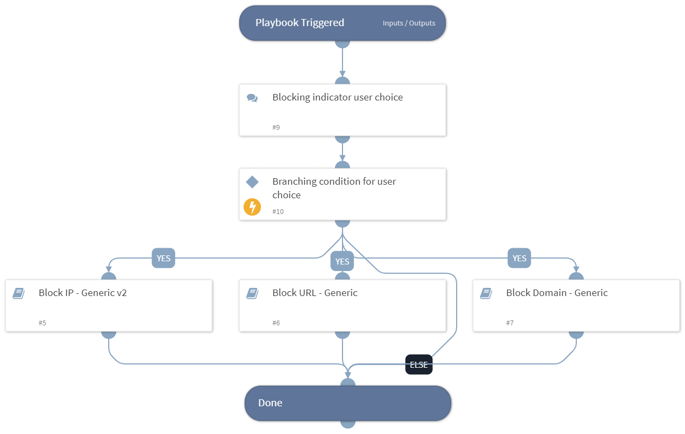

- NOTE: This playbook is deprecated.
- Sends indicators imported from ACTI feeds with a severity rating of 5 or higher to your firewall to be blocked.

## Dependencies
This playbook uses the following sub-playbooks, integrations, and scripts.

### Sub-playbooks
* Block IP - Generic v2
* Block Domain - Generic
* Block URL - Generic

### Integrations
This playbook does not use any integrations.

### Scripts
This playbook does not use any scripts.

### Commands
This playbook does not use any commands.

## Playbook Inputs
---

| **Name** | **Description** | **Default Value** | **Required** |
| --- | --- | --- | --- |
| IP | Considers IP\(s\) which have severity 5 or more | ${DBotScore.Indicator} | Optional |
| URL | Considers URL\(s\) which have severity 5 or more | ${DBotScore.Indicator} | Optional |
| Domain | Considers Domain\(s\) which have severity 5 or more | ${DBotScore.Indicator} | Optional |

## Playbook Outputs
---
There are no outputs for this playbook.

## Playbook Image
---
