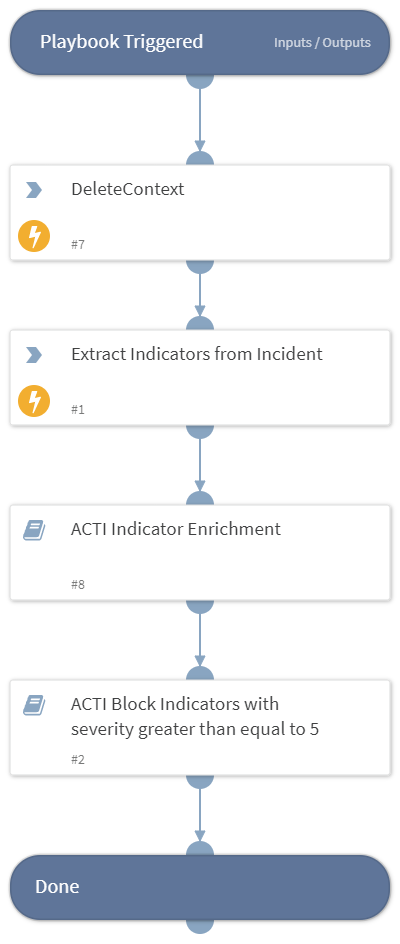

- NOTE: This playbook is deprecated.
- Extracts indicators from an incident and sends them to your firewall to be blocked.

## Dependencies
This playbook uses the following sub-playbooks, integrations, and scripts.

### Sub-playbooks
* ACTI Indicator Enrichment
* ACTI Block Indicators with severity greater than equal to 5

### Integrations
This playbook does not use any integrations.

### Scripts
* DeleteContext

### Commands
* extractIndicators

## Playbook Inputs
---
There are no inputs for this playbook.

## Playbook Outputs
---
There are no outputs for this playbook.

## Playbook Image
---
