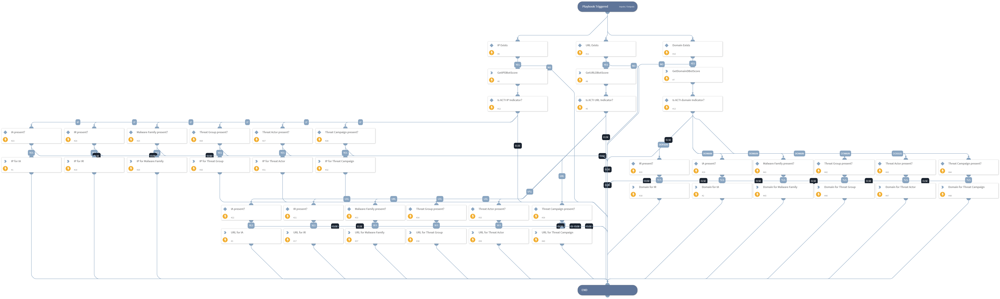

- NOTE: This playbook is deprecated.
- This sub-playbook makes the connections between ACTI indicators (from ACTI Indicator API) and ACTI intelligence reports (from ACTI Report API) that have pulled into an XSOAR incident via the _**Enrich Incidents with Indicators**_ and _**Enrich Incidents with Intelligence Reports**_ sub-playbooks.
- This sub-playbook _**cannot**_ be integrated into generic XSOAR playbooks and playbooks from other vendors by itself. It is dependent upon the _**Enrich Incidents with Indicators**_ and _**Enrich Incidents with Intelligence Reports**_ sub-playbooks.

## Dependencies
This playbook uses the following sub-playbooks, integrations, and scripts.

### Sub-playbooks
This playbook does not use any sub-playbooks.

### Integrations
This playbook does not use any integrations.

### Scripts
* GetIndicatorDBotScore
* Exists
* CreateIndicatorRelationship

### Commands
This playbook does not use any commands.

## Playbook Inputs
---

| **Name** | **Description** | **Default Value** | **Required** |
| --- | --- | --- | --- |
| IP | The extracted IP address. | ${IP.Address} | Optional |
| IA | The Intelligence Alert associated with the indicator. | ${intelligence_alerts} | Optional |
| IR | The Intelligence Report associated with the indicator. | ${intelligence_reports} | Optional |
| URL | The extracted URL. | ${URL.Data} | Optional |
| Domain | The extracted Domain. | ${Domain.Name} | Optional |
| MFam | The Malware Family associated with the indicator. | acti_malware_family_uuid | Optional |
| TA | The Threat Actor associated with the indicator. | acti_threat_actors_uuid | Optional |
| TG | The Threat Group associated with the indicator. | acti_threat_groups_uuid | Optional |
| TC | The Threat Campaign associated with the indicator. | acti_threat_campaigns_uuid | Optional |

## Playbook Outputs
---
There are no outputs for this playbook.

## Playbook Image
---

