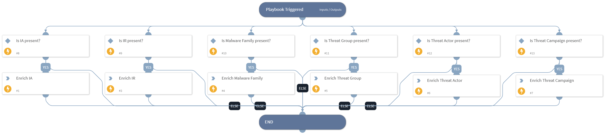

- This playbook enriches Intelligence Alerts, Intelligence Reports, Malware Families, Threat Actors, Threat Groups & Threat Campaigns

## Dependencies
This playbook uses the following sub-playbooks, integrations, and scripts.

### Sub-playbooks
This playbook does not use any sub-playbooks.

### Integrations
* ACTI Indicator Query

### Scripts
This playbook does not use any scripts.

### Commands
* acti-get-fundamentals-by-uuid
* acti-getThreatIntelReport

## Playbook Inputs
---

| **Name** | **Description** | **Default Value** | **Required** |
| --- | --- | --- | --- |
| ia_uuid | Intelligence Alert unique ID. | ${intelligence_alerts} | Optional |
| ir_uuid | Intelligence Report unique ID. | ${intelligence_reports} | Optional |
| MalwareFamily_uuid | Malware Family unique ID. | ${acti_malware_family_uuid} | Optional |
| ThreatGroup_uuid | Threat Group unique ID. | ${acti_threat_groups_uuid} | Optional |
| ThreatCampaign_uuid | Threat Campaign unique ID. | ${acti_threat_campaigns_uuid} | Optional |
| ThreatActor_uuid | Threat Actor unique ID. | ${acti_threat_actors_uuid} | Optional |

## Playbook Image
---

