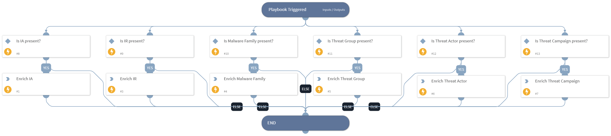

- NOTE: This playbook is deprecated.
- This playbook automatically queries ACTI Threat Indicator, Report, and Fundamental API to pull context for IOC and associated intelligence reports into XSOAR incidents.
- This sub-playbook can be integrated into generic XSOAR playbooks and playbooks from other vendors by itself.

## Dependencies
This playbook uses the following sub-playbooks, integrations, and scripts.

### Sub-playbooks
This playbook does not use any sub-playbooks.

### Integrations
* ACTI Indicator Query

### Scripts
* Exists

### Commands
* ip
* domain
* url

## Playbook Inputs
---

| **Name** | **Description** | **Default Value** | **Required** |
| --- | --- | --- | --- |
| IP_Pre_Enrich | The extracted IP. | ${IP.Address} | Optional |
| Domain_Pre_Enrich | The extracted Domain. | ${Domain.Name} | Optional |
| URL_Pre_Enrich | The extracted URL. | ${URL.Data} | Optional |

## Playbook Outputs
---

| **Path** | **Description** | **Type** |
| --- | --- | --- |
| IP | The enriched IP. | unknown |
| DBotScore | DBotScore of indicators. | unknown |
| Domain | The enriched Domain. | unknown |
| URL | The enriched URL | unknown |
| intelligence_alerts | The Intelligence Alerts related to indicators. | unknown |
| intelligence_reports | The Intelligence Reports related to indicators. | unknown |

## Playbook Image
---

