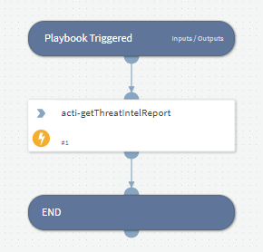

- NOTE: This playbook is deprecated.
- This sub-playbook can be plugged into playbooks from other vendors in order to pull ACTI Intelligence Alerts & Intelligence Reports into an XSOAR incident.
- This sub-playbook can be integrated into generic XSOAR playbooks and playbooks from other vendors by itself.

## Dependencies
This playbook uses the following sub-playbooks, integrations, and scripts.

### Sub-playbooks
This playbook does not use any sub-playbooks.

### Integrations
* ACTI Indicator Query

### Scripts
This playbook does not use any scripts.

### Commands
* acti-getThreatIntelReport

## Playbook Inputs
---

| **Name** | **Description** | **Default Value** | **Required** |
| --- | --- | --- | --- |
| ia_uuid | The Intelligence Alert uuid. | ${intelligence_alerts} | Optional |
| ir_uuid | The Intelligence Report uuid. | ${intelligence_reports} | Optional |
| Domain | The extarcted Domain. | ${Domain} | Optional |
| IP | The extracted IP. | ${IP} | Optional |
| URL | The extracted URL. | ${URL} | Optional |

## Playbook Outputs
---

| **Path** | **Description** | **Type** |
| --- | --- | --- |
| IAIR |  | unknown |
| DBotScore |  | unknown |
| Domain |  | unknown |
| IP |  | unknown |
| URL |  | unknown |

## Playbook Image
---
