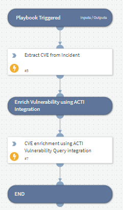

- NOTE: This playbook is deprecated.
- Enriches a vulnerability (CVE) with context from ACTI's Vulnerability Intelligence feed and stores the content in the XSOAR indicators store.

## Dependencies
This playbook uses the following sub-playbooks, integrations, and scripts.

### Sub-playbooks
This playbook does not use any sub-playbooks.

### Integrations
* ACTI Vulnerability Query

### Scripts
This playbook does not use any scripts.

### Commands
* extractIndicators
* acti-vuln

## Playbook Inputs
---
There are no inputs for this playbook.

## Playbook Outputs
---
There are no outputs for this playbook.

## Playbook Image
---

