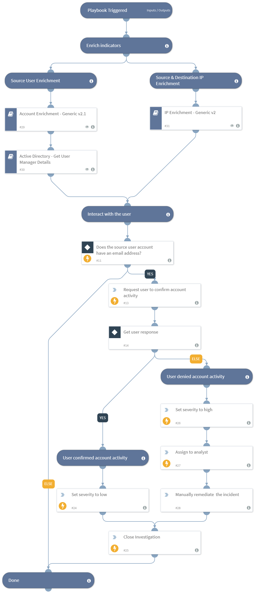

An unauthorised access to a cloud asset, a server or a physical endpoint can compromise an entire organization. 
Access investigations require security teams to reconcile data from multiple sources, gather user and network data, and communicate with users and other relevant parties. Valuable time is lost shuttling between screens and executing repeatable tasks while an attack continues to manifest.
This Access Investigation content pack contains the ‘Access Investigation - Generic’ playbook, that automates response to an unauthorised access incident. The pack also contains the corresponding custom Access incident type to facilitate analyst investigation.
The Access playbook orchestrates across multiple products to extract and enrich IOCs, interact with the suspected user and calculate the incident’s severity.

##### What does this pack do?
The playbooks included in this pack help you save time and automate repetitive tasks associated with Malware incidents:
- Create an Access incident within Cortex XSOAR associated with the unauthorized access.
- Extract and enrich user information, and retrieve the user’s manager details.
- Extract and enrich IP information.
- Interact with the user to gather more information regarding the suspected access.
- Calculate the incident’s severity based on the enriched information and information received from the user.
- Assign the investigation to an analyst.

As part of this pack, you will also get out-of-the-box Access incident type, which is easily customizable to suit the needs of your organization.

_For more information, visit our  [Cortex XSOAR Developer Docs](https://xsoar.pan.dev/docs/reference/playbooks/access-investigation---generic)_

