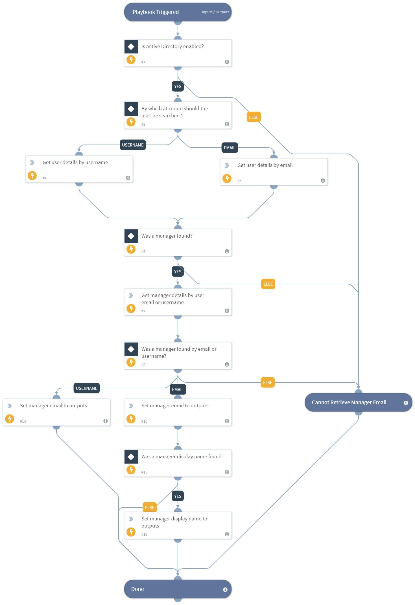

Takes an email address or a username of a user account in Active Directory, and returns the email address of the user's manager.

## Dependencies
This playbook uses the following sub-playbooks, integrations, and scripts.

### Sub-playbooks
This playbook does not use any sub-playbooks.

### Integrations
* Active Directory Query v2

### Scripts
* SetAndHandleEmpty

### Commands
* ad-get-user

## Playbook Inputs
---

| **Name** | **Description** | **Default Value** | **Required** |
| --- | --- | --- | --- |
| Username | Search for user by the sAMAccountName attribute in Active Directory. |  | Optional |
| UserEmail | Search for user by the email attribute in Active Directory. | Account.Email | Optional |

## Playbook Outputs
---

| **Path** | **Description** | **Type** |
| --- | --- | --- |
| UserManagerEmail | The email of the user's manager. | unknown |
| UserManagerDisplayName | The display name of the user's manager. | unknown |

## Playbook Image
---
