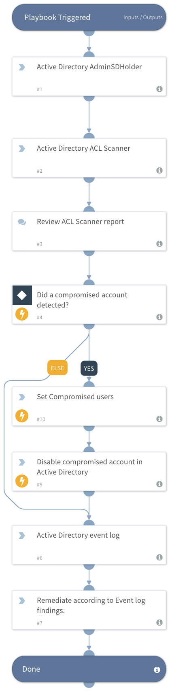

Active Directory Investigation playbook provides tools and guidance to investigate changes and manipulation in Active Directory containers, ACLs, Schema, and objects.
This playbook uses a 3rd party tool provided by Microsoft to scan the Active Directory access list, trees, and objects.
Additional investigative information is provided for manual investigation.

## Dependencies
This playbook uses the following sub-playbooks, integrations, and scripts.

### Sub-playbooks
This playbook does not use any sub-playbooks.

### Integrations
* Active_Directory_Query

### Scripts
This playbook does not use any scripts.

### Commands
* ad-disable-account
* setIncident

## Playbook Inputs
---
There are no inputs for this playbook.

## Playbook Outputs
---
There are no outputs for this playbook.

## Playbook Image
---
