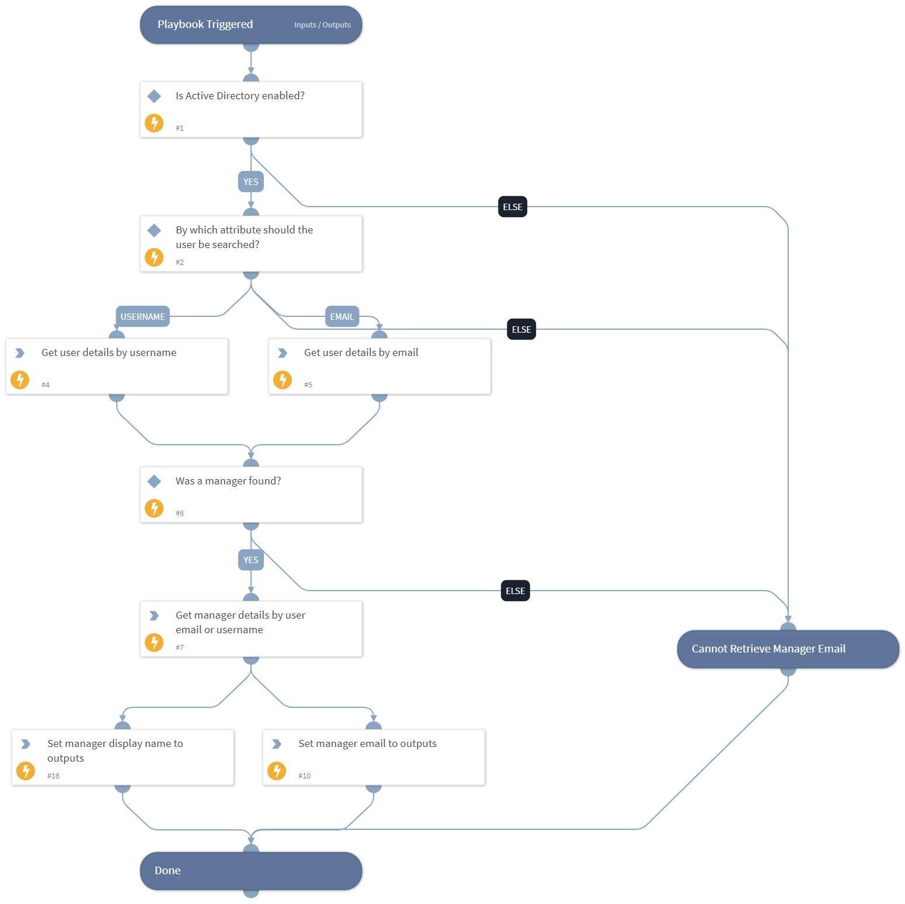

Use the Active Directory Query content pack to access and manage Active Directory objects (users, contacts, and computers) and run AD queries.

## What does this pack do?
- Retrieve detailed information about user accounts in Active Directory. 
- Create, update, and delete users and contacts in Active Directory.
- Add or remove users from groups in Active Directory.
- Enable or disable a user account in Active Directory.
- Based on an email address or a username of a user account in Active Directory, return the email address and/or username of the user's manager.
- Investigate changes in Active Directory containers, ACLs, Schema, and objects.

As part of this pack, you will get an integration, a playbook to investigate changes in Active Directory, a playbook to access a user's manager's email address or username, 2 classifiers, and 4 scripts:
- **ADGetUser**: Retrieves detailed information about a user account. 
- **IAMInitADUser**: Generates and sets an AD user account with a password, and enables the account. 
- **SendEmailToManager**: Sends an approval email to the manager of the employee with the given email allowing the manager to reply directly in the incident.
- **UserEnrichAD**: Enriches a username with Active Directory data.

## How does this pack work?
Create an instance of the **Active Directory Query v2** integration.
This integration can be used along with the Identity Lifecycle Management premium pack. For more information, see [Identity Lifecycle Management](https://xsoar.pan.dev/docs/reference/articles/identity-lifecycle-management) article.

For more information, see [Active Directory Query v2](https://xsoar.pan.dev/docs/reference/integrations/active-directory-query-v2)

