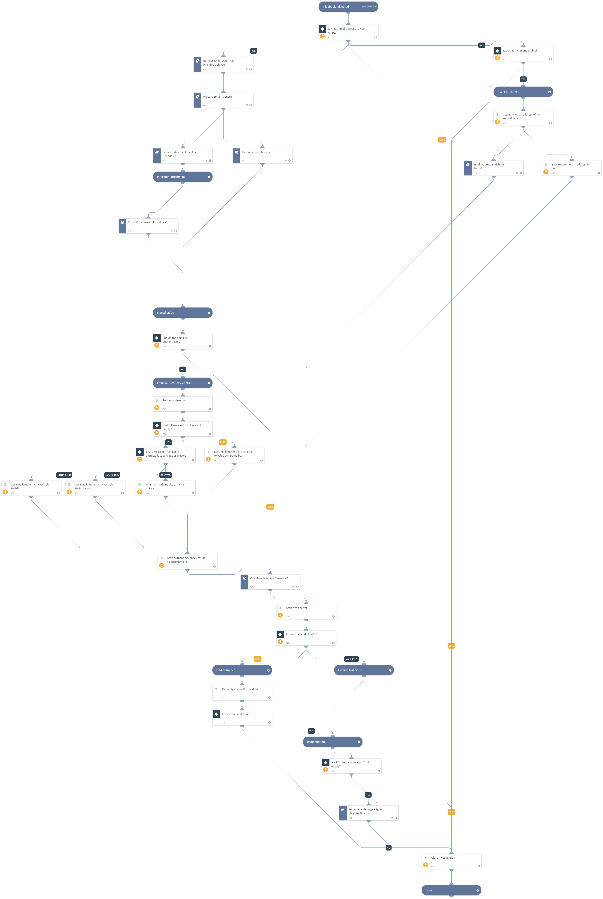

Investigates Agari policy events by obtaining the original message and attachments from the existing email integrations and remediates in Agari.

## Dependencies
This playbook uses the following sub-playbooks, integrations, and scripts.

### Sub-playbooks
* Process Email - Generic
* Detonate File - Generic
* Calculate Severity - Generic v2
* Retrieve Email Data - Agari Phishing Defense
* Email Address Enrichment - Generic v2.1
* Extract Indicators From File - Generic v2
* Entity Enrichment - Phishing v2
* Remediate Message - Agari Phishing Defense

### Integrations
This playbook does not use any integrations.

### Scripts
* AssignAnalystToIncident
* Set
* CheckEmailAuthenticity

### Commands
* setIncident

## Playbook Inputs
---

| **Name** | **Description** | **Default Value** | **Required** |
| --- | --- | --- | --- |
| APD Global Message ID | Global Message Id obtained from the incident. | incident.apdglobalmessageid | Required |
| AuthenticateEmail | Whether the authenticity of the email should be verified, using Authenticity Score. | True | Optional |
| OnCall | Set to true to assign only user that is currently on shift. Requires Cortex XSOAR v5.5 or later. | false | Optional |
| Role | The default role to assign the incident to. | Administrator | Optional |
| ResolveIP | Resolve IP addresses to hostnames \(DNS\). | False | Optional |
| AutoRemeditaion | Whether Automatic remediate message or not. | true | Optional |
| RemediateAction | Default action for remediation of message. | move | Optional |
| UserEnrichmentEnable | Flag for enabling User Enrichment. | True | Optional |
| User Id | Id of User. |  | Optional |
| APD Internal Message ID | Internal Message Id obtained from the incident. | incident.apdinternalmessageid | Required |

## Playbook Outputs
---
There are no outputs for this playbook.

## Playbook Image
---
