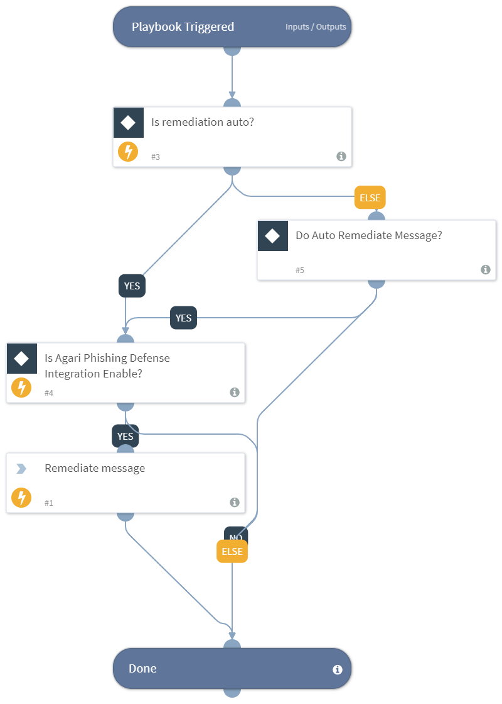

Remediates a given message id.

## Dependencies
This playbook uses the following sub-playbooks, integrations, and scripts.

### Sub-playbooks
This playbook does not use any sub-playbooks.

### Integrations
This playbook does not use any integrations.

### Scripts
This playbook does not use any scripts.

### Commands
* apd-remediate-message

## Playbook Inputs
---

| **Name** | **Description** | **Default Value** | **Required** |
| --- | --- | --- | --- |
| id | Id of message to remediate. | incident.apdinternalmessageid | Required |
| auto_remediation | Flag for whether to automatically remediate or not. | true | Optional |
| remediate_action | Action for remediation. | delete | Optional |

## Playbook Outputs
---
There are no outputs for this playbook.

## Playbook Image
---
