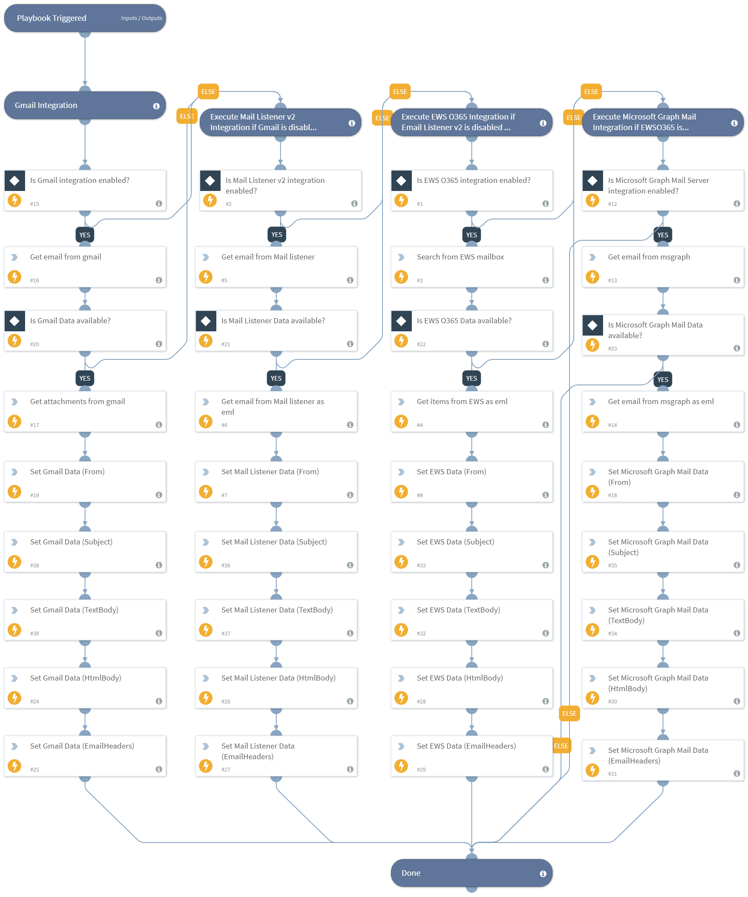

Retrieve Email Data from one of the Integrations of Gmail, Mail Listener v2, EWS O365, Microsoft Graph Mail.

## Dependencies
This playbook uses the following sub-playbooks, integrations, and scripts.

### Sub-playbooks
This playbook does not use any sub-playbooks.

### Integrations
This playbook does not use any integrations.

### Scripts
* Set

### Commands
* ews-search-mailbox
* ews-get-items-as-eml
* gmail-get-mail
* gmail-get-attachments
* mail-listener-get-email
* mail-listener-get-email-as-eml
* msgraph-mail-get-email
* msgraph-mail-get-email-as-eml

## Playbook Inputs
---

| **Name** | **Description** | **Default Value** | **Required** |
| --- | --- | --- | --- |
| Message Id | Message Id of email. |  | Optional |
| User Id | User Id of user. |  | Optional |

## Playbook Outputs
---

| **Path** | **Description** | **Type** |
| --- | --- | --- |
| EmailData | From field, Html Text of body, Headers, Text of body, Subject of email. | unknown |

## Playbook Image
---
