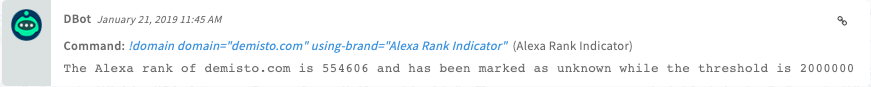

Alexa provides website ranking information that can be useful in determining if the domain in question has a strong web presence.
This integration was integrated and tested with Amazon Web Information Services.
## Configure Alexa Rank Indicator in Cortex


| **Parameter** | **Description** | **Required** |
| --- | --- | --- |
| Source Reliability | Reliability of the source providing the intelligence data. | True |
| Sensitivity threshold for configuring which domains are suspicious versus trusted. |  | True |
| Alexa rank - top domains to be considered trusted. | These domains will be given a DbotScore of good. | True |
| Use system proxy settings |  | False |
| Trust any certificate (not secure) |  | False |

## Commands
You can execute these commands from the CLI, as part of an automation, or in a playbook.
After you successfully execute a command, a DBot message appears in the War Room with the command details.
### domain
***
Provides an Alexa ranking of the Domain in question.


#### Base Command

`domain`
#### Input

| **Argument Name** | **Description** | **Required** |
| --- | --- | --- |
| domain | Domain to search. | Required | 


#### Context Output

| **Path** | **Type** | **Description** |
| --- | --- | --- |
| Domain.Name | string | The Domain being checked | 
| DBotScore.Score | number | The actual score. | 
| DBotScore.Vendor | string | The vendor used to calculate the score. | 
| DBotScore.Domain | string | Domain being reported | 
| DBotScore.Type | string | The indicator type. | 
| DBotScore.Indicator | string | The indicator that was tested. | 
| Alexa.Domain.Indicator | string | The Domain being checked | 
| Alexa.Domain.Name | string | The Domain being checked | 
| Alexa.Domain.Rank | string | Alexa rank as determined by Amazon | 


#### Command Example
```!domain domain=demisto.com```

#### Context Example
```json
{
    "Alexa": {
        "Domain": {
            "Indicator": "demisto.com",
            "Name": "demisto.com",
            "Rank": "9465040"
        }
    },
    "DBotScore": [
        {
            "Domain": "demisto.com",
            "Indicator": "demisto.com",
            "Reliability": "A - Completely reliable",
            "Score": 2,
            "Type": "domain",
            "Vendor": "Alexa Rank Indicator"
        }
    ],
    "Domain": {
        "Name": "demisto.com"
    }
}
```

#### Human Readable Output

