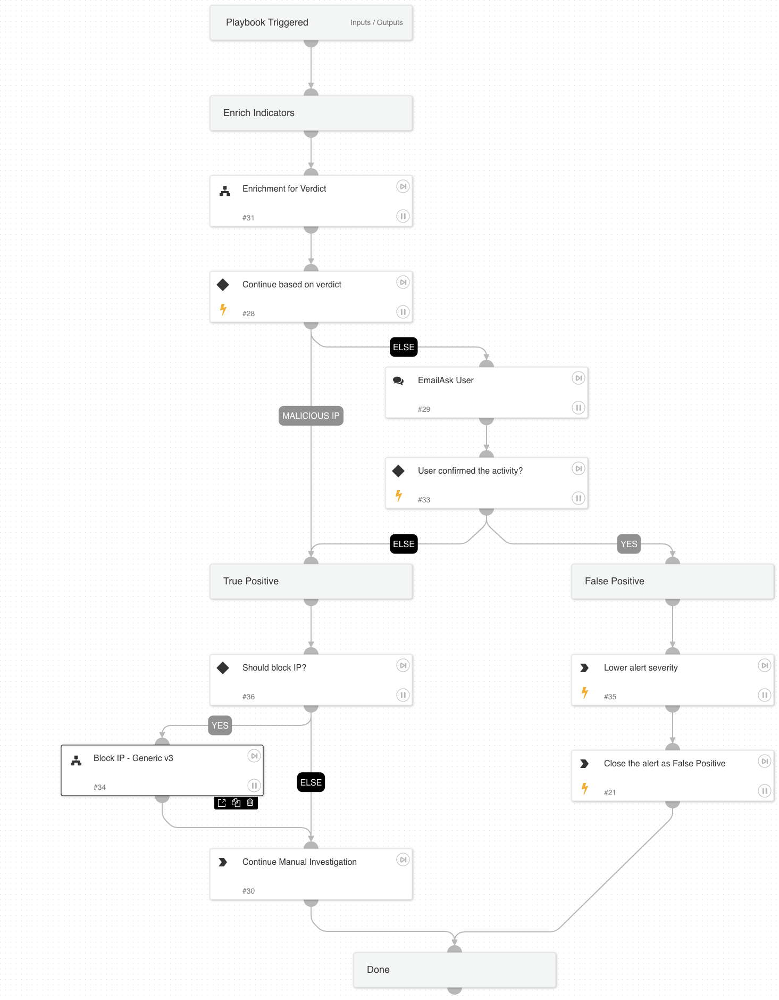

This playbook investigates an “Alibaba ActionTrail - multiple unauthorized action attempts detected by a user” alert by gathering user and IP information and performing remediation based on the information gathered and received from the user.

Used Sub-playbooks:
* Enrichment for Verdict
* Block IP - Generic v3

To link this playbook to the relevant alerts automatically, we recommend using the following filters when configuring the playbook triggers:
Alert Source = Correlation
Alert Name = Alibaba ActionTrail - multiple unauthorized action attempts detected by a user

## Dependencies

This playbook uses the following sub-playbooks, integrations, and scripts.

### Sub-playbooks

* Block IP - Generic v3
* Enrichment for Verdict

### Integrations

This playbook does not use any integrations.

### Scripts

This playbook does not use any scripts.

### Commands

* closeInvestigation
* setAlert

## Playbook Inputs

---

| **Name** | **Description** | **Default Value** | **Required** |
| --- | --- | --- | --- |
| InternalRange | List of internal IP ranges | lists.PrivateIPs | Optional |

## Playbook Outputs

---
There are no outputs for this playbook.

## Playbook Image

---

