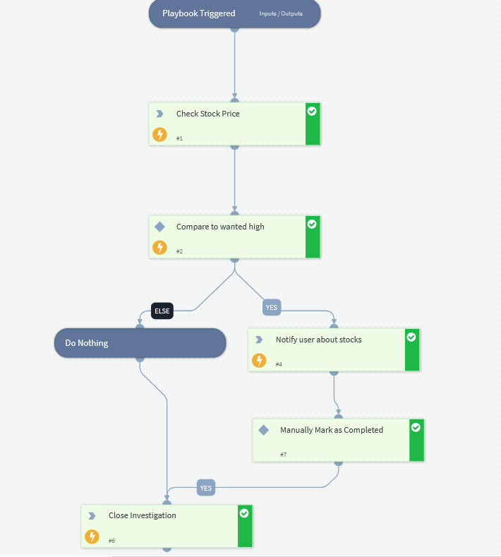

This playbook sends a message on Telegram when a stock price rises higher than a predefined price

## Dependencies
This playbook uses the following sub-playbooks, integrations, and scripts.

### Sub-playbooks
This playbook does not use any sub-playbooks.

### Integrations
* AlphaVantage

### Scripts
This playbook does not use any scripts.

### Commands
* closeInvestigation
* alphavantage-stock-data-get
* telegram-send-message

## Playbook Inputs
---

| **Name** | **Description** | **Default Value** | **Required** |
| --- | --- | --- | --- |
| Stock | Symbol/Ticker of a stock. Ex: PANW, AAPL, MSFT | incident.symbol | Required |
| Price | Price boundary to check. Notify when stock is higher than this price. | incident.price | Required |
| Telegram User Id | The user id of the user you want to send a message to. To get this, talk to @userinfobot on Telegram. | incident.userid | Required |
| Telegram Username | The username of the telegram account to send a message to. | incident.username | Required |

## Playbook Outputs
---
There are no outputs for this playbook.

## Playbook Image
---
