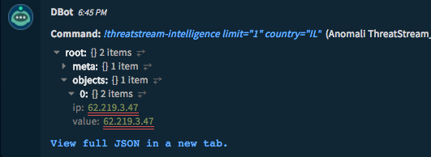
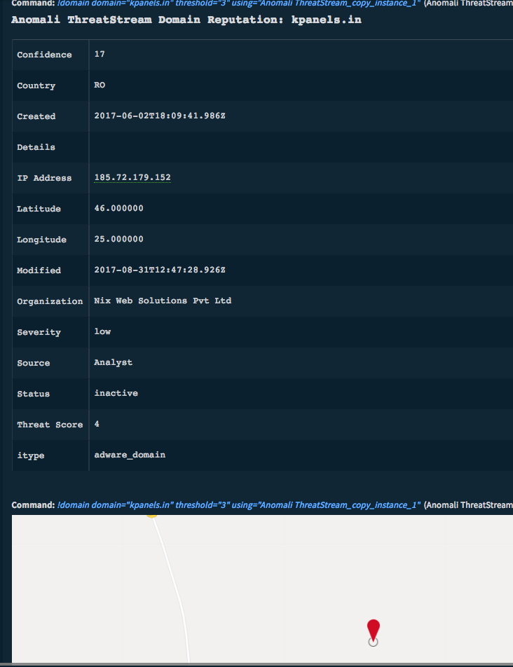
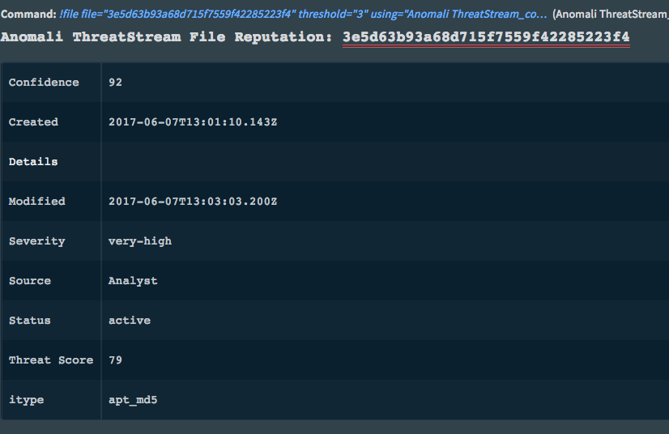
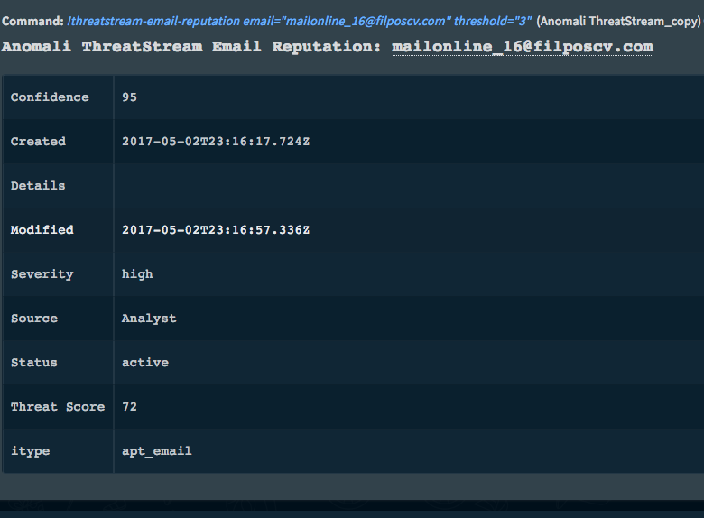
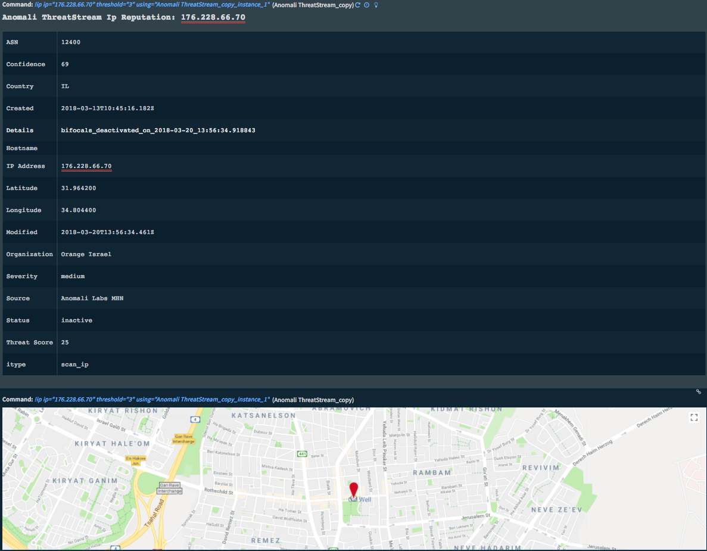

<!-- HTML_DOC -->
<h2>Overview</h2>

Anomali ThreatStream (previously ThreatStream Optic) is a threat-intelligence integration that enables you to pull threat intelligence from the ThreatStream platform and use in third-party tools. The integration works with the <code>v2</code> API on product version 2.5.4, using the <code>intelligence</code> resource.

Commands:

<ul>
<li><a href="#h_956498138931525680640820">Receive threat intelligence: threatstream-intelligence</a></li>
<li><a href="#h_5769900451251525680987811">Check IP/domain reputation: domain</a></li>
<li><a href="#h_1557915141571525681059225">Check file's checksum reputation: file</a></li>
<li><a href="#h_103925922131525681132050">Check email address reputation: threatstream-email-reputation</a></li>
<li><a href="#h_6439751152451525771642821">Check IP reputation: ip</a></li>
</ul>

<h2>Prerequisites</h2>

You need to retrieve your Anomali ThreatStream credentials, which you will enter in Cortex XSOAR.

<ul>
<li><code>user ID</code></li>
<li>
<code>API key</code> </li>
</ul>

If you do not have these credentials, register at <a href="http://ui.threatstream.com/" rel="nofollow">http://ui.threatstream.com</a>. 

<h2>Configure Cortex XSOAR to Integrate with Anomali ThreatStream</h2>
<ol>
<li>Navigate to to <strong>Settings</strong> &gt; <strong>Integrations</strong> &gt; <strong>Servers &amp; Services.</strong>
</li>
<li>Search for the Anomali ThreatStream integration.</li>
<li>Click <strong>Add instance</strong> to create and configure a new integration instance.
<ul>
<li>
<strong>Name |</strong> a meaningful name for the integration instance. (Required)</li>
<li>
<strong>Server URL |</strong> Anomali ThreatStream hostname or IP address and port. For example: <a href="https://api.threatstream.com">https://</a>api.threatstream.com. (Required)</li>
<li>
<strong>User name |</strong> Anomali ThreatStream user name. (Required)</li>
<li>
<strong>API Key |</strong> The API key you copied in the previous procedure. (Required)</li>
</ul>
</li>
<li>Click the <strong>Test</strong> button to verify the the URL and token. A green light means the test was successful.</li>
</ol>

<h2>Use Cases</h2>

Use this integration to retrieve threat intelligence from the ThreatStream cloud. You can specify criteria by which the intelligence should be retrieved, as shown in the commands below. The integration supports getting reputation for IP, domain, file and email.

<h2>Commands</h2>

You can execute these commands from the Cortex XSOAR CLI, as part of an automation, or in a playbook. After you successfully execute a command, a DBot message appears in the War Room with the command details.

<ul>
<li><a href="#h_956498138931525680640820">Receive threat intelligence: threatstream-intelligence</a></li>
<li><a href="#h_5769900451251525680987811">Check IP/domain reputation: domain</a></li>
<li><a href="#h_1557915141571525681059225">Check file's checksum reputation: file</a></li>
<li><a href="#h_103925922131525681132050">Check email address reputation: threatstream-email-reputation</a></li>
<li><a href="#h_6439751152451525771642821">Check IP reputation: ip</a></li>
</ul>
<h3 id="h_956498138931525680640820">Retrieve Threat Intelligence: threatstream-intelligence</h3>

Use this command to retrieve threat intelligence from the ThreatStream cloud.

<h4>Inputs</h4>
<table style="height: 327px; width: 688px;" border="2" cellpadding="6">
<tbody>
<tr>
<td style="width: 374.364px;"><strong>Input Parameter</strong></td>
<td style="width: 347.636px;"><strong>Description</strong></td>
<td style="width: 423px;"><strong>Notes</strong></td>
</tr>
<tr>
<td style="width: 374.364px;">limit</td>
<td style="width: 347.636px;">Specify the amount of records in a response.</td>
<td style="width: 423px;">Integer</td>
</tr>
<tr>
<td style="width: 374.364px;">asn</td>
<td style="width: 347.636px;">Autonomous System (AS) number associated with the indicator.</td>
<td style="width: 423px;"> </td>
</tr>
<tr>
<td style="width: 374.364px;">confidence</td>
<td style="width: 347.636px;">Confidence value assigned to the indicator.</td>
<td style="width: 423px;"> </td>
</tr>
<tr>
<td style="width: 374.364px;">country</td>
<td style="width: 347.636px;">Country associated with the indicator.</td>
<td style="width: 423px;">Country code.</td>
</tr>
<tr>
<td style="width: 374.364px;">created_ts</td>
<td style="width: 347.636px;">Date and time when the indicator was first detected on the ThreatStream cloud platform.</td>
<td style="width: 423px;">For example, 2014-10-02T20:44:35</td>
</tr>
<tr>
<td style="width: 374.364px;">expiration_ts</td>
<td style="width: 347.636px;">Time stamp of when intelligence will expire on ThreatStream.</td>
<td style="width: 423px;">Time stamp is UTC.</td>
</tr>
<tr>
<td style="width: 374.364px;">feed_id</td>
<td style="width: 347.636px;">Numeric ID of the threat feed that generated the indicator.</td>
<td style="width: 423px;"> </td>
</tr>
<tr>
<td style="width: 374.364px;">id</td>
<td style="width: 347.636px;">Unique ID for the indicator.</td>
<td style="width: 423px;"> </td>
</tr>
<tr>
<td style="width: 374.364px;">import_session_id</td>
<td style="width: 347.636px;">ID of import session that the indicator was imported to.</td>
<td style="width: 423px;"> </td>
</tr>
<tr>
<td style="width: 374.364px;">ip</td>
<td style="width: 347.636px;">IP address associated with the indicator, if the imported indicator is a domain or a URL.</td>
<td style="width: 423px;"> </td>
</tr>
<tr>
<td style="width: 374.364px;">is_public</td>
<td style="width: 347.636px;">Classification of the indicator, either <em>public</em> or <em>private</em>.</td>
<td style="width: 423px;"> </td>
</tr>
<tr>
<td style="width: 374.364px;">itype</td>
<td style="width: 347.636px;">Indicator type.</td>
<td style="width: 423px;"> </td>
</tr>
<tr>
<td style="width: 374.364px;">latitude</td>
<td style="width: 347.636px;">The IP's geo-location latitude.</td>
<td style="width: 423px;"> </td>
</tr>
<tr>
<td style="width: 374.364px;">longitude</td>
<td style="width: 347.636px;">The IP's geo-location longitude.</td>
<td style="width: 423px;"> </td>
</tr>
<tr>
<td style="width: 374.364px;">meta.detail</td>
<td style="width: 347.636px;">A string that contains a tag associated with the indicator. </td>
<td style="width: 423px;">Use the tag to search for related incidents.</td>
</tr>
<tr>
<td style="width: 374.364px;">meta.detail2</td>
<td style="width: 347.636px;">Additional details associated with the state of the indicator. For example, why an indicator is marked <em>false-positive</em>.</td>
<td style="width: 423px;"> </td>
</tr>
<tr>
<td style="width: 374.364px;">meta.maltype</td>
<td style="width: 347.636px;">Tag that specifies the malware associated with an indicator.</td>
<td style="width: 423px;"> </td>
</tr>
<tr>
<td style="width: 374.364px;">meta.severity</td>
<td style="width: 347.636px;">Severity assigned to the indicator through machine-learning algorithms that ThreatStream deploys.</td>
<td style="width: 423px;"> </td>
</tr>
<tr>
<td style="width: 374.364px;">modified_ts</td>
<td style="width: 347.636px;">When the indicator was last updated on the ThreatStream cloud platform.</td>
<td style="width: 423px;"> </td>
</tr>
<tr>
<td style="width: 374.364px;">org</td>
<td style="width: 347.636px;">Registered owner (organization) of the IP address associated with the indicator.</td>
<td style="width: 423px;"> </td>
</tr>
<tr>
<td style="width: 374.364px;">owner_ organization_id</td>
<td style="width: 347.636px;">ID of the (ThreatStream)organization that brought in the indicator through either a threat feed or the import process.</td>
<td style="width: 423px;"> </td>
</tr>
<tr>
<td style="width: 374.364px;">rdns</td>
<td style="width: 347.636px;">Domain name (obtained through reverse domain name lookup) associated with the IP address that is associated with the indicator.</td>
<td style="width: 423px;"> </td>
</tr>
<tr>
<td style="width: 374.364px;">source_reported_ confidence</td>
<td style="width: 347.636px;">A risk score, from 0 to 100, provided by the source of the indicator.</td>
<td style="width: 423px;"> </td>
</tr>
<tr>
<td style="width: 374.364px;">status</td>
<td style="width: 347.636px;">Status assigned to the indicator.</td>
<td style="width: 423px;"> </td>
</tr>
<tr>
<td style="width: 374.364px;">tags.name</td>
<td style="width: 347.636px;">Tag assigned to the indicator.</td>
<td style="width: 423px;"> </td>
</tr>
<tr>
<td style="width: 374.364px;">threat_type</td>
<td style="width: 347.636px;">Summarized threat type of the indicator. For example, malware, compromised, apt, c2, and so on.</td>
<td style="width: 423px;"> </td>
</tr>
<tr>
<td style="width: 374.364px;">trusted_circle_ids</td>
<td style="width: 347.636px;">IDs of the trusted circles that the indicator is shared with.</td>
<td style="width: 423px;"> </td>
</tr>
<tr>
<td style="width: 374.364px;">type</td>
<td style="width: 347.636px;">Type of indicator: domain, email, ip, md5, string, url.</td>
<td style="width: 423px;"> </td>
</tr>
<tr>
<td style="width: 374.364px;">update_id</td>
<td style="width: 347.636px;">An incremental numeric identifier associated with each update to intelligence on ThreatStream.</td>
<td style="width: 423px;"> </td>
</tr>
<tr>
<td style="width: 374.364px;">value</td>
<td style="width: 347.636px;">Value of the indicator.</td>
<td style="width: 423px;"> </td>
</tr>
</tbody>
</table>

 

<h4>Context Output</h4>

Path: DBotScore.Indicator Description: The tested indicator Path: DBotScore.Type Description: The indicator type Path: DBotScore.Vendor Description: Vendor used to calculate the score Path: DBotScore.Score Description: The actual score

<h4>JSON Output</h4>
<pre>{   "meta":{   "limit":1,  "next":"/api/v2/intelligence/?username=test%test.com\u0026country=IL\u0026api_key=12345678912345678
\u0026limit=1\u0026offset=1",  "offset":0,  "previous":null,  "took":39,  "total_count":49906  },  "objects":[   {   "asn":"12849",  "confidence":100,  "country":"IL",  "created_ts":"2018-01-03T16:59:29.054Z",  "description":null,  "expiration_ts":"2018-04-12T13:37:28.417Z",  "feed_id":122,  "id":50460807643,  "import_session_id":null,  "ip":"5.29.211.60",  "is_public":false,  "itype":"tor_ip",  "latitude":"32.332900",  "longitude":"34.859900",  "meta":{   "detail2":"bifocals_deactivated_on_2018-04-10_20:32:42.816201",  "severity":"low"  },  "modified_ts":"2018-04-11T13:37:28.423Z",  "org":"HOTnet",  "owner_organization_id":2,  "rdns":null,  "resource_uri":"/api/v2/intelligence/50460807643/",  "retina_confidence":-1,  "source":"TOR Exit Nodes",  "source_reported_confidence":100,  "status":"active",  "tags":null,  "threat_type":"tor",  "threatscore":25,  "trusted_circle_ids":[   146  ],  "type":"ip",  "update_id":1763222542,  "uuid":"56260f15-377a-48e7-ad40-121f8580a4c5",  "value":"5.29.211.60",  "workgroups":[</pre>
<h4>War Room Output</h4>

Command: <code>!threatstream-intelligence limit="1" country="IL"</code>

<h3 id="h_5769900451251525680987811">Check IP/domain reputation: domain</h3>
<h4>Inputs</h4>
<table style="height: 75px; width: 692px;" border="2" cellpadding="6">
<tbody>
<tr>
<td style="width: 202.557px;"><strong>Input Parameter</strong></td>
<td style="width: 460.739px;"><strong>Description</strong></td>
</tr>
<tr>
<td style="width: 202.557px;">domain</td>
<td style="width: 460.739px;">The domain name you want to check the reputation for.</td>
</tr>
<tr>
<td style="width: 202.557px;">threshold</td>
<td style="width: 460.739px;">The ThreatScore that determines if a domain is considered malicious.</td>
</tr>
</tbody>
</table>

 

<h4>Context Output</h4>

Path: DBotScore.Indicator Description: The tested indicator Path: DBotScore.Type Description: The indicator type Path: DBotScore.Vendor Description: Vendor used to calculate the score Path: DBotScore.Score Description: The actual score

<h4>JSON Output</h4>
<pre>{      "meta":{         "limit":1000,       "next":null,       "offset":0,       "previous":null,       "took":4,       "total_count":1    },    "objects":[         {            "asn":"",          "confidence":17,          "country":"RO",          "created_ts":"2017-06-02T18:09:41.986Z",          "description":null,          "expiration_ts":"2017-08-31T11:58:38.253Z",          "feed_id":0,          "id":859843899,          "import_session_id":213529,          "ip":"185.72.179.152",          "is_public":true,          "itype":"adware_domain",          "latitude":"46.000000",          "longitude":"25.000000",          "meta":{               "detail":"",             "detail2":"bifocals_deactivated_on_2017-08-31_12:47:29.013755",             "severity":"low"          },          "modified_ts":"2017-08-31T12:47:28.926Z",          "org":"Nix Web Solutions Pvt Ltd",          "owner_organization_id":738,          "rdns":null,          "resource_uri":"/api/v2/intelligence/859843899/",          "retina_confidence":17,          "source":"Analyst",          "source_reported_confidence":90,          "status":"inactive",          "tags":[               {                  "id":"rd4",                "name":"pony"             }          ],          "threat_type":"adware",          "threatscore":4,          "trusted_circle_ids":null,          "type":"domain",          "update_id":1023048164,          "value":"kpanels.in",          "workgroups":null       }    ] }</pre>
<h4>War Room Output</h4>

Command: <code>!domain domain="kpanels.in" threshold="3"</code>

<h3 id="h_1557915141571525681059225">Check file's checksum reputation: file</h3>
<h4>Inputs</h4>
<table style="height: 75px; width: 692px;" border="2" cellpadding="6">
<tbody>
<tr>
<td style="width: 202.557px;"><strong>Input Parameter</strong></td>
<td style="width: 460.739px;"><strong>Description</strong></td>
</tr>
<tr>
<td style="width: 202.557px;">domain</td>
<td style="width: 460.739px;">The domain name you want to check the reputation for.</td>
</tr>
<tr>
<td style="width: 202.557px;">threshold</td>
<td style="width: 460.739px;">The ThreatScore that determines if a file is considered malicious.</td>
</tr>
</tbody>
</table>

 

<h4>Context Output</h4>

Path: DBotScore.Indicator Description: The tested indicator Path: DBotScore.Type Description: The indicator type Path: DBotScore.Vendor Description: Vendor used to calculate the score Path: DBotScore.Score Description: The actual score

<h4>JSON Output</h4>
<pre>{      "meta":{         "limit":1000,       "next":null,       "offset":0,       "previous":null,       "took":45,       "total_count":1    },    "objects":[         {            "asn":"",          "confidence":92,          "country":null,          "created_ts":"2017-06-07T13:01:10.143Z",          "description":null,          "expiration_ts":"2017-09-04T13:31:00.194Z",          "feed_id":0,          "id":872721081,          "import_session_id":214717,          "ip":null,          "is_public":true,          "itype":"apt_md5",          "latitude":null,          "longitude":null,          "meta":{               "detail":"",             "detail2":"imported by user 3096",             "severity":"very-high"          },          "modified_ts":"2017-06-07T13:03:03.200Z",          "org":"",          "owner_organization_id":738,          "rdns":null,          "resource_uri":"/api/v2/intelligence/872721081/",          "retina_confidence":-1,          "source":"Analyst",          "source_reported_confidence":92,          "status":"active",          "tags":[               {                  "id":"03e",                "name":"trickbot"             }          ],          "threat_type":"apt",          "threatscore":79,          "trusted_circle_ids":null,          "type":"md5",          "update_id":854928373,          "value":"3e5d63b93a68d715f7559f42285223f4",          "workgroups":null       }    ] }</pre>
<h4>War Room Output</h4>

Command: <code>!file file="3e5d63b93a68d715f7559f42285223f4" threshold="3"</code>

<h3 id="h_103925922131525681132050">Check Email Address Reputation: threatstream-email-reputation</h3>
<h4>Inputs</h4>
<table style="height: 75px; width: 692px;" border="2" cellpadding="6">
<tbody>
<tr>
<td style="width: 202.557px;"><strong>Input Parameter</strong></td>
<td style="width: 460.739px;"><strong>Description</strong></td>
</tr>
<tr>
<td style="width: 202.557px;">domain</td>
<td style="width: 460.739px;">The domain name you want to check the reputation for.</td>
</tr>
<tr>
<td style="width: 202.557px;">threshold</td>
<td style="width: 460.739px;">The ThreatScore that determines if an email is considered malicious.</td>
</tr>
</tbody>
</table>
<h4> </h4>
<h4>Context Output</h4>

Path: DBotScore.Indicator Description: The tested indicator Path: DBotScore.Type Description: The indicator type Path: DBotScore.Vendor Description: Vendor used to calculate the score Path: DBotScore.Score Description: The actual score

<h4>JSON Output</h4>
<pre>{      "meta":{         "limit":1000,       "next":null,       "offset":0,       "previous":null,       "took":4,       "total_count":1    },    "objects":[         {            "asn":"",          "confidence":17,          "country":"RO",          "created_ts":"2017-06-02T18:09:41.986Z",          "description":null,          "expiration_ts":"2017-08-31T11:58:38.253Z",          "feed_id":0,          "id":859843899,          "import_session_id":213529,          "ip":"185.72.179.152",          "is_public":true,          "itype":"adware_domain",          "latitude":"46.000000",          "longitude":"25.000000",          "meta":{               "detail":"",             "detail2":"bifocals_deactivated_on_2017-08-31_12:47:29.013755",             "severity":"low"          },          "modified_ts":"2017-08-31T12:47:28.926Z",          "org":"Nix Web Solutions Pvt Ltd",          "owner_organization_id":738,          "rdns":null,          "resource_uri":"/api/v2/intelligence/859843899/",          "retina_confidence":17,          "source":"Analyst",          "source_reported_confidence":90,          "status":"inactive",          "tags":[               {                  "id":"rd4",                "name":"pony"             }          ],          "threat_type":"adware",          "threatscore":4,          "trusted_circle_ids":null,          "type":"domain",          "update_id":1023048164,          "value":"kpanels.in",          "workgroups":null       }    ] }</pre>
<h4>War Room Output</h4>

Command: <code>!threatstream-email-reputation email="mailonline_16@filposcv.com" threshold="3"</code>

<h3 id="h_6439751152451525771642821">Check IP Reputation: ip</h3>
<h4>Inputs</h4>
<table style="height: 75px; width: 692px;" border="2" cellpadding="6">
<tbody>
<tr>
<td style="width: 202.557px;"><strong>Input Parameter</strong></td>
<td style="width: 460.739px;"><strong>Description</strong></td>
</tr>
<tr>
<td style="width: 202.557px;">domain</td>
<td style="width: 460.739px;">The domain name you want to check the reputation for.</td>
</tr>
<tr>
<td style="width: 202.557px;">threshold</td>
<td style="width: 460.739px;">The ThreatScore that determines if a domain is considered malicious.</td>
</tr>
</tbody>
</table>
<h3> </h3>
<h4>Context Output</h4>

Path: DBotScore.Indicator Description: The tested indicator Path: DBotScore.Type Description: The indicator type Path: DBotScore.Vendor Description: Vendor used to calculate the score Path: DBotScore.Score Description: The actual score

<h4>JSON Output</h4>
<pre>{      "meta":{         "limit":1000,       "next":null,       "offset":0,       "previous":null,       "took":4,       "total_count":1    },    "objects":[         {            "asn":"12400",          "confidence":69,          "country":"IL",          "created_ts":"2018-03-13T10:45:16.182Z",          "description":null,          "expiration_ts":"2018-03-20T10:45:16.178Z",          "feed_id":112,          "id":50591222843,          "import_session_id":null,          "ip":"176.228.66.70",          "is_public":false,          "itype":"scan_ip",          "latitude":"31.964200",          "longitude":"34.804400",          "meta":{               "detail2":"bifocals_deactivated_on_2018-03-20_13:56:34.918843",             "severity":"medium"          },          "modified_ts":"2018-03-20T13:56:34.461Z",          "org":"Orange Israel",          "owner_organization_id":2,          "rdns":null,          "resource_uri":"/api/v2/intelligence/50591222843/",          "retina_confidence":69,          "source":"Anomali Labs MHN",          "source_reported_confidence":70,          "status":"inactive",          "tags":null,          "threat_type":"scan",          "threatscore":25,          "trusted_circle_ids":[               145          ],          "type":"ip",          "update_id":1695845308,          "uuid":"09688972-7581-4fb9-8e50-7c99a02cd442",          "value":"176.228.66.70",          "workgroups":[             ]       }    ] }</pre>
<h4>War Room Output</h4>

Command: <code>!ip ip="176.228.66.70" threshold="3"</code>

<h2>Troubleshooting</h2>

The integration was tested with the <code>v2</code> API on version 2.5.4.

<ul>
<li>If a command does not return a response, the server might be down, or an incorrect address was entered.</li>
<li>If you receive a <code>401 Unauthorized</code> error, the API credentials might be incorrect.</li>
</ul>
