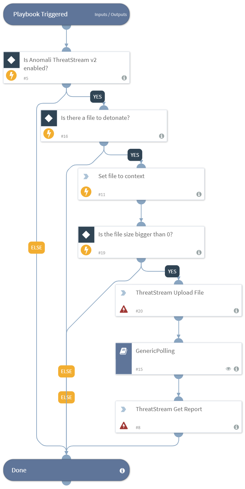

Detonates one or more files using the Anomali ThreatStream v2 integration. This playbook returns relevant reports to the War Room, and file reputations to the context data.

## Dependencies
This playbook uses the following sub-playbooks, integrations, and scripts.

### Sub-playbooks
* GenericPolling

### Integrations
This playbook does not use any integrations.

### Scripts
* Set

### Commands
* threatstream-submit-to-sandbox
* threatstream-analysis-report

## Playbook Inputs
---

| **Name** | **Description** | **Default Value** | **Source** | **Required** |
| --- | --- | --- | --- | --- |
| File | The file object of the file to detonate. | None | File | Optional |
| VM | The VM to use (string). | - | - | Optional |
| SubmissionClassification | The classification of the sandbox submission. | - | - | Optional |
| PremiumSandbox | Specifies if the premium sandbox should be used for detonation. | - | - | Optional |
| Tags | A CSV list of tags applied to this sample. | - | - | Optional |
| Interval | The polling frequency. How often the polling command should run (in minutes). | - | - | Optional |
| Timeout | The amount of time to wait before a timeout occurs (in minutes). | - | - | Optional |

## Playbook Outputs
---

| **Path** | **Description** | **Type** |
| --- | --- | --- |
| File.Malicious | The malicious file's description. | unknown |
| File.Malicious.Vendor | The vendor that made the decision that the file is malicious. | string |
| File.Type | The file type. For example, "PE". | string |
| File.Size | The file size. | number |
| File.MD5 | The MD5 hash of the file. | string |
| File.Name | The file name. | string |
| File.SHA1 | The SHA1 hash of the file. | string |
| File | The file object. | unknown |
| File.SHA256 | The SHA256 hash of the file. | string |
| DBotScore | The DBotScore object. | unknown |
| DBotScore.Indicator | The indicator that was tested. | string |
| DBotScore.Type | The indicator type. | string |
| DBotScore.Vendor | The vendor used to calculate the score. | string |
| DBotScore.Score | The actual score. | number |

## Playbook Image
---

