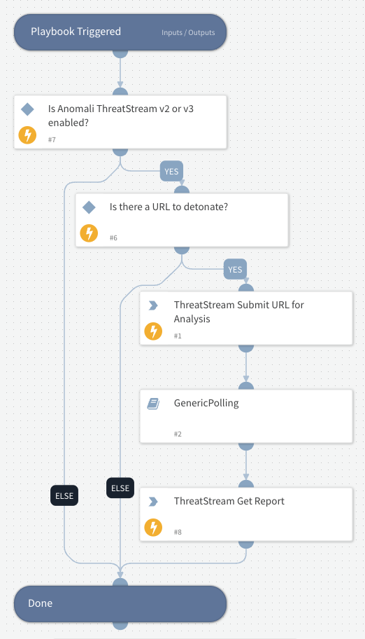

Detonates one or more URLs using the Anomali ThreatStream sandbox integration.
Returns relevant reports to the War Room and URL reputations to the context data.

## Dependencies

This playbook uses the following sub-playbooks, integrations, and scripts.

### Sub-playbooks

* GenericPolling

### Integrations

* AnomaliThreatStreamv3
* Anomali_ThreatStream_v2

### Scripts

This playbook does not use any scripts.

### Commands

* threatstream-submit-to-sandbox
* threatstream-analysis-report

## Playbook Inputs

---

| **Name** | **Description** | **Default Value** | **Required** |
| --- | --- | --- | --- |
| URL | URL to detonate. | URL.Data | Optional |
| Interval | How often to execute polling \(in minutes\). | 5 | Optional |
| Timeout | The duration after which to stop polling and to resume the playbook \(in minutes\). | 120 | Optional |
| VM | The VM to use \(string\) |  | Optional |
| SubmissionClassification | Classification of the sandbox submission. |  | Optional |
| PremiumSandbox | Specifies if the premium sandbox should be used for detonation. |  | Optional |
| Tags | A CSV list of tags applied to this sample. |  | Optional |

## Playbook Outputs

---

| **Path** | **Description** | **Type** |
| --- | --- | --- |
| ThreatStream.Analysis.ReportID | The report ID submitted to the sandbox. | string |
| ThreatStream.Analysis.Status | The analysis status. | string |
| ThreatStream.Analysis.Platform | The platform of the submission submitted to the sandbox. | string |
| ThreatStream.Analysis.Category | The report category. | string |
| ThreatStream.Analysis.Started | The detonation start time. | string |
| ThreatStream.Analysis.Completed | The detonation completion time. | string |
| ThreatStream.Analysis.Duration | The duration of the detonation \(in seconds\). | string |
| ThreatStream.Analysis.VmName | The VM name. | string |
| ThreatStream.Analysis.VmID | The VM ID. | string |
| ThreatStream.Analysis.Verdict | The verdict of the sandbox detonation. | string |
| ThreatStream.Analysis.Network.UdpSource | The UDP source. | string |
| ThreatStream.Analysis.Network.UdpDestination | The UDP destination. | string |
| ThreatStream.Analysis.Network.UdpPort | The UDP port. | number |
| ThreatStream.Analysis.Network.IcmpSource | The ICMP source. | string |
| ThreatStream.Analysis.Network.IcmpDestination | The ICMP destination. | string |
| ThreatStream.Analysis.Network.IcmpPort | The ICMP port. | number |
| ThreatStream.Analysis.Network.TcpSource | The TCP source. | string |
| ThreatStream.Analysis.Network.TcpDestination | The TCP destination. | number |
| ThreatStream.Analysis.Network.TcpPort | The TCP port. | number |
| ThreatStream.Analysis.Network.HttpSource | The source of the HTTP address. | string |
| ThreatStream.Analysis.Network.HttpDestinaton | The destination of the HTTP address. | string |
| ThreatStream.Analysis.Network.HttpPort | The port of the HTTP address. | string |
| ThreatStream.Analysis.Network.HttpsSource | The source of the HTTPS address. | string |
| ThreatStream.Analysis.Network.HttpsDestinaton | The destination of the HTTPS address. | string |
| ThreatStream.Analysis.Network.HttpsPort | The port of the HTTPS address. | string |
| ThreatStream.Analysis.Network.Hosts | The network analysis hosts. | string |

## Playbook Image

---

