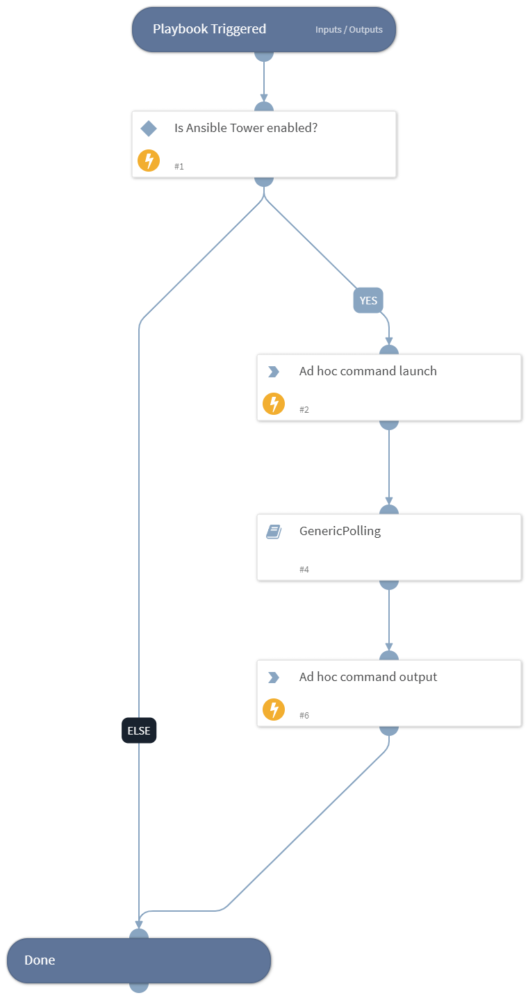

Generic polling playbook for runing ad hoc commands. Ad-hoc commands in Ansible allows you to execute simple tasks at the command line against one or all of your hosts. This playbook first launchrd an ad hoc command, then reportd the status of the task when it finishes running, and at the end returns the output of the task.

## Dependencies
This playbook uses the following sub-playbooks, integrations, and scripts.

### Sub-playbooks
* GenericPolling

### Integrations
* Ansible Automation Platform

### Scripts
This playbook does not use any scripts.

### Commands
* ansible-tower-adhoc-command-launch
* ansible-tower-adhoc-command-stdout

## Playbook Inputs
---

| **Name** | **Description** | **Default Value** | **Required** |
| --- | --- | --- | --- |
| credentials_id | Select credentials that allows Tower to access the nodes this job will be run against \(if needed\). |  | Required |
| Inventory_id | Select the inventory containing the hosts you want this job to manage \(if needed\). |  | Required |
| module_name | Modules are discrete units of code that can be used from the command line or in a playbook task. Ansible ships with a number of modules that can be executed directly on remote hosts or through playbooks. |  | Required |
| module_args | Module arguments |  | Optional |
| show_output | Print output from the ad hoc command that is running. | False | Optional |
| Interval | Polling frequency. How often the polling command should run \(in minutes\). | 1 | Optional |
| Timeout | How much time \(in minutes\) to wait before a timeout occurs. | 10 | Optional |

## Playbook Outputs
---

| **Path** | **Description** | **Type** |
| --- | --- | --- |
| AnsibleAWX.AdhocCommand.id | Ad hoc command ID. | unknown |
| AnsibleAWX.AdhocCommand.status | Ad hoc command status. | unknown |
| AnsibleAWX.JobStdout.content | Job content output. | unknown |

## Playbook Image
---
