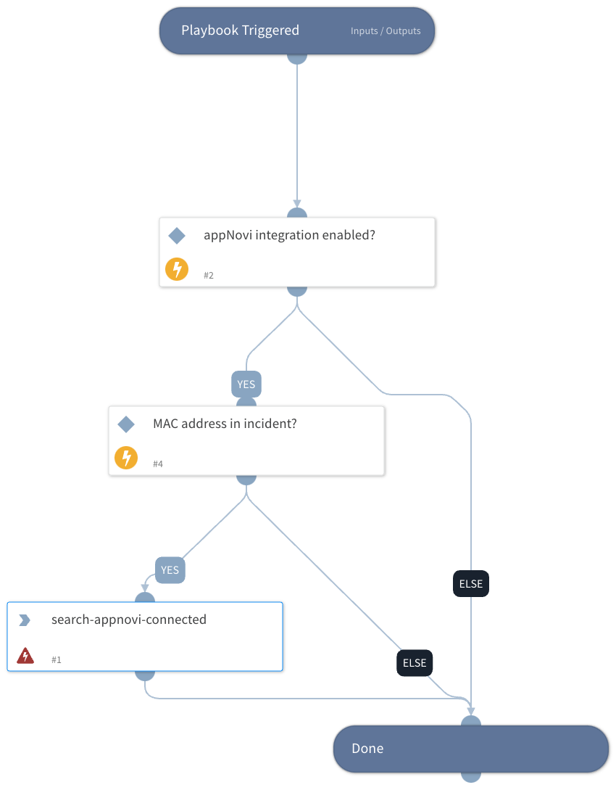

Lookup servers and IPs by MAC address

## Dependencies
This playbook uses the following sub-playbooks, integrations, and scripts.

### Sub-playbooks
This playbook does not use any sub-playbooks.

### Integrations
* appNovi

### Scripts
* Exists

### Commands
* search-appnovi-connected

## Playbook Inputs
---

| **Name** | **Description** | **Default Value** | **Required** |
| --- | --- | --- | --- |
| mac_address | mac address | ${incident.macaddress} | Required |

## Playbook Outputs
---

| **Path** | **Description** | **Type** |
| --- | --- | --- |
| appNovi.attached | list of Servers and IPs associated with MAC address | unknown |

## Playbook Image
---
